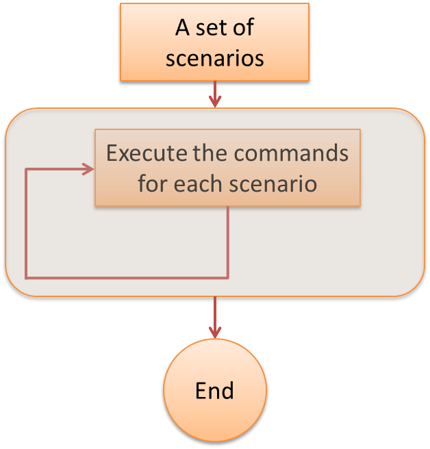
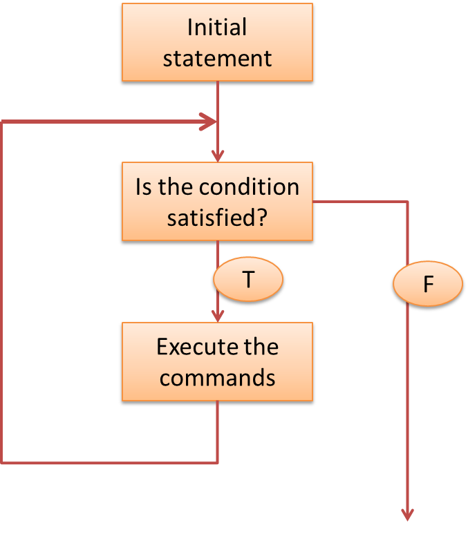

# Control flows and functions in Base R

## Learning outcomes


By the end of this topic, you should be able to

- create control flows in R
- understand the concept and benefit of vectorization
- call functions in R with specified arguments
- create R functions without default values
- create R functions with default values
- debug functions in R

Note that page numbers refer to the book [The R
Software](http://biostatisticien.eu/springeR/index-en.html).


## Control Flow - Introduction

Control flows connect several building blocks of your code together

- A loop can be used to repeat the same portion of code (or block of code) for a number of times

- In an algorithm, logical operations are used to decide whether a loop should continue or not

  - An 'if' statement can be used to execute a command if some condition is satisfied
  
  - A 'for' loop is used to repeat a building block for a pre-determined number of times
  
  - A 'while' loop is used to repeat a building block until some condition fails


## Control Flow - Instructions if and else - Page 117


```r
x <- 3
y <- 2
if (x<=y) {
  print("x smaller than y")
  } else {
  print("x larger than y")
}
## [1] "x larger than y"
```


## Control Flow - Instructions for - Page 119


```r
j <- 0
for (i in 1:3){
  j <- i+j}
  j
## [1] 6
# i=1,j=1 -> i=2,j=3 -> i=3,j=6
x <- c(1,3,7,2)
for (var in x){ 
  print(2*var)}
## [1] 2
## [1] 6
## [1] 14
## [1] 4
# var=1 -> var=3 -> var=7 -> var=2
```

  


## Control Flow - Instructions while - Page 119


```r
x <- 2
y <- 1
while(x+y<6){
  x<-x+y
  print(x+y)}
## [1] 4
## [1] 5
## [1] 6
x
## [1] 5
# (x=2,y=1) -> (x+y=3<6) -> (x=3,y=1) -> (x+y=4<6) -> 
#(x=4,y=1) -> (x+y=5<6) -> (x=5,y=1) -> (x+y=6) -> End
```

  


## Notes

- Loops can be inefficient and, **if possible**, you should avoid them. See next slide (and an example on Page 120).

- Another common control flow instruction is repeat (see example on Page 120)

- You can use break to exit a for, while or repeat loop (see R help file and example on Pages 119-120)

- You can use "next" to move to the next loop (see example on Pages 119-120)

## Vectorization - Pages 85-86

- As we have already seen, R 'naturally' operates on vectors and matrices, applying operations element-by-element


```r
x <- c(1,2,3)
y <- c(4,5,6)
x+y
## [1] 5 7 9
M <- matrix(1:9, nrow=3)
exp(M)
##           [,1]      [,2]     [,3]
## [1,]  2.718282  54.59815 1096.633
## [2,]  7.389056 148.41316 2980.958
## [3,] 20.085537 403.42879 8103.084
```

- We call this behaviour 'vectorization', and it is one of the main strengths of R 
- Vectorization is much quicker than using loops!


## Vectorization - Example - Pages 86


```r
x <- runif(5000000) # Generate 5 million random elements
z <- 0;
system.time(for(i in 1:5000000) z <- z + x[i])
##    user  system elapsed 
##   0.101   0.001   0.104
z
## [1] 2500481
system.time(zz <- sum(x))
##    user  system elapsed 
##   0.004   0.000   0.005
zz
## [1] 2500481
```


## Functions - calling functions - pages 43-44
	
 - A function in R is defined by its name and by the list of its parameters (or arguments). Most functions output a value.

 - Using a function (or calling or executing it) is done by typing its name followed, in brackets, by the list of arguments to be used. Arguments are separated by commas. Each argument can be followed by the sign = and the value to be given to the argument.
	
> **functionname(arg1 = value1, arg2 = value2, arg3 = value3)**
	
 - Note that you do not necessarily need to indicate the names of the arguments, but only their values, as long as you follow their order.
	
 - For any R function, some arguments must be specified and others are optional (because a default value is already given in the code of the function).
 
 - Can you name some functions you already know and that we have seen?

## Functions - calling functions - page 44

If one executes the name of a function without the brackets (), then R will display the contents of the function.

What do you learn from the following examples?


```r
factorial
## function (x) 
## gamma(x + 1)
## <bytecode: 0x7fce37948e00>
## <environment: namespace:base>
factorial(6)
## [1] 720
date
## function () 
## .Internal(date())
## <bytecode: 0x7fcdf7755858>
## <environment: namespace:base>
date()
## [1] "Mon Feb  1 17:02:18 2021"
```

## Functions - Arguments - page 45

The function log(x, base = exp(1)) can take two arguments: x (its value must be specified) and base (optional, because a default value is provided as exp(1)).

You can call a function by playing with the arguments in several different ways. This is an important feature of R which makes it easier to use. All the following commands will execute the same calculations


```r
log(3)
## [1] 1.098612
log(x = 3)
## [1] 1.098612
log(x = 3, base = exp(1))
## [1] 1.098612
log(x = 3, exp(1))
## [1] 1.098612
log(3, base = exp(1))
## [1] 1.098612
log(3, exp(1))
## [1] 1.098612
log(base = exp(1), 3)
## [1] 1.098612
log(base = exp(1), x = 3)
## [1] 1.098612
```


## Developing functions - Creating a function - Page 194

An important part of coding in R is creating your own functions.

Creating a function is done following the general syntax: function(\<list of arguments\>) \<body of the function\>, where

- \<list of arguments\> is a list of named arguments (also called formal arguments) ;

- \<body of the function\> represents, as the name suggests, the contents of the code to execute when the function is called. 


Note: For R, a function is a specific object. 

## Developing functions - Calling a function - Pages 194-195

To execute it, the user needs to call the function, followed by the effective arguments listed between parenthesis() and separated by commas. Here an effective argument is the value affected to a formal argument. 


```r
# This line creates a function called 'hello' with one argument called 'name'
hello <- function(name){cat("Hello, my dear", name, "!")}
# This line executes the function, with the the effective argument 'Josephine'
hello(name = "Josephine")
## Hello, my dear Josephine !
```

## Developing functions - Body of a function - Page 195

- The body of a function can be a simple R instruction, or a sequence of R instructions. In the latter case, the instructions must be enclosed between the characters \{ and \} to delimit the beginning and end of the body of the function.

- Several R instructions can be written on the same line as long as they are separated by a semicolon ';'


## Functions - Multiple arguments example

Of course, a function can have more than one argument. Here, function CDF.pois() has two arguments, **x** and **lambda**. It calculates the CDF `\(F_X(x)\)` at **x** of a Poisson random variable with parameter equal to **lambda**. Note the use a **for loop**. 

```r
CDF.pois <- function(x, lambda){
  # Initialise the cdf to 0
  cdf = 0
  # For k from 0 to x, add together the probablity masses p(k)
  for (k in 0:x){
    cdf = cdf + exp(-lambda)*lambda^k/factorial(k)
  }
  # Return the result
  return(cdf)
}
CDF.pois(x = 3, lambda = 4)
## [1] 0.4334701
```

Note: we have every right to use a function within a function. For instance, here we use the (already defined) function factorial() inside our new function CDF.pois().


## Developing functions - Default argument values - Page 195

- When declaring a function, all arguments are identified by a unique name.

- Each argument can be associated with a **default value**. To specify a default value, use the character **=** followed by the default value.

- When the function is called with no effective argument for that argument, the default value will be used.


## Developing functions - Adding default values - Page 196

- Let us add to our function hello() the possibility of choosing a language with 'eng' as the default, and see a few calls of this function.


```r
hello <- function(name="Peter",language="eng") {
  cat(switch(language,fr="Bonjour",sp="Hola",
             eng="Hello"),name,"!")
}

hello()
## Hello Peter !

hello(name="Ben")
## Hello Ben !

hello(name = "Pedro", language="sp")
## Hola Pedro !
```

Note: the command `help('switch')` will navigate you to the help file of the 'switch' function. What does it do?

## Developing functions - Partial naming of effective arguments - Pages 196-197

R allows calling a function without typing in the complete name of a formal argument:


```r
hello <- function(name="Peter",language="eng") {
  cat(switch(language,fr="Bonjour",sp="Hola",
             eng="Hello"),name,"!")
}

hello(lang="fr")
## Bonjour Peter !

hello(l="fr")
## Bonjour Peter !
```

Rule: in the ordered list of formal arguments of the function, the selected formal argument is the first formal argument for which there is a match between the first letters of the argument name and the partial name given by the user.

## Developing functions - Object returned by a function - Pages 198-199

A way to explicitly tell an R function what object to return is to use the function return(). This instruction halts the execution of the code in the body of the function and returns the object between brackets.


```r
hello <- function(name="Peter") {
  return(paste("Hello",name,"!"))}

hello()
## [1] "Hello Peter !"
```

Note that if there is no 'return()' in the body of the function, then the function will return the result of the last evaluated expression. See help("function") for details.

## Developing functions - Variable scope in the body of a function - Page 200-201

- Variables defined inside the body of a function have a local scope during function execution. This means that a variable inside the body of a function is physically different from another variable with the same name, but defined in the workspace of your R session.

- Generally speaking, local scope means that a variable only exists inside the body of the function. After the execution of the function, the variable is thus automatically deleted from the memory of the computer.


## Functions - Storing functions in your R codes
	
You may not want to define all your functions in a single R script 

- the file can get too long, hence inefficient to manage
- you may want to use the same function(s) in many different projects


It is good practice to:

- store all functions in a single script, or separate scripts;
- use the source() function to use them in the main script of a project.

Note: Functions would still need to be included in the 'R code Appendix' of an assignment.


```r
source("C:/Users/ACTL1101/R_lab_2018/my_functions.r")
# in my current script, I can now use all functions declared in file "my_functions.r"
```


## Debugging functions - browser() - Pages 255-256

A useful debugging function in R is the function browser(). If you insert the instruction browser() in the source of your function, the program will stop at the place where it was inserted.

By typing the letter `n` (for next), you can inspect the code and the contents of variables sequentially. To leave the inspection mode, type `Q` (for Quit).

## Example 

Create the following function 


```r
bin_func <- function(n,m){
  num <- factorial(n)
  den <- factorial(m)*factorial(n-m)
  browser()
  res <- num/den
  return(res)}
```


## Debugging functions - debug() - Pages 257

Another interesting function is debug() which is equivalent to putting the instruction browser() at the top of a function. Thus debug(bin_func) marks the functions bin_func as debuggable. Any subsequent call of this function will launch the debugger.

To get rid of this mark, use the function undebug().


## Relevant exercises

5.12, 5.13, 8.1-8.11

