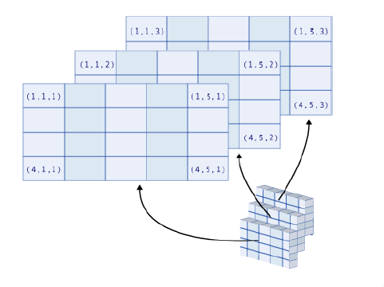

# Data structures, mathematical operations, importation and exportation in Base R

## Learning outcomes

By the end of this topic, you should be able to

- recognise and create different data structures in R
- demonstrate the advantages of different data structures
- perform mathematical operations
- import external data of different formats into R 
- export R data into a variety of formats
- perform set operations

**Warning:** the materials here are so-called "Base R". There are easier (and often better) ways of doing things with the "tidyverse" ecosystem (see next section).

Note that page numbers refer to the book [The R
Software](http://biostatisticien.eu/springeR/index-en.html).

## Data structure - Vectors - page 51

 - The basic data structure in R is the **vector** (a sequence of data points), which we have encountered before


```r
# Create a vector called 'myVector'
(myVector <- c(1,2,3))
## [1] 1 2 3
myVector * 3
## [1] 3 6 9
```

- We now look into some more operations we can perform on vectors

## Vector operations - Some basic functions - Page 87

- length(): returns the length of a vector.
- sort(): sorts the elements of a vector, in increasing or decreasing order.
- rev(): rearranges the elements of a vector in reverse order.
- rank(): returns the vector of ranks of the elements. 
- head(): returns the first few elements of a vector.
- tail(): returns the last few elements of a vector. 

## Vector operations - Examples - Page 87-88


```r
x  <- c(1,3,6,2,7,4,8,1,0)
length(x)
## [1] 9
sort(x)
## [1] 0 1 1 2 3 4 6 7 8
sort(x, decreasing=TRUE)
## [1] 8 7 6 4 3 2 1 1 0
rev(x)
## [1] 0 1 8 4 7 2 6 3 1
rank(x)
## [1] 2.5 5.0 7.0 4.0 8.0 6.0 9.0 2.5 1.0
head(x, 3)
## [1] 1 3 6
tail(x, 2)
## [1] 1 0
```


## Data structure - Matrices and arrays - page 51

- Matrices and arrays are generalisations of vectors
- A **matrix** has two dimensions (hence you need two indices to access a data point)
- An **array** allows for even more dimensions (hence you need multiple indices)


## Data structure - Matrices and arrays - page 52
	

```r
(X <- matrix(1:12, nrow=4, ncol=3, byrow=TRUE))
##      [,1] [,2] [,3]
## [1,]    1    2    3
## [2,]    4    5    6
## [3,]    7    8    9
## [4,]   10   11   12
(X <- matrix(1:12, nrow=4, ncol=3, byrow=FALSE))
##      [,1] [,2] [,3]
## [1,]    1    5    9
## [2,]    2    6   10
## [3,]    3    7   11
## [4,]    4    8   12
class(X)
## [1] "matrix" "array"
	
(X <- array(1:6, dim=c(2,1,3)))
## , , 1
## 
##      [,1]
## [1,]    1
## [2,]    2
## 
## , , 2
## 
##      [,1]
## [1,]    3
## [2,]    4
## 
## , , 3
## 
##      [,1]
## [1,]    5
## [2,]    6
class(X)
## [1] "array"
```

Note: we used function class() to identify the stucture of X.

## Data structure - Matrices and arrays - page 53

Take a few minutes to think about how to interpret a three-dimensional array. The image below may help you.

  


## Recycling - Pages 86-87

Given an operation on two vectors/matrices/arrays of different lengths, R will complete the shortest data structure by repeating its elements from the beginning. We call this behaviour 'recycling':


```r
x <- c(1,2,3,4,5,6)
y <- c(1,2,3)
x + y
## [1] 2 4 6 5 7 9
```

Another example is below, where the vector 1:3 is repeated to fill in a matrix:


```r
matrix(1:3, ncol=3, nrow=4)
##      [,1] [,2] [,3]
## [1,]    1    2    3
## [2,]    2    3    1
## [3,]    3    1    2
## [4,]    1    2    3
```

## Merging - Merging columns - Page 89

You can merge vectors or matrices together to create a new matrix with functions cbind() and rbind().


```r
(B <- cbind(1:4,5:8))
##      [,1] [,2]
## [1,]    1    5
## [2,]    2    6
## [3,]    3    7
## [4,]    4    8
(C <- cbind(B, 9:12))
##      [,1] [,2] [,3]
## [1,]    1    5    9
## [2,]    2    6   10
## [3,]    3    7   11
## [4,]    4    8   12
class(C)
## [1] "matrix" "array"
```
Try guess what rbind() does, then look it up in the book or on the internet.


## Matrix operations - Pages 315-316-317

You can perform 'usual' mathematical operations on matrices. What are the mathematical meaning of the operations performed below?


```r
A <- matrix(c(2,3,5,4), nrow=2, ncol=2, byrow=T)
B <- matrix(c(1,2,8,7), nrow=2, ncol=2, byrow=F)
I2 <- diag(nrow=2) # identity matrix of size 2x2
A
##      [,1] [,2]
## [1,]    2    3
## [2,]    5    4
B
##      [,1] [,2]
## [1,]    1    8
## [2,]    2    7
A+B 
##      [,1] [,2]
## [1,]    3   11
## [2,]    7   11
A*B
##      [,1] [,2]
## [1,]    2   24
## [2,]   10   28
A/B
##      [,1]      [,2]
## [1,]  2.0 0.3750000
## [2,]  2.5 0.5714286
A%*%I2
##      [,1] [,2]
## [1,]    2    3
## [2,]    5    4
A%*%B
##      [,1] [,2]
## [1,]    8   37
## [2,]   13   68
t(B)
##      [,1] [,2]
## [1,]    1    2
## [2,]    8    7
```

Note: the diag() function can also be used for different purposes (see R help file)


## Matrix operations - the solve() function - Pages 316-317

The solve(a,b) function can be used to solve `\(a \%*\% x = b\)`,  for `\(x\)`. Here `\(b\)` can be a vector or a matrix. If 'solve' is used with only one argument, e.g. solve(A), it will return the inverse of a matrix (if it exists).


```r
x <- solve(A, c(1,1))
A%*%x
##      [,1]
## [1,]    1
## [2,]    1
```


```r
solve(B) %*% B
##      [,1] [,2]
## [1,]    1    0
## [2,]    0    1
```

## Matrix operations - The function apply() - Page 93

The function apply() is often quite handy. It applies a given function to the elements of all rows (MARGIN=1) or all columns (MARGIN=2) of a matrix.


```r
(X <- matrix(c(1:4, 1, 6:8), nr = 2))
##      [,1] [,2] [,3] [,4]
## [1,]    1    3    1    7
## [2,]    2    4    6    8
apply(X, MARGIN=1, FUN=sum)
## [1] 12 20
apply(X, MARGIN=2, FUN=mean)
## [1] 1.5 3.5 3.5 7.5
```

Other functions you could use: rowSums(), colSums(), rowMeans(), colMeans().
	


## Important note on data structures

- Do not confuse 'data structure' (vector, matrix, array,...) with 'data type' (which we saw in Week 1). 
- A 'data type' refers to the **type** of information (numerical, string, logical, etc.) while a 'data structure' refers to **how we store** (or structure!) the information (in a vector, in a matrix, etc.)


## Data structure - Lists - page 53

- Elements stored in vectors, matrices or arrays need to be of the same type (and R automatically converts them to the same type if they are not)


```r
myVector <- c(1,2,"A", TRUE)
myVector
## [1] "1"    "2"    "A"    "TRUE"
typeof(myVector)
## [1] "character"
```


- Lists can group together, in one structure, data of different types without altering them.


```r
myList <- list(TRUE, my.matrix=matrix(1:4, nrow=2), c(1+2i,3), "A character string")
myList
## [[1]]
## [1] TRUE
## 
## $my.matrix
##      [,1] [,2]
## [1,]    1    3
## [2,]    2    4
## 
## [[3]]
## [1] 1+2i 3+0i
## 
## [[4]]
## [1] "A character string"
```


	
## Data structure - Data frames - page 54

A data.frame in R is a table where 

- each row represents a single observation (e.g. an individual)
- each column represents a single variable, which must be of the same data type across all rows

	
Data frames are widely used in R

- flexibility of having multiple data types
- in many cases, a dataset can be formulated as a data.frame

## Data structure - Data frames 


```r
BMI <- data.frame(
  Gender=c("M","F","M","F"),
  Height=c(1.83,1.76,1.82,1.60),
  Weight=c(67,58,66,48),
  row.names=c("Jack","Julia","Henry","Emma"))

BMI
##       Gender Height Weight
## Jack       M   1.83     67
## Julia      F   1.76     58
## Henry      M   1.82     66
## Emma       F   1.60     48
str(BMI)
## 'data.frame':	4 obs. of  3 variables:
##  $ Gender: chr  "M" "F" "M" "F"
##  $ Height: num  1.83 1.76 1.82 1.6
##  $ Weight: num  67 58 66 48
```

You can access a specific variable using the \$ command

```r
BMI$Gender
## [1] "M" "F" "M" "F"
```

## Merging - Merging columns of data frames - Page 89-91

One may need to add to a data set some variables from another dataset (that has the same subjects). In these cases, you should use the merge() function with appropriate 'by' arguments. Let's see an example.


```r
X <- data.frame(GENDER=c("F","M","M","F"),
ID=c(123,234,345,456),
NAME=c("Mary","James","James","Olivia"),
Height=c(170,180,185,160))

Y <- data.frame(GENDER=c("M","F","F","M"),
ID=c(345,456,123,234),
NAME=c("James","Olivia","Mary","James"),
Weight=c(80,50,70,60))

X
##   GENDER  ID   NAME Height
## 1      F 123   Mary    170
## 2      M 234  James    180
## 3      M 345  James    185
## 4      F 456 Olivia    160
Y
##   GENDER  ID   NAME Weight
## 1      M 345  James     80
## 2      F 456 Olivia     50
## 3      F 123   Mary     70
## 4      M 234  James     60
cbind(X,Y)
##   GENDER  ID   NAME Height GENDER  ID   NAME Weight
## 1      F 123   Mary    170      M 345  James     80
## 2      M 234  James    180      F 456 Olivia     50
## 3      M 345  James    185      F 123   Mary     70
## 4      F 456 Olivia    160      M 234  James     60
merge(X,Y, by=c("NAME")) # Not good, because NAME is not unique among rows
##     NAME GENDER.x ID.x Height GENDER.y ID.y Weight
## 1  James        M  234    180        M  345     80
## 2  James        M  234    180        M  234     60
## 3  James        M  345    185        M  345     80
## 4  James        M  345    185        M  234     60
## 5   Mary        F  123    170        F  123     70
## 6 Olivia        F  456    160        F  456     50
merge(X,Y, by=c("ID")) # Better
##    ID GENDER.x NAME.x Height GENDER.y NAME.y Weight
## 1 123        F   Mary    170        F   Mary     70
## 2 234        M  James    180        M  James     60
## 3 345        M  James    185        M  James     80
## 4 456        F Olivia    160        F Olivia     50
merge(X,Y)  # Does not replicate variables present in both data sets
##   GENDER  ID   NAME Height Weight
## 1      F 123   Mary    170     70
## 2      F 456 Olivia    160     50
## 3      M 234  James    180     60
## 4      M 345  James    185     80
```


## Merging - Example

One can use the all.x argument to include the rows where the values of the by argument are not shared in both datasets.


```r
current_courses <- data.frame( Course_Code = c("ACTL1101", "MATH1251", "ACCT1511", "ECON1102"))

actl_info <- data.frame(Course_Code  = c("ACTL1101", "ACTL2111", "ACTL2131", "ACTL2102"), 
                        Course_Name = c("Introduction to Actuarial Studies", 
                                        "Financial Mathematics for Actuaries", 
                                        "Probability and Mathematical Statistics", 
                                        "Foundations of Actuarial Models"))

merge(x=current_courses, y=actl_info, by = "Course_Code", all.x = TRUE)
##   Course_Code                       Course_Name
## 1    ACCT1511                              <NA>
## 2    ACTL1101 Introduction to Actuarial Studies
## 3    ECON1102                              <NA>
## 4    MATH1251                              <NA>

merge(x=current_courses, y=actl_info, by = "Course_Code")
##   Course_Code                       Course_Name
## 1    ACTL1101 Introduction to Actuarial Studies
```


## Data structure - Factors

A factor can be used to store character strings

- each element is treated as a factor (even if the input is a real number)
- some functions require data structured as a factor


```r
x <- factor(c("blue","green","blue","red","blue","green","green"))
levels(x)
## [1] "blue"  "green" "red"
class(x)
## [1] "factor"
```
	
Note: Function 'levels()' shows you all unique factors, which can be handy.


## Data structure - Summary

|**Data structure** | **Instruction in R**  | **Description**     |
|:------------------|:----------------------|:--------------------|
| vector            |	c()                   | Sequence of elements of the same nature
| matrix            | matrix()              | Two-dimensional table of elements of the  same nature |
| array             |	array()               | More general than a matrix; table with several dimensions   |
| list              |	list()                | Sequence of R structures of any (and possibly different) nature.  |
| data frame        |	data.frame()          | Two-dimensional table. The columns can be of different natures, but must have the same length.         |
| factor            |	factor()              | Vector of character strings associated with a modality table   |
| dates             |	as.Date()             | Vector of dates   |
| time series       |	ts()                  | Values of a variable observed at several time points   |


## Importing data - text files - Page 64
- R is a great tool to analyse data... but we first need to get our data into R!
- There are three main R functions to import data from a text file. Here we focus on the read.table and read.csv functions, which are widely used to import excel and csv files.

|**Function name**   | **Description**                        |
|:-------------------|:---------------------------------------|
| read.table()       | best suited for data sets presented as tables, as it is often the case in statistics         |
| read.ftable()      | 	reads contingency tables         |
| scan()             |	much more flexible and powerful. Use this in all other cases|

## Importing data - read.table() - Pages 64-65

|**Argument name**    | **Description**                                   |
|:--------------------|:--------------------------------------------------|
| file=path/to/file   | Location and name of the file to be read          |
| header=TRUE         | 	Indicates whether the variable names are given on the first line of the file|
| sep="" |	This is the field separator character. Values on each line of the file are separated by this character. (e.g.  "" = whitespace, "," = comma, "$\backslash$t" = tabulation)       |
|dec="."              |Decimal mark for numbers ("." or ",")              |
|row.names=1          |1st column of the file gives the individuals' names|

To read data from a text file:


```r
my.data <- read.table(file=file.choose(), header=TRUE, sep="\t", dec=".", row.names=1)
```

The path can be specified explicitly: 


```r
my.data <- read.table(file="C:/MyFolder/somedata.txt")
```

Alternatively, you can use double back slash \\\\ instead of /.
	
## Importing data - read.table() - Pages 64-66

Note:

- If the file is located in your current working directory, you do not need to specify the full path


```r
data <- read.table(file="mydata.txt")
```

- You can visualise the beginning or end of your data by using head(data) or tail(data)


## Importing data - Exercise - Page 66

- Download the Danish fire data from Moodle and save it to your working directory (set up the working directory somewhere on your computer, or start a new project in RStudio). Name it danishfire.txt.
- Use the function readLines() to visualize the beginning of the data. Why should we do so?
- Import the data and store it in a data frame called danish\_fire.
- Display the first few records of danish\_fire by using the head() function.
- Display the structure of danish\_fire.
- Calculate the mean of the building losses, as well as the correlation between the building losses and contents losses. Hint: Use functions mean() and cor().

## Importing data - Solution - Page 66

Use the function readLines() to visualize the beginning of the data file **before** you read the data, so you know the structure of the data and are able to determine the arguments of the function read.table()


```r
#Careful: this line will be different for you, enter the path of where 'danishfire.txt' is for you
setwd("C:/Users/z3519303/Dropbox/ACTL1101 2019/R_lab_2019/Week 2") 
readLines("danishfire.txt",n=3)
```

Now let's import the data (note the first row is the header)


```r
# import data, note that the header argument is TRUE
danish_fire <- read.table(file = "danishfire.txt", header = TRUE)
head(danish_fire)
class(danish_fire)
str(danish_fire)
# some numerical analysis
mean(danish_fire$building)
cor(danish_fire$building, danish_fire$contents)
```

## Importing data - Standard formats (e.g. csv) - Page 67

With standard formats, most of the arguments of the function read.table() are fixed. There are some functions that are designed to be equivalent to read.table() with several arguments filled with pre-determined values:
	
- read.csv(): .csv format (csv stands for comma separated values)
- read.delim(): Tab-separated data


## Exporting data - Pages 72-73

Now try to export the danish fire data you have imported to R.
	

```r
# Exporting data to a text file
write.table(danish_fire, file = "myfile.txt", sep = "\t")
# Exporting data to a csv file
write.csv(danish_fire, file = "myfile.csv")
```

You can also save data to the clipboard and then paste them into your spreadsheet.


## Additional notes - data structures

There are many functions related to data structures in R, and it is practically impossible to go through them all in class. We have summarised some useful contents below.

  - Replicating elements (see Pages 73-74)


```r
rep(1,4)
## [1] 1 1 1 1
rep(1:4, 2)
## [1] 1 2 3 4 1 2 3 4
rep(1:4, each = 2)
## [1] 1 1 2 2 3 3 4 4
rep(1:4, c(2,1,2,3))
## [1] 1 1 2 3 3 4 4 4
rep(1:4, each = 2, len = 4) 
## [1] 1 1 2 2
rep(1:3, each = 2, times = 3)
##  [1] 1 1 2 2 3 3 1 1 2 2 3 3 1 1 2 2 3 3
```

- Naming the elements of a vector using the function names (see Page 51)


```r
vec <- 1:10
names(vec) <- letters[1:10]
vec
##  a  b  c  d  e  f  g  h  i  j 
##  1  2  3  4  5  6  7  8  9 10
```

Here, the built-in constants letters[1:10] return the first 10 letters of the alphabet.

- There are other data structures we haven't introduced yet. Two common ones are the date structure and time series structure.
	
    - You can use the as.Date() function for dates


```r
dates <- c("92/27/02","92/02/27")
as.Date(dates,"%y/%m/%d")
## [1] NA           "1992-02-27"
```

    - You can also create a time series structure


```r
ts(1:10, frequency=4, start=c(1959,2))
##      Qtr1 Qtr2 Qtr3 Qtr4
## 1959         1    2    3
## 1960    4    5    6    7
## 1961    8    9   10
```

## Additional notes - read.ftable - see Page 67


Following is an example of a contingency table	

|         |**"alcohol"**    | **"never"** | **"occasional"**|**"regular"**|
|:--------|:----------------|:------------|:----------------|:------------|
|"GENDER" | "tobacco"       |             |                 |             |
|"M"      | "non-smoker"    | 6           | 19              | 7           |
|         | "former smoker" | 0           | 9               | 0           |
|         | "smoker"        | 1           | 6               | 5           |
|"F"      | "non-smoker"    | 12          | 26              | 2           |
|         | "former smoker" | 3           | 5               | 1           |
|         | "smoker"        | 1           | 6               | 1           | 

	

```r
Intima.table <- read.ftable("Intima_ftable.txt",row.var.names=c("GENDER","tobacco"),col.vars=list("alcohol"=c("never","occasional","regular"))) 
Intima.table
```

## Additional notes - scan - see Page 68


Function scan() should be used when the data are not organized as a rectangular table.For example, suppose your data file contains the following lines:

  


```r
# Reading variable names:
variable.name <- scan("Intima_Media2.txt",skip=4,nlines=1,what="")
# Reading data:
data <- scan("Intima_Media2.txt",skip=7,dec=",")
mytable <- as.data.frame(matrix(data,ncol=9,byrow=TRUE))
colnames(mytable) <- variable.name

mytable
```

Note

- The argument skip=n is used to omit reading the first n lines of the file
- You can read data files directly from Internet with read.table() and scan()

## Additional notes - Importing data from Excel (see Pages 69-70)


- Approach One: Using copy-paste:

    - Using the mouse, select the range of the data (in the spreadsheet) which you wish to incorporate into R. Once the data are selected, copy them to the clipboard (from the Edit menu, or with the keyboard shortcuts Ctrl+C on Windows or Command+C on a Mac)
    - All you need to do now is type the following instructions in the R console to transfer the data from the clipboard.
	
      - x <- read.table(file("clipboard"),sep="\t",header=TRUE,dec=",")

- Approach Two: Using an intermediary text file:

    -Save your file as a csv file or tab-separated file,  then you can use the procedures we discussed in the previous slides.
    

    
## Additional notes - Importing data from some other software - Page 71
 

|**Software**|**"Package"**|**"R function"**|**"File extension"**|**"Output format"**|
|:-----------|:------------|:---------------|:-------------------|:------------------|
|SPSS        |foreign      |read.spss()     |*.sav               |list               |
|Minitab     |foreign      |read.mtp()      |*.mtp               |list               |
|SAS         |foreign      |read.xport()    |*.xpt               |data.frame         |
|Matlab      |R.matlab     |readMat()       |*.mat               |list               |

## Additional notes - Importing large data files - Page 71
	
R can handle large data sets quickly and efficiently. For this, you need to specify explicitly the type of each column using the argument colClasses of the function read.table().


```r
tm <- Sys.time() # Gets the current time.
dbsnp <- read.table("dbsnp123.dat")
Sys.time() - tm

tm <- Sys.time()
dbsnp2 <- read.table("dbsnp123.dat",
colClasses=rep("character",3))
Sys.time() - tm
```

## Additional notes - Matrix operations - Diagonals, upper and lower matrices - Page 319

Execute the following instructions. What are the mathematical meaning of the operations?


```r
M <- matrix(1:9,nrow=3)
diag(M)
## [1] 1 5 9
M[lower.tri(M)]
## [1] 2 3 6
M[lower.tri(M)] <- 0
M[upper.tri(M)] <- 0
M
##      [,1] [,2] [,3]
## [1,]    1    0    0
## [2,]    0    5    0
## [3,]    0    0    9
```

## Additional notes - Merging rows - Pages 92-93

- Method 1: The generic function is rbind().


```r
rbind(1:4,5:8)
##      [,1] [,2] [,3] [,4]
## [1,]    1    2    3    4
## [2,]    5    6    7    8
```

- Method 2: Alternatively, you can install the gtools package (via the Packages windows in Rstudio) and use the smartbind() function


```r
df1 <- data.frame(A=1:3, B=LETTERS[1:3])
df2 <- data.frame(A=6:8, E=letters[1:3])
smartbind(df1, df2)
```

## Additional notes - Set operations 

- R allows for set operations - Page 99


```r
A <- c(4,5,2,7)
B <- c(2,1,7,3)
C <- c(2,3,7)
is.element(C,A)
## [1]  TRUE FALSE  TRUE
all(A%in%B)
## [1] FALSE
intersect(A,B)
## [1] 2 7
union(A,B)
## [1] 4 5 2 7 1 3
setdiff(A,B)
## [1] 4 5
```

- Exercises			

Given that

```r
A <- c(4,5,2,7)
B <- c(2,1,7,3)
C <- c(2,3,7)
```

Calculate 

    - the collection of elements of A and B that only belong to one set	
    - the number of elements that belong to A, B and C

- Solutions		


```r
# the collection of elements of A and B that only belong to one set
union(setdiff(A,B), setdiff(B,A))
## [1] 4 5 1 3

# the number of elements that belong to A, B and C
length(intersect(intersect(A,B), C))
## [1] 2
```

## Relevant exercises 

- 3.14, 3.15, 4.1-4.15, 5.2, 5.4, 5.5, 10.1, 10.3, 10.5-10.10
