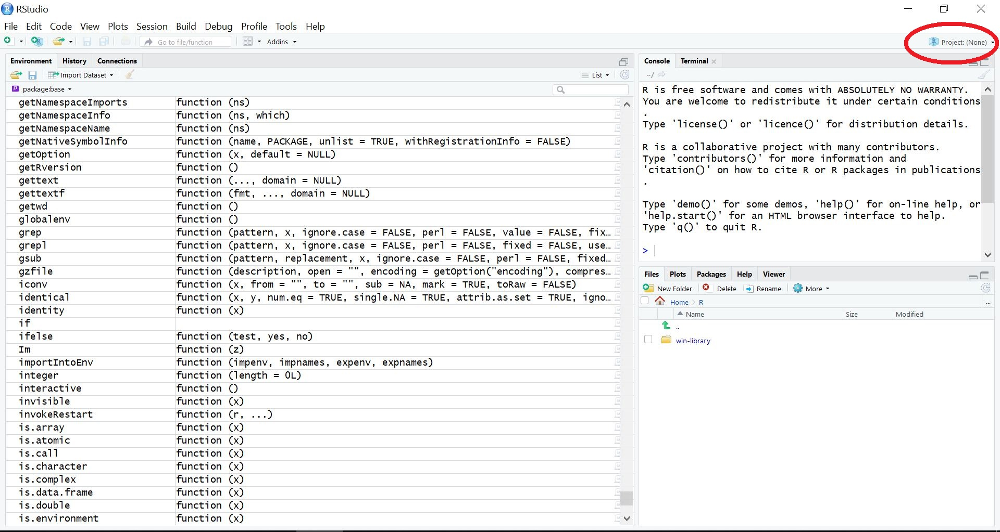

# Working with R Projects

## The Bigger Picture

In this document we learn how to use projects to help work in R Studio more efficiently. This skill has broad application in many aread of the data visualisation and communication workflow.

<center> </img></center>


## References

This content refers to [the Tidyverse LinkedIn Learning tutorial 2.1 - 2.3](https://www.linkedin.com/learning/learning-the-r-tidyverse/why-should-you-use-projects-in-rstudio)

## What are R projects?

- R projects are a type of file which function with `RStudio`
- They have the `.Rproj` file extension
- R projects are each associated with a directory
- They are useful when working with many files for one purpose, hence the name "project"
- A great feature is that they "know" which files are relevant to a project, when you open the project `RStudio` will load those files automatically.

## What do they do?

- If we are working in an R project, we automatically have our working directory set as the folder that the project is associated with
- The RMarkdown file used to produce these notes is within a project, so we can call on images from the image folder without specifying the full file path


```r
knitr::include_graphics("images/RStudio-Ball.png")
```


- In this example, we only need to specify the sub-folder "images" and the image "Rstudio-Ball.png"

## How to create projects

- At the top right of our `RStudio` workspace, there is a project button
- You can select an existing project or create a new one
- This button will also tell you which project is currently open


<center> </img></center>

- If we are creating a new project, we may select a new or existing directory

<center> </img></center>

## How to navigate existing projects

- The "Files" tab of `RStudio` will automatically view the project directory when the project is loaded
- From here we can navigate files

<center> </img></center>


- `.R` files (R script files) can be created in our project directory as normal
- Clicking a `.R` file in the project viewer opens it
- `.Rmd` files (`RMarkdown` files) can likewise be created and opened

## Structuring R projects

- Keeping files neat and tidy in R is an art form
- It is suggested folders are used to keep separate components of data separate
- In this example our directory separates raw and tidied data
- One can still access files from these folders without issue

## save() and load()

- Notice that in this project, we keep raw and tidy versions of the same data in different folders
- This is possible because we can save R objects in one file and reload them in another file
- For example, the `raw_data` folder contains a file called `survey.txt` which looks like this:


```r
library("readr")
read_file("raw_data/survey.txt")
```

```
## [1] "Who in my family likes cereal? June 18/06/2019\r\n\r\nMe No\r\nMum Yes\r\nDad No\r\nSister Yes\r\nBrother No\r\nGrandma Yes\r\nGrandpa Yes"
```

- In the file `data_tidying.R` (in which the data was tidied up), the `save()` function was used as below:


```r
save(data, file = "tidy_data/data.rdata")
```

- Note the first argument is the object to save (`data`) and the second is the file path
- *The file **must** be named the same as the name of the object*
- *The `.rdata` extension **must** be included*
- We may want to load this data later in another file (for example, this `.Rmd` file) with `load()`


```r
library("tidyverse")
load("tidy_data/survey_data.rdata")
survey_data
```

```
## # A tibble: 7 x 2
##   family_member cereal_preference
##   <chr>         <chr>            
## 1 Me            No               
## 2 Mum           Yes              
## 3 Dad           No               
## 4 Sister        Yes              
## 5 Brother       No               
## 6 Grandma       Yes              
## 7 Grandpa       Yes
```

- The loaded file automatically takes the name of the original file

**Side note**: in practice never name your data "`data`". It may lead to errors when loading the file, and you should use something more descriptive (such as "`fam_cereal`". We only used it here for demonstration purposes.

So to summarise, with `save()` and `load()` we can split up our R projects into several script files for different purposes.
