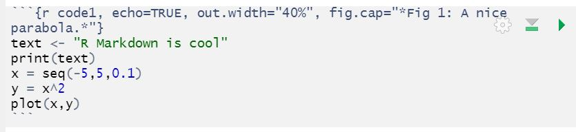
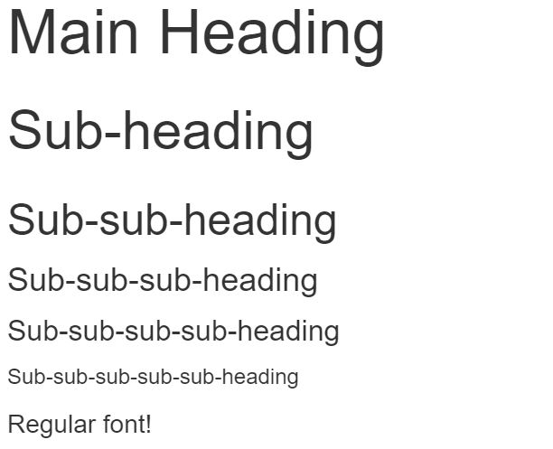

```{r setup, include=FALSE, message=TRUE}
knitr::opts_chunk$set(echo = TRUE,
                      warning = FALSE,
                      message = FALSE,
                      out.width = "60%",
                      fig.align = 'center')
```

# R Markdown

## The Bigger Picture

In this document we learn how to create and manipulate R Markdown documents. Simply put, we are learning how to create documents, slideshows, websites and reports to produce and communicate the visualisations created earlier on. In the overall context of the workflow, this falls into the category of producing our presentations.

<center> </img></center>
\  
<center> </img></center>

`
There are references to LinkedIn Learning videos. These are complementary but not really required as the notes below are meant to be self-contained. Some students and staff would have access for free. Do not purchase access unless you are sure you don’t have access through your organisation already.
`

## What is R Markdown?
> [LinkedIn Learning 1.1](https://www.linkedin.com/learning/creating-reports-and-presentations-with-r-markdown-and-rstudio/what-is-markdown) 

> [LinkedIn Learning 1.2](https://www.linkedin.com/learning/creating-reports-and-presentations-with-r-markdown-and-rstudio/what-is-r-markdown)

### Markup Languages

- R Markdown is a markup language
- Markup langages are systems for annotating documents and other media
- Some other markup languages are:
    - Markdown (different from R Markdown!)
    - LaTeX
    - HTML

### How does R Markdown work?

- R Markdown begins by looking like a weird R script with its own special syntax
- R Markdown documents have the special file extension `.Rmd`
- It includes chunks of R code, and possibly some snippets of other languages
- After we "knit" the document together (according to how we specify), it looks like a nicely rendered form of media
- The document you are currently reading was built in R Markdown!

<center> </img></center>

### What can R Markdown do?

There are three broad types of documents R Markdown can produce. Note that each have sub-categories, and other document types exist. See [here](https://rmarkdown.rstudio.com/lesson-9.html) for more information.

#### PDF
> [LinkedIn Learning 1.3](https://www.linkedin.com/learning/creating-reports-and-presentations-with-r-markdown-and-rstudio/writing-pdf-reports-in-r-markdown)

- These documents always look the same
- They cannot be edited without leaving a 'footprint' (the edits will be noticeable!)
- They can be password protected

#### HTML Reports
> [LinkedIn Learning 1.4](https://www.linkedin.com/learning/creating-reports-and-presentations-with-r-markdown-and-rstudio/writing-html-reports-in-r-markdown)

- Documents which can be put online
- They are easily viewable on mobile
- These reports can interact with htmlwidgets (moving objects, responsive to the viewer's behaviour!)

#### HTML Presentations
> [LinkedIn Learning 1.5](https://www.linkedin.com/learning/creating-reports-and-presentations-with-r-markdown-and-rstudio/writing-html-presentations-in-r-markdown)

- These are HTML documents comparable to a slideshow presentation
- There are several preset styles
- Some styles are very customisable

#### Other Media
> [LinkedIn Learning 1.6](https://www.linkedin.com/learning/creating-reports-and-presentations-with-r-markdown-and-rstudio/what-else-can-you-build-with-r-markdown)

R Markdown can also produce:

- Microsoft PowerPoint presentations
- Microsoft Word documents
- Blog-style webpages (Blogdown)
- Multi-chapter books and reference documents (Bookdown)

## LaTeX, BibTeX and TeX
> [LinkedIn Learning 2.1](https://www.linkedin.com/learning/creating-reports-and-presentations-with-r-markdown-and-rstudio/what-are-latex-and-bibtex)

### LaTeX

- LaTeX is a markup language like R Markdown
- It is heavily used in academia for its ability to create mathematical formulae with ease and precision
- We can call LaTeX in R Markdown if we configure RStudio correctly

### BibTeX

- A reference management software for LaTeX
- It is required to customise the appearance and layout of all PDF documents in R Markdown

### TeX

- A typesetting system which encompasses LaTeX
- Developed with LaTeX partly to process mathematical formulae
- LaTeX is **one distribution** of TeX

## Installing TeX
> [LinkedIn Learning 2.2](https://www.linkedin.com/learning/creating-reports-and-presentations-with-r-markdown-and-rstudio/setting-up-tex-for-generating-r-markdown-reports)

This installation is needed to call upon several functions of R Markdown. Depending on your operating system, the installation for TeX will be one of these options:

| macOS | Linux | Windows |
| :-: | :-: | :-: |
| Go to [http://www.tug.org/mactex](http://www.tug.org/mactex) and install TeX | Run `sudo apt-get install texlive-full` | Go to [https://miktex.org/download](https://miktex.org/download) and install TeX |

After the installation, RStudio will automatically be able to detect TeX on your computer.

## Installing Pandoc
> [LinkedIn Learning 2.3](https://www.linkedin.com/learning/creating-reports-and-presentations-with-r-markdown-and-rstudio/installing-pandoc)

- Pandoc is a software which can convert files from one markup format to another
- This is what will convert our `.Rmd` (R Markdown) files to other, more useful formats
- Make sure the latest version of Pandoc is installed on your computer by visiting [https://pandoc.org/installing.html](https://pandoc.org/installing.html)


## The R Markdown Package
> [LinkedIn Learning 3.1](https://www.linkedin.com/learning/creating-reports-and-presentations-with-r-markdown-and-rstudio/installing-r-markdown)

R Markdown must be installed as a package through R Studio by running the following:

```{r install1, eval=FALSE}
install.packages("rmarkdown")
```

- R Markdown is now almost up and running
- The final step is to watch for RStudio warning that extra packages need to be installed for R Markdown to operate
- A pop-up may or may not appear, depending on the current version of `rmarkdown`

<center> </img></center>

Once these are installed, R Markdown is ready for use!

## The R Markdown interface
> [LinkedIn Learning 3.2](https://www.linkedin.com/learning/creating-reports-and-presentations-with-r-markdown-and-rstudio/r-markdown-knitting-and-generating-outputs)

**Reminder: R Markdown files are of the type `.Rmd`**

- When we're in RStudio, we create a new R Markdown document
- It is recommended to do this in a new (or existing) *R Project*
- Navigate to `File`\(\rightarrow\)`New File`\(\rightarrow\)`Rmarkdown...`
- This menu will appear.

<center> </img></center>

- We are immediately forced to make a choice, however, no selection we make is permanent
- By default, we will begin by working in an HTML document
- When we select OK, we have an R Markdown document in front of us

<center> </img></center>

- If we save this document, it will appear in our files tab

<center> </img></center>

- The document currently appears to look like a script
- We use the "Knit" button to compile this script into the document type we chose

<center> </img></center>
\  
<center> </img></center>

- We are also able to freely modify the text in the `.Rmd` file
- This is our first step to creating our own reports

<center> </img></center>
<center> </img></center>
<div style="clear: both;">

## The YAML Header
> [LinkedIn Learning 3.3](https://www.linkedin.com/learning/creating-reports-and-presentations-with-r-markdown-and-rstudio/the-yaml-header-of-an-rmd-file)

- YAML is a standard for configuration files
- By modifying the "YAML header", we configure our R Markdown file
- The YAML header is everything between the two `---`
- It is automatically generated when we create a document
- In this format, indentation matters, so when we modify our headers we must be careful

### Basic options:

- The `title`, `author` and `date` options are self-explanatory
- The `output` option dictates the document we produce when we Knit (by default it is set to whatever we selected when creating the document)
- Some output styles (which we will cover) are:
    - `html_document` and `bookdown::html_document2`
    - `pdf_document` and `bookdown::pdf_document2`
    - `slidy_presentation`
    - `ioslides_presentation`
    - `beamer_presentation`
    
### Additional options:

- There are very many different fields we can add to the YAML header
- Some are simple to include and require only one line, such as the `subtitle` field added below
- Others are more complex and must be formatted by several layers of indentation, such as the `toc` field

<center> </img></center>
<center> </img></center>


- We will introduce a few more fields later on, but here are lists of [useful PDF-relevant fields](https://bookdown.org/yihui/rmarkdown/pdf-document.html) and [useful HTML-relevant fields](https://bookdown.org/yihui/rmarkdown/html-document.html)

## Code Chunks
> [LinkedIn Learning 3.4](https://www.linkedin.com/learning/creating-reports-and-presentations-with-r-markdown-and-rstudio/code-chunks-and-global-code-chunk-settings)

R Markdown is enormously useful for its ability to display and run code.

### Creating Code Chunks

```{r code1, echo=TRUE, out.width="40%", fig.cap="*Fig 1: A nice parabola.*"}
text <- "R Markdown is cool"
print(text)
x = seq(-5,5,0.1)
y = x^2
plot(x,y)
```

- "Code chunks" are small, dedicated sections of the R Markdown document which come with their own options for displaying or running code
- We begin a code chunk with three backticks (\`s) and end it with three backticks
- After the three backticks we have a section of curly brackets (`{ }`)
- In these backticks, we state the language we are coding in, then type a space, then name the code chunk
- **Warning**: never give two code chunks in the same document the same name, or the document will not compile

<center> </img></center>

- The above code runs and produces the code shown above

### Code Chunk options

#### Global Chunk options

- When creating chunks, all options are set to a "global" default which spans the entire document
- These default options are specified in the chunk called `setup`, which is automatically generated at the beginning of our `.Rmd` file
- The `opts_chunk$set()` function can set any default chunk options, and we can modify this to include whatever options we need

<center> </img></center>
<center> </img></center>
<div style="clear: both;">

#### Local Chunk options

- Local chunk options are specified from within one chunk and are listed in the curly brackets (`{ }`)
- They overwrite global options (that means that any local chunk option is obeyed, rather than the default)

<center> </img></center>

#### List of options

| Option | Argument | Use |
| :-: | :-: |
| `include` | TRUE or FALSE | Specifies whether code and results appears in knitted document |
| `echo` | TRUE or FALSE | Specifies whether code is displayed in knitted document |
| `message` | TRUE or FALSE | Specifies whether messages generated from the code appear in knitted document |
| `warning` | TRUE or FALSE | Specifies whether warnings generated by the code appear in knitted document |
| `out.width` | "40%" or 300px | Specifies the width of figures output from the code |
| `fig.cap` | "Caption" | Adds a caption to a figure |
| `fig.align` | 'center', etc | Specifies how figures should be aligned when output |

[For the long, full list of options, see this link.](https://yihui.name/knitr/options/#plots)

## Running code in R Markdown documents
> [LinkedIn Learning 3.5](https://www.linkedin.com/learning/creating-reports-and-presentations-with-r-markdown-and-rstudio/writing-and-running-r-code-in-r-markdown-files)

### Specifying output

We can choose how code output is displayed in RStudio.

- We go to the "cog" icon and we can select from displaying output inline or in console

<center> </img></center>

Output inline VS output in console:

 </img>
 </img>
<div style="clear: both;">

### Running individual lines

- To run individual lines is the same as in an R script
- If a line has been selected, CTRL+ENTER will run the line

### Running from chunks

- There are two buttons in every code chunk
- The first runs all code above a chunk
    - This is very useful if lots of our code is inter-dependent
- The second runs just the current chunk

<center> </img></center>

### The Run button

- This button prodivdes a list of options for running chunks

<center> </img></center>


## Sectioning R Markdown documents
> [LinkedIn Learning 3.6](https://www.linkedin.com/learning/creating-reports-and-presentations-with-r-markdown-and-rstudio/splitting-documents-into-sections-or-slides-in-r-markdown)

### Sectioning in standard documents

- In R Markdown, the hash (`#`) symbol is used for headings
- One hash, #, is an 'h1' heading (the largest)
- Two hashes, ##, is an 'h2' heading (slightly less large)
- This goes all the way to six hashes, ######, for the smallest subheading
- Each heading can be formatted to be different (see `.css` files below), but by default, the more "sub" the heading is, the smaller the font

Our R Markdown code VS its PDF output VS its HTML output



<div style="clear: both;">

### Sectioning in slides

- If we are working with a slideshow document, headings and the hash (`#`) symbol also serve as slide headings
- As an example, we can do this in the `slidy_presentation` format (discussed below)

<center> </img></center>
<center> </img></center>
<div style="clear: both;">

## Tabsets
> [LinkedIn Learning 3.7](https://www.linkedin.com/learning/creating-reports-and-presentations-with-r-markdown-and-rstudio/tabbed-sections-in-r-markdown-html-reports)

- **Note**: this will ***only*** work with the `html_document` formatting 
- Tabset options can create sophisticated headings
- If we write `{.tabset}` immediately after a heading, the subheadings will be condensed into a selection bar

 </img>
 </img>
<div style="clear: both;">

- If we write `{.tabset .tabset-dropdown}`, this selection bar will be a dropdown menu instead

 </img>
 </img>
<div style="clear: both;">

## R Markdown text options
> [LinkedIn Learning 3.8](https://www.linkedin.com/learning/creating-reports-and-presentations-with-r-markdown-and-rstudio/formatting-text-in-r-markdown-files) and 

> [LinkedIn Learning 3.9](https://www.linkedin.com/learning/creating-reports-and-presentations-with-r-markdown-and-rstudio/bullets-and-lists-in-r-markdown)

| Feature | Implementation |
| :- | :- |
| Bold | Surround text by `**` or `__` |
| Italics | Surround text by `*` |
| Strikethrough | Surround text by `~~` |
| Superscript | Surround text by `^` |
| Code font | Surround text by backticks (\`s)|
| Bullet points | `-` then space at the beginning of a line, and repeat on the next line |
| Sub-bullet points | Four spaces, then `-` at the beginning of a line, and repeat on the next line |
| Numbered list | `1.` then space at the beginning of the line, and repeat on the next line (type the number one (1) repeatedly!) |
| New paragraph | Two spaces at the end of a line |

 </img>
 </img>
<div style="clear: both;">

Here's an [R Markdown cheat sheet](https://www.rstudio.com/wp-content/uploads/2015/02/rmarkdown-cheatsheet.pdf) to help remember all these formats!

## Referencing

References in R Markdown is done by placing a caret (`^`) wherever we desire to put a reference, then typing the reference in square brackets immediately after.

```{NULL reference}
A reference may look like this!^[Mann, H. (2019)]
```

A reference may look like this!^[Mann, H. (2019)]


## Code Chunk Navigation and Naming Convention
> [LinkedIn Learning 4.1](https://www.linkedin.com/learning/creating-reports-and-presentations-with-r-markdown-and-rstudio/name-your-code-chunks-sensibly)

- Technically, R Markdown does not require any code chunks to be named
- It is, however, always a good idea to name code chunks for debugging and readability purposes
- The `namer` package can be installed to automatically name chunks in a script
- However, for large scripts, naming code chunks appropriately is the recommended approach
- This makes navigation through an `.Rmd` file much easier

As an example, consider a very large `.Rmd` file containing material on the `ggplot` package:

<center> </img></center>

The button at the bottom of the script tab provides instand navigation between headings and code chunks in an `.Rmd` file. This navigation becomes much clearer with appropriate code chunk names.

## Including Code from Script Files
> [LinkedIn Learning 4.2](https://www.linkedin.com/learning/creating-reports-and-presentations-with-r-markdown-and-rstudio/including-code-from-script-files)

- If we have a script file saved in our project folder, we can call on it with the `source()` command

```{r source1}
source("script.R")
```

## Different Slide Formats
> [LinkedIn Learning 5.1](https://www.linkedin.com/learning/creating-reports-and-presentations-with-r-markdown-and-rstudio/what-are-slidy-ioslides-and-beamer)

There are three types of slides formats R Markdown, with their own strengths and weaknesses:

- Ioslides (`output: ioslides_presentation`)
- Slidy (`output: slidy_presentation`)
- Beamer (`output: beamer_presentation`)

Ioslides and Slidy produce HTML output whereas Beamer produces PDF output.

### Ioslides
> [LinkedIn Learning 5.2](https://www.linkedin.com/learning/creating-reports-and-presentations-with-r-markdown-and-rstudio/features-of-ioslides-presentations)


- Creates HTML slides
- Designed by Google for their 2010 I/O conference
- Almost no customisability
- Works well on mobile
- Built in with hotkey functions:

|Hotkey|Effect|
| :-: | :-: |
|`w`|Toggle to widescreen|
|`o`|Toggle to overview|
|`h`|Highlight code line|
|`p`|Include presenter notes|


Highlighting lines of code requires the use of this unique syntax:


<div style="clear: both;">

Creating presenter notes (slides that can only be shown by pressing `p`) requires wrapping the content by some HTML:


<div style="clear: both;">

### Slidy
> [LinkedIn Learning 5.3](https://www.linkedin.com/learning/creating-reports-and-presentations-with-r-markdown-and-rstudio/features-of-slidy-presentations)

- Creates HTML slides
- Slidy is the best choice for making custom HTML slides with custom `.css` files
- By default they are very minimal
- Also built with hotkeys

|Hotkey|Effect|
|:-:|:-:|
|`c`|Opens a table of contents|
|`a`|Converts the slides to a linear document|
|`s`|Makes font smaller|
|`b`|Makes font bigger|
|`f`|Removes the footer|

By manipulating the YAML header, we can add a timer to the footer:

```{NULL timer, eval=FALSE}
output:
  slidy_presentation:
    duration: 2
```

Here is a set of Slidy slides produced with and without custom `.css` styles:


<div style="clear: both;">

[Credit to alblaine](https://github.com/alblaine/countess/blob/master/styles.css) for the style!

### Beamer
> [LinkedIn Learning 5.4](https://www.linkedin.com/learning/creating-reports-and-presentations-with-r-markdown-and-rstudio/pdf-presentations-with-beamer)

- Creates PDF slides
- Based on the LaTeX class "Beamer"
- Many different styles are available online
- Knowledge of LaTeX is required to do certain features, such as including slide numbers

Here is the default Beamer VS one with custom styles:


<div style="clear: both;">

Including custom styles is achieved in two steps:

1. Modifying the YAML header as such

```{NULL beamer1}
output:
  beamer_presentation:
    includes:
      in_header: styles/styles.tex
```

2. Creating a `.tex` file in our project in the directory `slides/styles.tex`

These few commands (written in your LaTeX file) will allow you to make a few changes to your slides:

- Add custom colours and themes to your slides
- Go to [the Beamer gallery](http://deic.uab.es/~iblanes/beamer_gallery/) to find themes and colours you like!

```{NULL beamer2}
\usetheme{THEME_NAME}
\usecolortheme{COLOUR_THEME_NAME}
```

- Add slide numbers to your slides
```{NULL beamer3}
\setbeamertemplate{navigation symbols}{}
\setbeamertemplate{footline}[page number]
```

## Controlling Chart Output
> [LinkedIn Learning 6.1 - 6.3](https://www.linkedin.com/learning/creating-reports-and-presentations-with-r-markdown-and-rstudio/ggplot2-and-plots-in-r-markdown-documents)

- We produce graphs in R Markdown by putting the relevant code in code chunks and then running them
- This works with normal code and `ggplot2` code

```{r chart_output1}
# Base R plot
x = seq(-5,5,0.1)
y = x^2
plot(x,y)

# ggplot2 plot
library("tidyverse")
load("tidy_EnvAcc_data/consumption.rdata")
consumption %>%
  ggplot() +
  geom_col(aes(x = year,
               y = water_consumption,
               fill = State))
```

`fig.width` and `fig.height` can only take numeric arguments, and one or both can be specified. Measurements are in inches. Generally used for PDF.


```{r chart_output2, fig.width = 4, fig.height = 4, echo=FALSE}
plot(x,y)
```

`fig.width` and `fig.asp` (also numeric, often between 0 and 1) can both be specified, and figure height will be determined based on `fig.asp`.


```{r chart_output3, fig.width = 6, fig.asp = 0.6180, echo=FALSE}
plot(x,y)
```

`out.width` and `out.height` can take several arguments. Generally we use a character string to specify percentage or pixel measurement (eg out.width = "40%" or out.width = "480px"). However, `out.height` cannot overwrite the aspect ratio, and so it has limited usefulness.

Take note that these options can take some special LaTeX arguments as well. See [here under "out.width, out.height"](https://yihui.name/knitr/options/#plots).


```{r chart_output4, out.width = "50%", echo=FALSE}
plot(x,y)
```

Of course, all chunk options can also be modified globally.

## Images and R Markdown

### Images with Knitr
> [LinkedIn Learning 7.1](https://www.linkedin.com/learning/creating-reports-and-presentations-with-r-markdown-and-rstudio/inserting-images-with-include-graphics)

If you know the directory to your image, you can use `include_graphics()` from the `knitr` package to output the image as a figure. It will be responsive to chunk figure options.

```{r images1, out.width="20%"}
knitr::include_graphics("images/Rlogo.svg")
```

### Images with Raw HTML
> [LinkedIn Learning 7.2](https://www.linkedin.com/learning/creating-reports-and-presentations-with-r-markdown-and-rstudio/inserting-images-using-raw-html)

**Keep in mind**: HTML images (that is, images included using this html code) can only be inserted into HTML documents.

With even no understanding of HTML, inserting images is very simple. HTML can be pasted directly into an R Markdown file.

`src` specifies the file path of the image.

```{NULL images2}

```


The image can easily be centred with the centre tag.

```{NULL images3}
<center>  </center>
```

<center>  </center>

HTML images are extremely tweakable, but require knowledge of HTML!

### Images with Raw LaTeX
> [LinkedIn Learning 7.3](https://www.linkedin.com/learning/creating-reports-and-presentations-with-r-markdown-and-rstudio/inserting-images-using-raw-latex)

**Keep in mind**: LaTeX insertion can only be done in PDF documents.

LaTeX insertion, like HTML, is relatively simple to use. With LaTeX knowledged, images become extremely tweakable. This LaTeX can be pasted directly into an R Markdown script and run.

The argument in curly brackets specifies the file path of the image.

```{NULL images4}
\includegraphics{images/Rlogo.JPG}
```

<center>  </center>

We can adjust the size using some LaTeX as well.

```{NULL images5}
\includegraphics[width = 5cm]{images/Rlogo.JPG}
```

## Tables
> [LinkedIn Learning 8.1](https://www.linkedin.com/learning/creating-reports-and-presentations-with-r-markdown-and-rstudio/displaying-tables-in-r-markdown)

We can display tables in R Markdown in two ways.

1. As an R Markdown formatted table
1. As the output from code

The first option is fixed: there is only one method for creating R Markdown formatted tables. However, code output can be configured in several ways.

### R Markdown Formatted Tables
> [LinkedIn Learning 8.2](https://www.linkedin.com/learning/creating-reports-and-presentations-with-r-markdown-and-rstudio/markdown-tables-in-rmd)

Let's consider a table and how it is formatted. The following table describes the capabilities of HTMLwidgets packages in R:

| Library | Charts | Maps | Networks | Tables |
| :- | :-: | :-: | :-: | :-: |
| DT | No | No | No | Yes |
| Highcharter | Yes | Yes | No | No |
| Leaflet | No | Yes | No | No |
| Plotly | Yes | Yes | No | No |
| visNetwork | No | No | Yes | No |

- Formatting tables relies heavily on the vertical bar (`|`) key
- First we write the column headings
- Then we specify the alignment of column words
- Lastly we fill our final rows with data

Using our example, the first line of the table looks like this:

```{NULL tables1, eval=FALSE}
| Library | Charts | Maps | Networks | Tables |
```

- We simply separate our column headings with bars

Our second line will have the same number of entries as our table above, spaced with bars. In each entry we type one of:

- `:-:` (centre text for the column)
- `:-` (text wraps left)
- `-:` (text wraps right)

In our example, the "Library" column wraps left, and the remaining table entries are cetred, so our second line looks like this:

```{NULL tables2, eval=FALSE}
| :- | :-: | :-: | :-: | :-: |
```

We then simply enter our data, spacing with bars. The whole table looks like this:

```{NULL tables3, eval=FALSE}
| Library | Charts | Maps | Networks | Tables |
| :- | :-: | :-: | :-: | :-: |
| DT | No | No | No | Yes |
| Highcharter | Yes | Yes | No | No |
| Leaflet | No | Yes | No | No |
| Plotly | Yes | Yes | No | No |
| visNetwork | No | No | Yes | No |
```

## Kable Tables and other tables
> [LinkedIn Learning 8.3 - 8.5](https://www.linkedin.com/learning/creating-reports-and-presentations-with-r-markdown-and-rstudio/formatting-printed-data-frames-and-tibbles),


We can print out tables using R code in R Markdown. `consumption` is a tibble created using the Tidyverse package:

```{r tables4}
head(consumption)
```

We can also use the `kable()` function from `knitr` to print tables that appear to be much nicer in R Markdown. We simply pipe our data through the function:

```{r tables5}
head(consumption) %>%
  knitr::kable()
```

We can also customise the way these tables look if we install the `kableExtra` package:

```{r tables6}
library("knitr")
library("kableExtra")

head(consumption) %>%
  kable() %>%
  kable_styling(bootstrap_options = "striped")
```

`bootstrap_options` is just one modification we can make to our kable tables. See [here](https://www.rdocumentation.org/packages/kableExtra/versions/1.1.0/topics/kable_styling) for the full argument breakdown.

Lastly we note there is a way to make formating tables as kable tables automatic in a document. That is by modifying the YAML header. The `output: html_document` (etc) line should be removed and replaced with:

```{NULL tables7}
output:
  html_document:
    df_print: kable
```

Remember that indentation matters!

**Note**: `df_print: tibble` formats tables as tibbles (from the Tidyverse package) and `df_print: paged` formats tables as HTML tables which support pagination over rows and columns.

As one final option, the `DT` package is able to produce interactive tables we can use with R Markdown. Using the package, we can pipe tibbles or data.frames into the `datatable()` function:

```{r tables8}
library("DT")
consumption %>%
  datatable()
```

## Captions with Bookdown
> [LinkedIn Learning 9.1](https://www.linkedin.com/learning/creating-reports-and-presentations-with-r-markdown-and-rstudio/captions-in-r-markdown) and

> [LinkedIn Learning 9.2](https://www.linkedin.com/learning/creating-reports-and-presentations-with-r-markdown-and-rstudio/captions-with-bookdown)

Bookdown is an R package that facilitates writing books and long-form media with R Markdown. We use it for for the useful captioning solutions it provides. To use them, however, we must change our output type in the YAML header to special Bookdown outputs. One of:

- `output: bookdown::pdf_document2`
- `output: bookdown::html_document2`

For captioning figures, we use the `fig.cap` code chunk option as normal. This will now automatically number figures.

```{r caption1, fig.cap="*A nice parabola.*"}
text <- "R Markdown is cool"
print(text)
x = seq(-5,5,0.1)
y = x^2
plot(x,y)
```

For captioning tables, we use the `caption` argument of the `kable` function

```{r caption2, echo=TRUE}
head(consumption) %>%
  knitr::kable(caption = "Water Consumption in Australia")
```

For referring to figures or tables, we use the special Bookdown notation `\@ref`. We then specify that we are referencing either a figure or a table, and finally we specify the code chunk we are referencing. In the below examples, replace "label" with the name of the relevant code chunk.

```{NULL caption3}
\@ref(fig:label)
\@ref(tab:label)
```

Here is a reference to the above Figure \@ref(fig:caption1) , and here is one to the above Table \@ref(tab:caption2).

## Custom Styles
> [LinkedIn Learning 10.1](https://www.linkedin.com/learning/creating-reports-and-presentations-with-r-markdown-and-rstudio/using-custom-styles-in-r-markdown)

There are two ways to style R Markdown documents.

- HTML output types require CSS options in a `.css` file
    - Recall this includes `html_document`, `bookdown::html_document2` and `slidy_presentation` output
- PDF output types require LaTeX options in a `.tex` file
    - Recall this includes `pdf_document`, `bookdown::pdf_document2` and `beamer_presentation` output
    
## Custom HTML with CSS
> [LinkedIn Learning 10.2](https://www.linkedin.com/learning/creating-reports-and-presentations-with-r-markdown-and-rstudio/styling-html-reports-in-r-markdown)

CSS is a stylesheet language. We use it to specify the presentation of documents written in HTML or XML. It is simple to find the right code to do whatever you need, online, but we consider the basics here.

Before we format our file, we must create a new `.css` file. The steps to do this are:

1. In RStudio navigate `File`\(\rightarrow\)`New File`\(\rightarrow\)`Text File`
1. Save the new file to the relevant project folder
1. Name the file with the `.css` extension, eg `styles.css`

We must also specify in the YAML header that we will be using these styles in our document. We add the  line:

```{NULL css1, eval=FALSE}
css: styles.css
```

We now add to the `.css` file. We use CSS syntax to target parts of our document we wish to modify.

```{NULL css2, eval=FALSE}
body {
  font-size: 14px; 
  font-family: "Times New Roman";
  background-color: #e0fbff;
} 
```

Here is an example of modifying an element of our document We type `body` to specify we are making changes to the main text. We open our curly brackets (`{ }`) and specify each option on a new line. Each line ends with a semi-colon (`;`). We have changed these options:

- `font-size` is now 14 pixels
- `font-family` is now in Times New Roman (ie we have changed the text font)
- `background-color` is now a shade of light blue selected using [HTML colour codes](https://htmlcolorcodes.com/color-picker/)

Of course, each element has its own options, meaning there are many, many options we can modify altogether. Here are a few in action:

<center> </img></center>
<center> </img></center>
<div style="clear: both;">

## Custom PDF with TeX
> [LinkedIn Learning 10.3](https://www.linkedin.com/learning/creating-reports-and-presentations-with-r-markdown-and-rstudio/styling-pdf-reports-in-r-markdown)

We already know that TeX is the underlying force behind the configuration of PDF documents with R Markdown, so it's unsurprising that we call on it for our PDF styles.

Before we format our file, we must create a new `.tex` file. The steps to do this are:

1. In RStudio navigate `File`\(\rightarrow\)`New File`\(\rightarrow\)`Text File`
1. Save the new file to the relevant project folder
1. Name the file with the `.sty` extension, eg `pdf_styles.sty`

We must also specify in the YAML header that we will be using these styles in our document. We add the lines:

```{NULL tex1, eval=FALSE}
header-includes:
  - \usepackage{"pdf_styles.sty"}
```

**Note**: if we wanted to use multiple `.sty` files, we can do this with:

```{NULL tex2, eval=FALSE}
header-includes:
  - \usepackage{"pdf_styles.sty"}
  - \usepackage{"other_styles.sty"}
```

It takes some knowledge of LaTeX to be able to implement options. Here are a few:

```{NULL tex3, eval=FALSE}
\usepackage{sectsty}            % Call on a package to modify styles

\sectionfont{\color{red}}       % Change header font
\subsectionfont{\color{blue}}   % Change subheader font

\usepackage{helvet}             % Change font type to Helvetica
```

<center> </img></center>

## Displaying Other Languages
> [LinkedIn Learning 11.2](https://www.linkedin.com/learning/creating-reports-and-presentations-with-r-markdown-and-rstudio/display-latex-or-html-in-rmd-files)

To display HTML, we simply copy some HTML into a code chunk and set the language as `html`. This works for other languages, including `latex` and `markdown` itself.

<center>  </center>
\  

```{html html_example}
<div class="row">
  <div class="col-md-6">
    Hello
  </div>
  <div class="col-md-6">
    World!
  </div>
</div>
```

```{latex latex_example}
\usepackage{my_package}
% latex
```

```{markdown markdown_example}
# Example Heading

Here is an example of some text I could put in R Markdown. My **italics** and *bold* won't display in a code chunk!
```

[See here for some other possible languages](https://rmarkdown.rstudio.com/authoring_knitr_engines.html%23sql).

## Calling on LaTeX in R Markdown
> [LinkedIn Learning 11.3](https://www.linkedin.com/learning/creating-reports-and-presentations-with-r-markdown-and-rstudio/run-latex-in-pdf-documents)

### LaTeX Code

- If we call on LaTeX code, we can paste it directly
- R Markdown handles almost all of it fine, but not the following:

| LaTeX symbol | We must write |
| :-: | :-: |
| `\#` | `\\#` |
| `\\` | `\\\\` |

- Also if we are in a code chunk and using LaTeX, we must put a `\\` before the following:
    - `$`, `%`, `&`, `~`, `_`, `^`, `{, }`
    
### LaTeX Formatting

To call upon \(LaTeX\) formatting, we have two options.

- If we wish to call on a formula in a line, we surround the line with `\(` and `\)` 

```{latex formula1}
\(X_{t} = \theta X_{t-1} + Z_t + \phi Z_{t-1}\)
```

\(X_{t} = \theta X_{t-1} + Z_t + \phi Z_{t-1}\)

- We may also frame a section of LaTeX code with `$$` to render entire sections of formatting

```{latex formula2}
$$
\quad
\begin{pmatrix} 
12 & 4 & 1 \\
4/3 & 0.9 & e \\
\pi & 0 & 8 \\
\end{pmatrix}
\quad
$$
```

$$
\quad
\begin{pmatrix} 
12 & 4 & 1 \\
4/3 & 0.9 & e \\
\pi & 0 & 8 \\
\end{pmatrix}
\quad
$$

## Calling on HTML in R Markdown
> [LinkedIn Learning 11.4](https://www.linkedin.com/learning/creating-reports-and-presentations-with-r-markdown-and-rstudio/run-html-in-r-markdown)

Note that this is only possible in HTML document formats.

Some HTML will run fine and without the need for formatting after being pasted into R Markdown. If this is not the case, code can be framed with special "html_preserve" framing.

<center> </img></center>


<!--html_preserve-->
<h3>
  <font color="red">This </font>
  <font color="orange">is </font>
  <font color="yellow">the </font>
  <font color="green">power </font>
  <font color="blue">of </font>
  <font color="purple">HTML! </font>
</h3>
<!--/html_preserve-->

## Pubishing HTML Documents to the Web
> [LinkedIn Learning 13](https://www.linkedin.com/learning/creating-reports-and-presentations-with-r-markdown-and-rstudio/publishing-with-rpubs-com)

There are two main ways to publish:

- [RPubs](https://rpubs.com/) is a free platform provided by RStudio
- [GitHub Pages](https://pages.github.com/) is a free-to-use platform, but requires knowledge of Git

## Using RPubs

**1.** Connect to the [RPubs website](https://rpubs.com/) and register an account

<center> </img></center>

**2.** Click the "Publish" button from within R Studio. This can be done either from the `.Rmd` file or from the knitted document

<center> </img></center>
<center> </img></center>
<div style="clear: both;">

**3.** Select "Publish"


<center> </img></center>

**4.** Set a title, description, and choose a slug (the slug is the last part of the URL)

<center> </img></center>


Your document is now public at the available URL!