```{r setup, include=FALSE, message=TRUE}
knitr::opts_chunk$set(echo = TRUE,
                      warning = FALSE,
                      out.width = "80%")
```

```{r tidyverse, include=FALSE, message=FALSE}
library("tidyverse")
```

# Blogdown

## The Bigger Picture

In this document we learn the process of creating our own websites with Blogdown. Simply put, we are learning how to take our knowledge of R Markdown and use it to structure websites of our own design. In the overall context of the workflow, this falls into the category of producing presentations based on the data visualisation we have performed.

<center>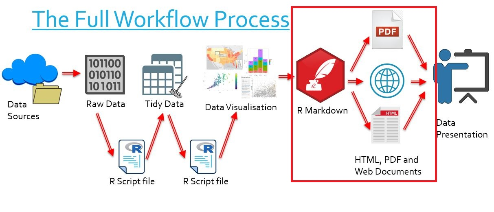 </img></center class="ImageBorder">
\  
<center>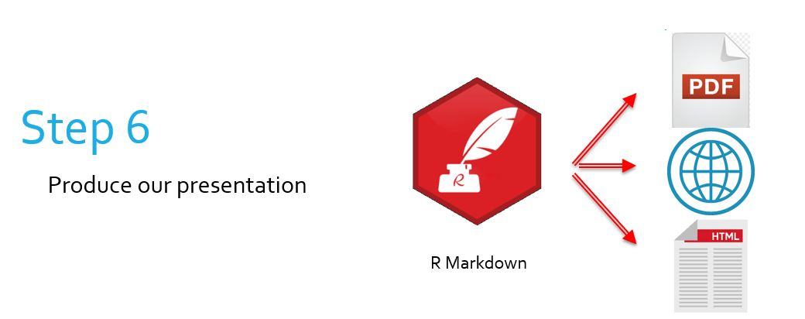 </img></center class="ImageBorder">

If one wants full flexibility when building a website, professional tools such as Adobe Dreamweaver are excellent, but they would deserve a whole course just for themselves. The advantage of Blogdown is that it allows the publishing of a nice looking website very easily and with minimal knowledge of website construction.


## What is a blog?

A blog is a type of website. Typically, blogs have a main page, or homepage, and then several sub-pages which can be found from the homepage. These sub-pages will be referred to as "posts" in this material. Below is an example of a blog - the [R-bloggers](https://www.r-bloggers.com/) homepage.

<center>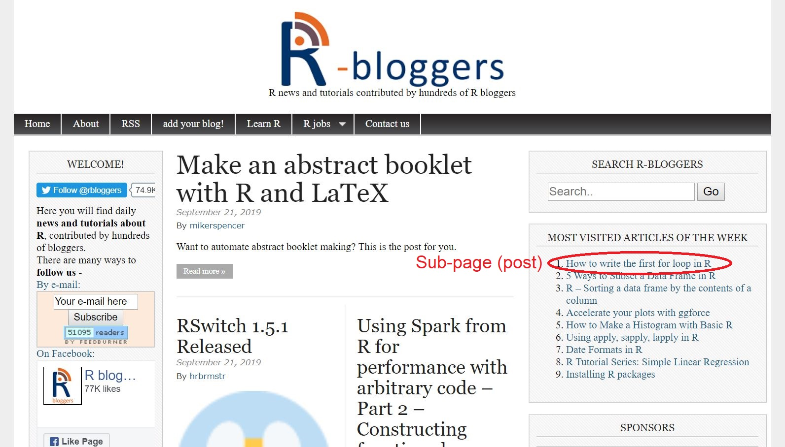 </img></center>

Conceptually, it is analogous to a personal journal/diary with a succession of entries. Major differences include:

- The entries are typically written to be shared with others, which is why they are called "posts"
- The entries can be categorised, potentially in a number of different (cross-sectional) ways
- Posts can include cross-links between themselves, and to other elements on the web.
- Posts can include interactive elements, such as htmlwidgets
- There is a homepage and interface, a "shell" for the posts, called a **theme**. It will typically include generic information, such as information about the author or the theme, links to the categories (if that functionality is used for the posts), etc... 

There are a number of different themes to choose from, with different functionalities and "look and feel". The great advantage of using Blogdown is that one does not need to create those themes; they are readily available (from Hugo - see below for details). They can be tweaked if one wished to do so, but it is generally unnecessary.

## What is Blogdown?

Blogdown is an R package launched in 2017, and comes with [it's own guide book](https://bookdown.org/yihui/blogdown/)! It was created and is currently being serviced by R Studio. It is particularly useful for its capabilities to interact with Hugo and create websites from R Studio.

- Hugo is a website generator ([their website can be found here](https://gohugo.io/))
- It allows us to create static websites
    - that is, websites with posts produced exactly as stored
    - Can contain .html, .css, images, text, JavaScript, etc

Blogdown calls upon the capabilities of Hugo so that we can generate and maintain websites from RStudio.

## Setting Up
> [R Blogdown 1.1](https://bookdown.org/yihui/blogdown/installation.html)

```{r install, eval=FALSE}
install.packages("blogdown")
blogdown::install_hugo()
```

- First we install Blogdown by typing the above into the R Studio terminal
- We **do not** have to `library()` Blogdown because it is used in a unique way
- We also call the `install_hugo()` Blogdown command to install Hugo automatically so we can use its capabilities

## How to use Blogdown (basic concepts)
> [R Blogdown 1.2](https://bookdown.org/yihui/blogdown/a-quick-example.html)

### The Default Website

Blogdown does not operate in the same way as many other packages.

- To get started working with Blogdown, we would open R Studio and create a new project with nothing in it 
- **Note:** "Website using blogdown" is one of the options when creating a new project from the File menu. *Do not use this option, but create a plain empty project instead.* The instructions below assume you are in an empty project - that was to make sure we know what happens in your R Studio when you follow the instructions. (the "Website using blogdown" choice includes pre-chosen options which may vary from one distribution of R Studio to another)
- We would then type the `blogdown::new_site()` command into the terminal
- **Note:** *the command will only execute in a completely empty project*. If your project is not completely empty, make a new one!

```{r howto, eval=FALSE}
blogdown::new_site()
```

This creates the 'default' website with the default theme, sample posts and default formatting. It is automatically made viewable in the 'Viewer' tab. Themes refer to the basic layout of our website. [Many can be viewed here](http://themes.gohugo.io). Below is an example of what a website built through Blogdown may look like. There are many other styles that look different, but fundamentally they are all constructed in similar ways.

<center>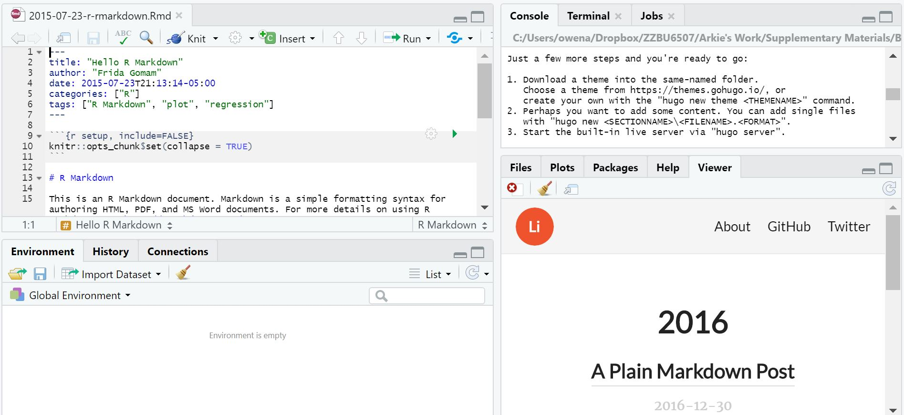 </img></center>

Also consider the files that were automatically created.

<center>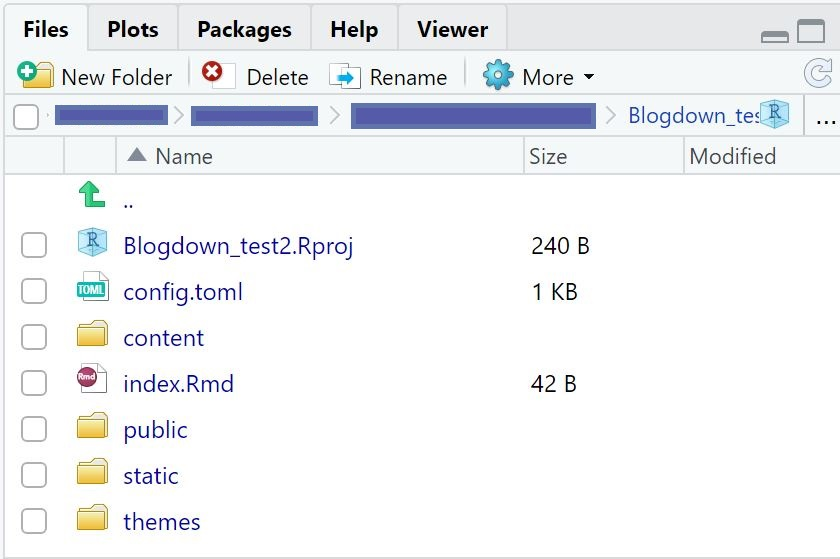 </img></center>

These are all necessary components of building websites with Blogdown. We will discuss the meaning of several of them soon. The files we do not discuss can be considered to be background work done by R, and their inner workings are unimportant for our basic purposes.

### LiveReload

This is a technology implemented in Blogdown we must be aware of. It automatically rebuilds and reloads websites we create when any source file of the website is modified and saved. This means we never need to explicitly rebuild our websites - LiveReload makes editing our websites very easy and smooth!

### Important Hugo Files

#### config.toml

<center>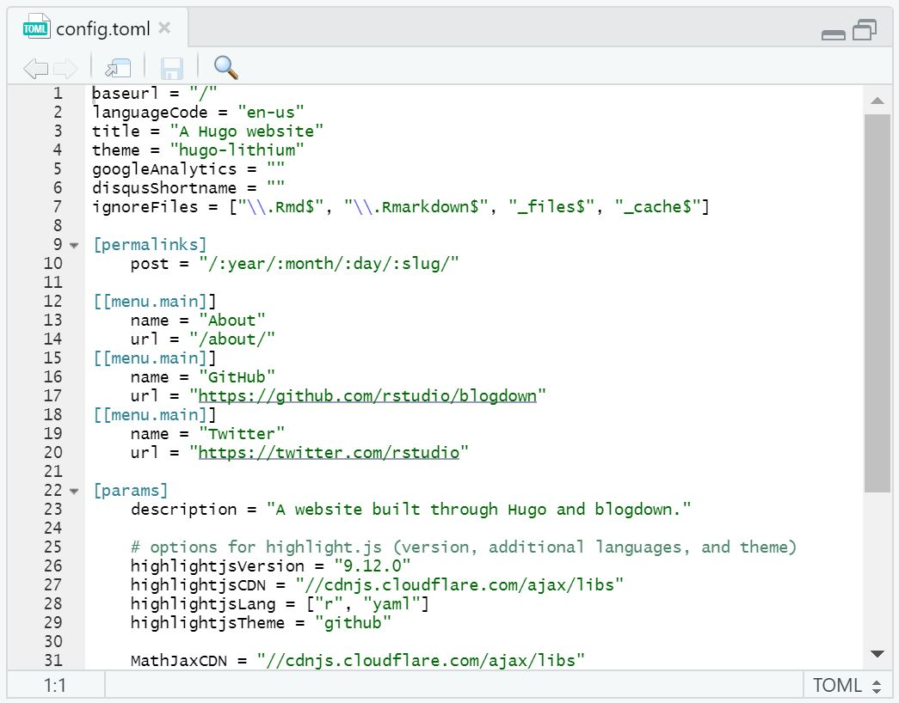 </img></center>

TOML is a configuration file format, and `config.toml` is a file which controls several aspects of our website, including:

- The title
- The theme
- Menu icons
- Menu urls

It can be opened in R Studio simply by clicking on the file in the 'Files' tab. Unless we understand TOML well, we can't understand most of this file. However, some sections, like `[[menu.main]]`, we can clearly pinpoint to a function and then modify as we like.
As an example, let's copy the format we observe to add another link to the menu of our website.

<center>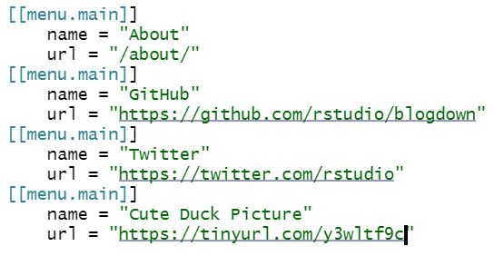 </img></center>

Now we save our file, and observe the changes. We have added a link, taking us to a picture of a duck, on our menu bar!

<center>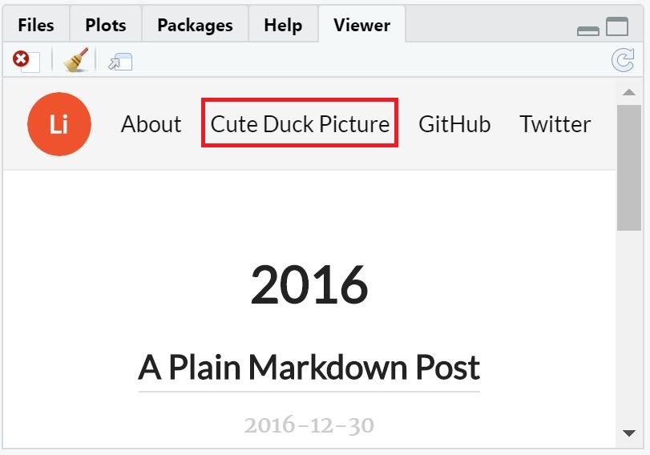 </img></center>

#### The `content` directory

This is a folder containing R Markdown source files. R Markdown is how we write the "pages" of our Blogdown website - each `.Rmd` file is its own page. We will learn how to modify each of them in time.

#### The publishing directory

By default this is the folder called `public/`. Our website is generated to this directory automatically, so there is no need to move files to and from the publishing directory manually. When we eventually upload our website, all the contents of this folder will be used. We are able to upload this directory for any web server supporting static websites. In other words, this folder *is* our website and it is what we need to upload and make available when we want to publish the website.

### Summary

We use Blogdown in R Studio so we have a familiar way of writing and formatting documents to become websites. Blogdown lets us communicate with Hugo so we can easily produce and reproduce static websites. We write R Markdown files which become our pages and these are put in the `content` directory. LiveReload automatically processes all our files into a publishing directory, generally called `public/`. We can then use the contents of that publishing directory to upload a website to the web.

## R Studio 'Addins' with Blogdown
>[R Blogdown 1.3](https://bookdown.org/yihui/blogdown/rstudio-ide.html)

### What is an 'addin'?

- Addins are processes performed by R Studio that are not installed in R Studio by default
- They can be found in a dropdown menu in the toolbar
- For Blogdown, they are very important to understand and use

<center>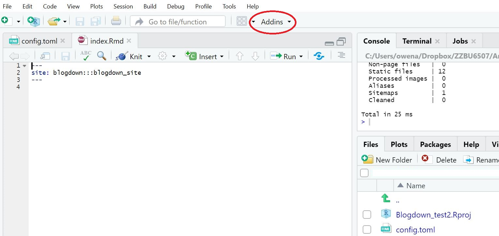 </img></center>
\  
<center>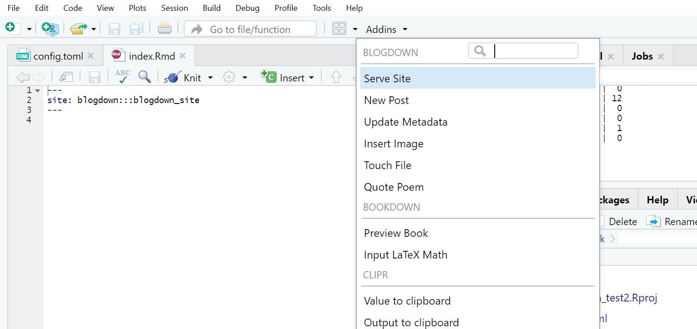 </img></center>

### The "Serve Site" addin

- This initialises an updated live preview of our website
- We can use it whenever our preview isn't loaded automatically
- The preview will update whenever we modify and save a source file

### The "New Post" addin

As soon as we use this button, we are presented with a dialogue box which will allow us to create a new post.

<center>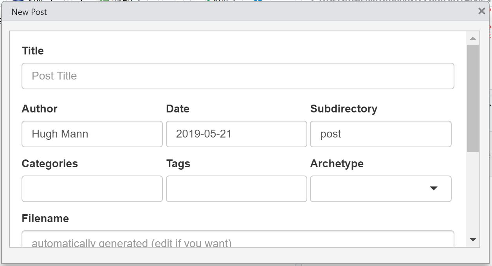 </img></center>

\  

- **We specify the title and author**
- **The date** will be today by default
- **The "Categories" and "Tags" section** allow us to add in descriptors of our posts
    - "Categories" are overall encompassing terms to describe the nature of a post, whereas "Tags" are terms used to give a sense of the content of the post, or 'buzz words' which the post discusses. The two categories often overlap.
    - For example, if I wrote a post about why I think ducks are adorable, I might use the categories "animals", "opinion", "ducks" and the tags "ducks", "cute", "fluffy" and "adorable".
- **The 'Archetype'** refers to what code will instantly run when we create a new post
    - This is beyond our needs, but [this handy post](https://alison.rbind.io/post/2019-02-19-hugo-archetypes/) is useful
- **The filename and slug** are both automatically generated but can be modified
    - The 'slug' refers to the last bit of the URL of our post when we open it on the web
    - For example, on the website `www.ducks.com`, if we go to the page at `www.ducks.com/quack`, the slug is 'quack' 
- **The format we select will be `.Rmd` for now**


### The "Update Metadata" addin

<center>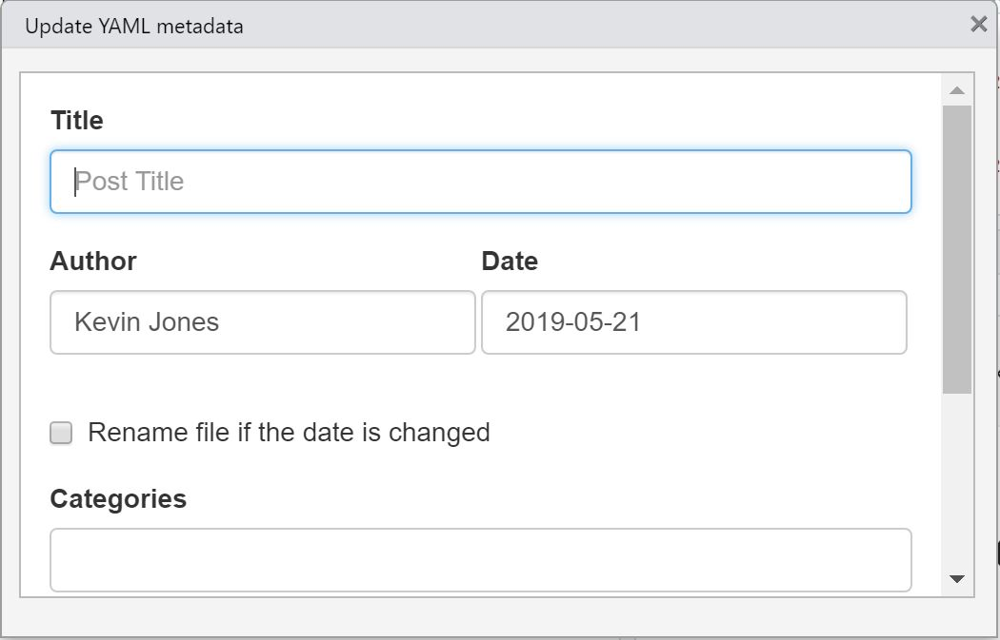 </img></center>

- This updates the metadata of the currently opened post
- In other words, it gives us the option to modify several of the above options *after* we've created a post

### The "Insert Image" addin

<center>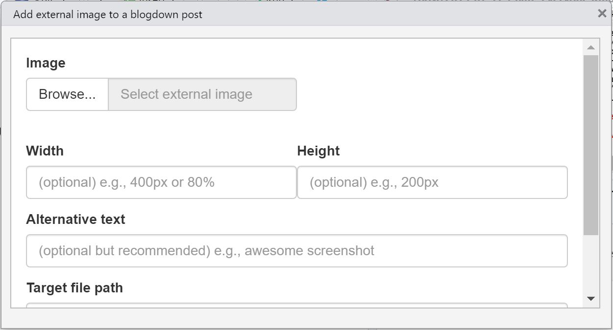 </img></center>

- This allows us to select an image from our computer and automatically embed it
- The addin lets us specify a height, width and caption

**Note**: if an error is encountered, images can be manually inserted the following way:

- Navigate to the subfolder of the project `content/post/`
- Create a new folder within this directory called `YYYY-MM-DD-name-of-post_files`, where the relevant information relates to your website's post
    - Don't forget the name of this folder must end in `_files`
- Move your image file to this directory
- In your `.Rmd` file, where the image is to be placed, type

```{r image, eval=FALSE}

```

## Global Options
> [R Blogdown 1.4](https://bookdown.org/yihui/blogdown/global-options.html)

- Global options are miscellaneous settings which affect how Blogdown works
- For our purposes it is convenient to set a few

```{r global_options1, eval=FALSE}
file.edit("~/.Rprofile")
```

This command opens a script containing our global options. We can use the `options()` command to modify the default author of any posts we create, and set the default extension of new posts by typing in the following and saving:

```{r global_options2, eval=FALSE}
options(blogdown.author = "Hugh Mann",
        blogdown.ext = ".Rmd")
```

For more global options, see [section 1.4 of the Blogdown book](https://bookdown.org/yihui/blogdown/global-options.html).

## A note on Markdown

- Markdown is similar to R Markdown
- It is another language used to format documents and text
- It cannot render or evaluate code chunks, and so it is not particularly useful to us
- This course focuses on R Markdown, however Blogdown is fully compatible with regular Markdown

# Publishing Websites
> [R Blogdown Chapter 3](https://bookdown.org/yihui/blogdown/deployment.html)

There are many services that allow us to publish static websites for free, including:

- [Netlify](https://www.netlify.com/)
- [Updog](https://updog.co)
- [GitHub Pages](https://pages.github.com)
- [Travis + GitHub](https://travis-ci.org)
- [GitLab Pages](http://gitlab.com)

All of the above are detailed in [Chapter 3 of the Blogdown book](https://bookdown.org/yihui/blogdown/deployment.html). This course will recommend methods with Netlify. The basic steps are:

- Update the website through R Studio
- Create a Netlify account
- In the section prompting "Drag and drop your site folder here", place the entire `public` file
- Netlify assigns us a random site name we may then change in "Site Settings"

There are also methods to connect a git repository to Netlify:

- On Netlify, select "New site from Git"
- Connect a GitHub, GitLab or BitBucket account to Netlify
- Select a folder to be made into a website

This method is more advanced, but allows for extremely easy updates to existing websites. For more information see [Chapter 3.1](https://bookdown.org/yihui/blogdown/netlify.html).

## Worked Example

Let's say we're interested in making a simple website about the environment. It will contain posts about environmental topics, and maybe even some R coding. Where do we begin?

### Creating a Website

First we pick a theme for the website. This will dictate the basic layout of the website.

- We can browse from many existing themes [at the Hugo themes website](http://themes.gohugo.io)
- Here we click on the "Paper" theme and get redirected to this page

<center>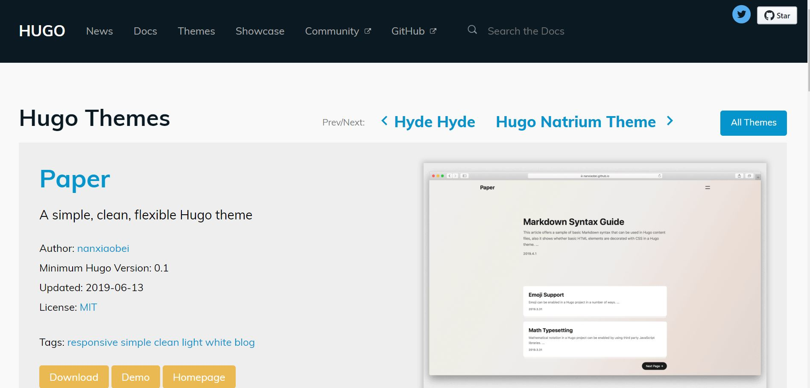 </img></center>

- If we click on the "Homepage" of the theme, we are directed to https://github.com/nanxiaobei/hugo-paper/
- **Take note of the slug of this page**, "nanxiaobei/hugo-paper", which is of the form "user/repo"
- This slug will be used to select our theme in R Studio

Now we create our website from R Studio.

- We create a new, empty project
    - Remember, it must be empty!
    
<center>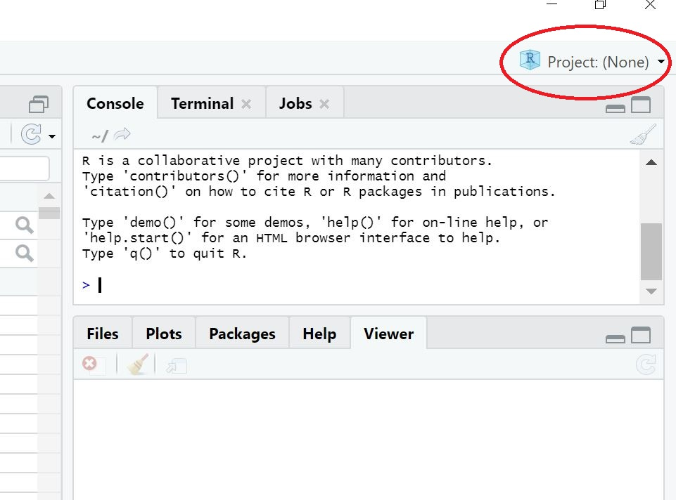 </img></center>
    
- We then go to the console and run `new_site()` to create a new Hugo site

```{r eg1, eval=FALSE}
blogdown::new_site(theme = 'nanxiaobei/hugo-paper')
```

- Notice we use the `theme` argument and the slug from our theme's homepage to instruct Blogdown to use the theme we desire

We now have a preview of our website as well as several new files in our directory.

<center>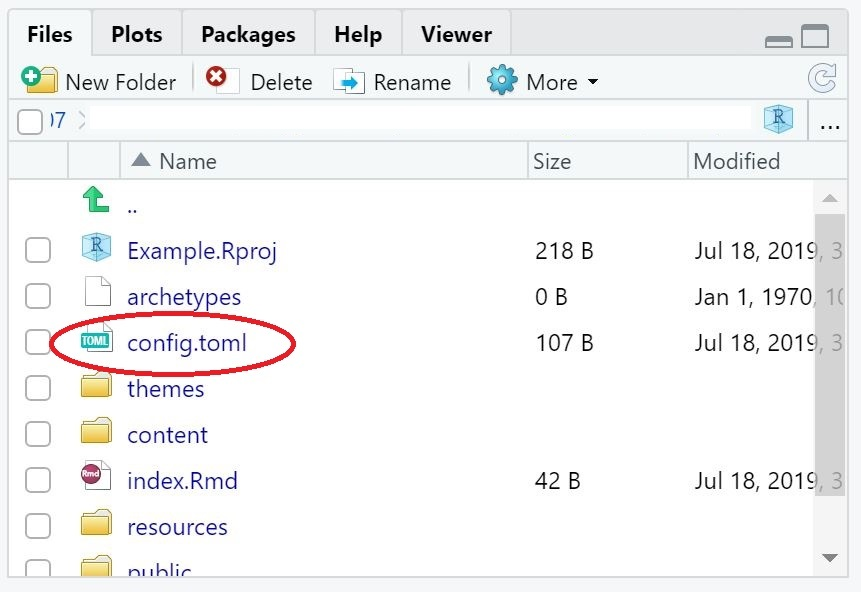 </img></center>

- It is a good idea to navigate to the `config.toml` file and modify any necessary fields
- Here we modify the title

<center> </img></center>
\  
<center>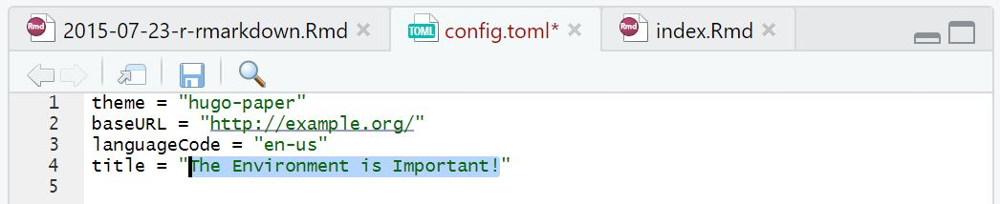 </img></center>

Our website has now been created!

### Editing a Website

- To edit a website, we begin by calling on the "Serve Site" addin
- Changes we make to our website will now automatically update on our screen

<center>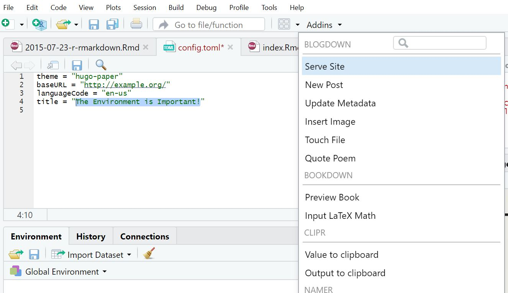 </img></center>

- To add a new post, we call on the "New Post" addin and fill in the relevant sections

<center> </img></center>

- We are then greeted with a `.Rmd` file, and we can fill it with content as we like

<center>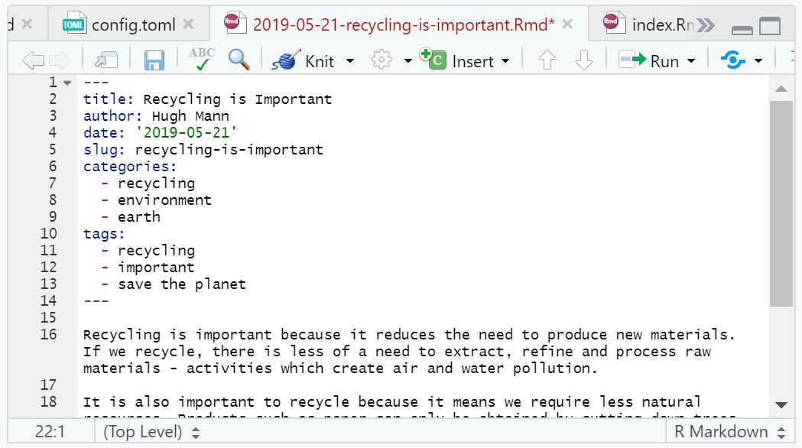 </img></center>

- Here we will also use the "Insert Image" addin to insert a picture

<center>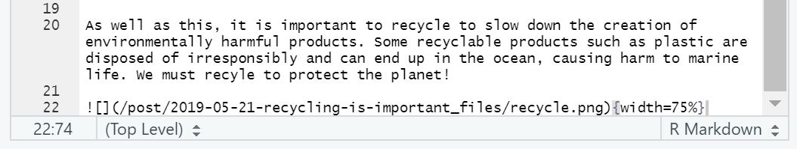 </img></center>

- When we hit save, we are automatically greeted with the updated version of our website
- We notice the default post is present, and we may not want this, but this is easily fixed by navigating to the `content` folder and deleting the relevent R Markdown file

<center>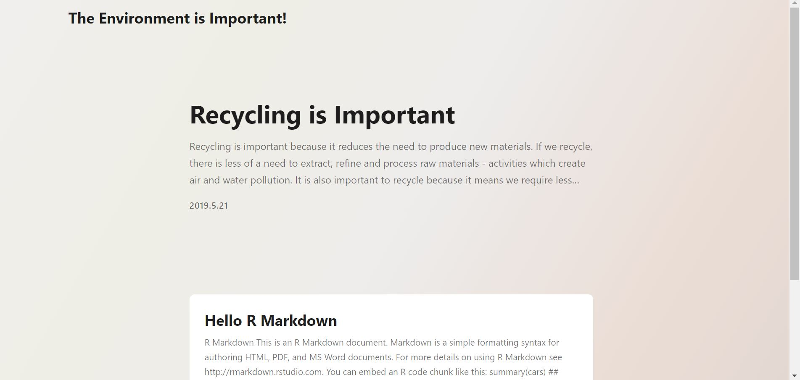 </img></center>

### Adding an htmlwidget

This isn't complicated, we just need to keep this in mind:

If we `load()` a `.rdata` object into a blog page, *the object must be in the `post` sub-folder of the `content` directory!* This means that if we wish to use `farm_data.rdata` to create an htmlwidget, we ***must*** have the data file in the same directory as the post.

In this example, we will use the `.rdata` file stored inside the folder `tidy_ABARES_data` for the new blog post `htmlwidget`. (Note this pre-supposes you have already created such a post, otherwise it won't appear in the directory and you won't know where to put your `.rdata` file)

<center>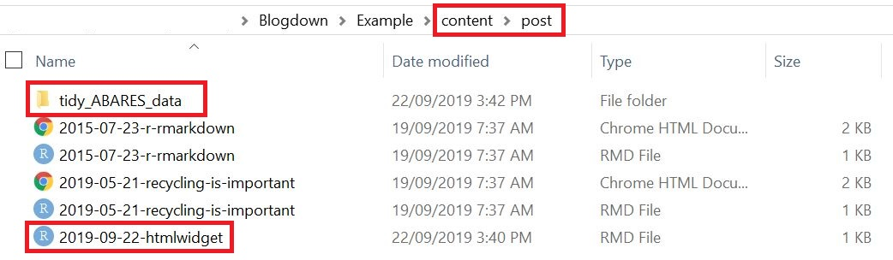 </img></center>

We open the post in which we wish to insert the htmlwidget. We then just create a code chunk containing it. (You may want to look for the directory provided along with the Rmd file to copy and paste the code.)

<center>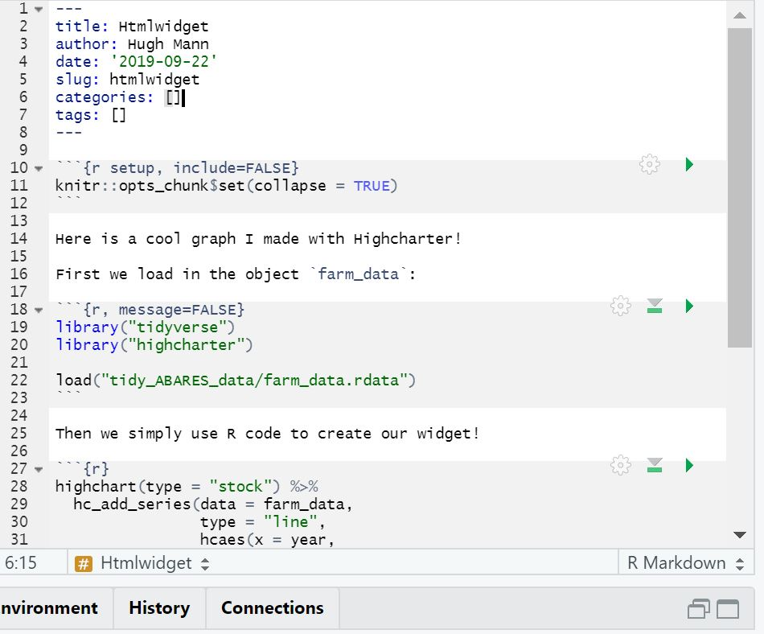 </img></center>
<center>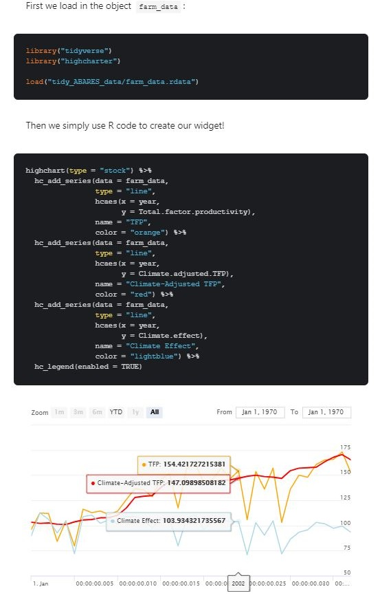 </img></center>
<div style="clear: both;">


### Publishing a Website

- We make sure all our files are saved
- We log in to our [Netlify](https://www.netlify.com) account
- We go to our project folder and drag the entire `public` directory onto Netlify

<center>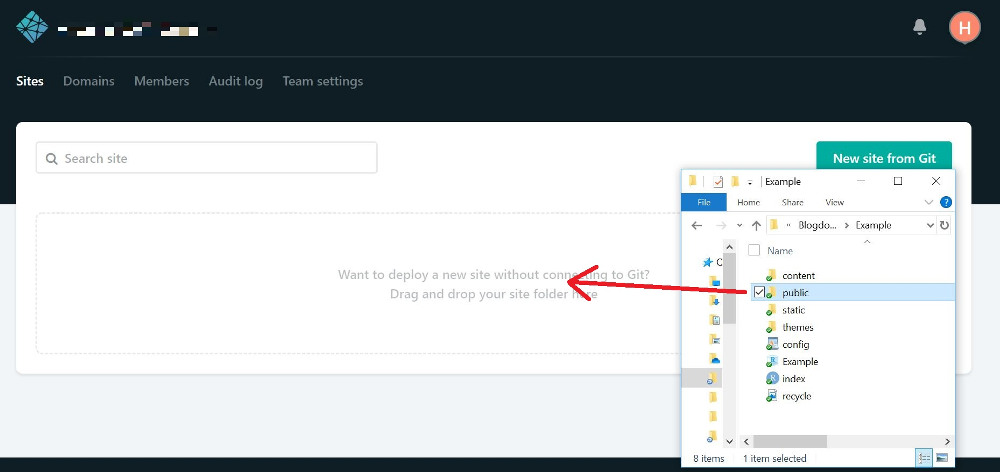 </img></center>

- After the loading has finished, we click on "Site Settings" and change our site name

<center>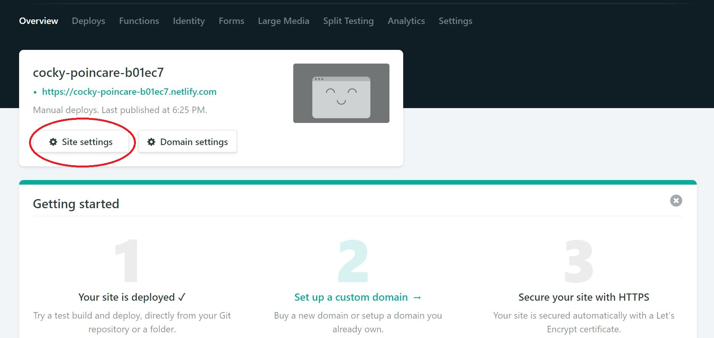 </img></center>
\  
<center>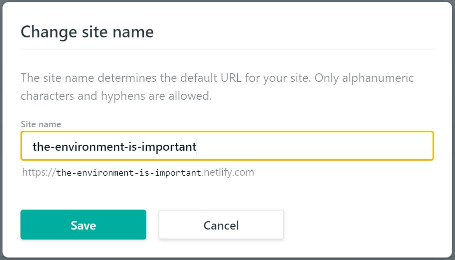 </img></center>

We're done, [and our website looks great](https://the-environment-is-important.netlify.com/)!

## Summary - The Blogdown Workflow Process
>[R Blogdown 1.7](https://bookdown.org/yihui/blogdown/workflow.html)

First we build a website:

- Create a new project
- Pick a new theme from [http://themes.gohugo.io](http://themes.gohugo.io)
- Run `blogdown::new_site(theme = 'user/repo')` in the console (where `user/repo` depends on the theme)
- Edit any options we wish in `config.toml`

Then we edit a website:

- Click "Serve Site" to view the site
- Click "New Post" to create a new post

Then we publish a website:

- Save all our files
- Log into Netlify
- Drag and drop our `public` folder
- Update the site name

## Extension - Advanced Custom Blogs

We have now covered enough to make basic Blogdown blogs. For a more comprehensive look at advanced Blogdown and customisation options, see [the Blogdown book](https://bookdown.org/yihui/blogdown/), specifically chapter 2. This is not required for the course!