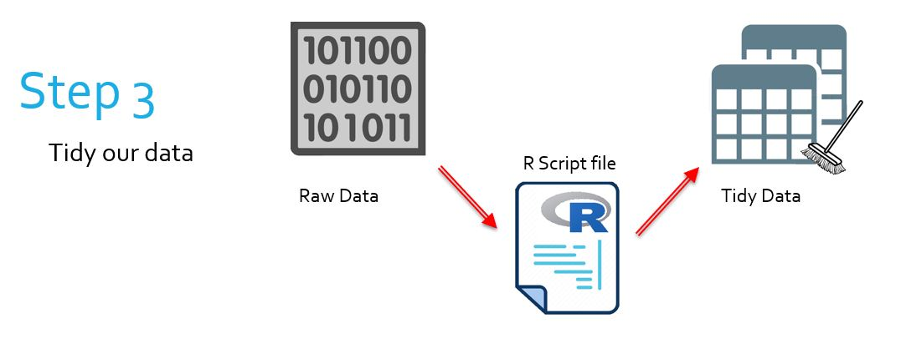

# The Tidyverse

## The Bigger Picture

In this document we learn how to manipulate data with the Tidyverse. Simply put, we are learning how to transform raw data into clean, easy-to-work-with tidy data. In the overall context of the workflow, this falls into the category of wrangling raw data into something more useable.

<center> </img></center>
\  
<center> </img></center>

`
There are references to LinkedIn Learning videos. These are complementary but not really required as the notes below are meant to be self-contained. Some students and staff would have access for free. Do not purchase access unless you are sure you don’t have access through your organisation already.
`

## What is the Tidyverse?
> [LinkedIn Learning 1.1 - 1.3](https://www.linkedin.com/learning/learning-the-r-tidyverse/what-is-the-tidyverse)


```r
library("tidyverse")
# Loads the tidyverse packages
```

- A series of R packages that can be used together
- The aim is to create data which is 'tidy'
- Uses
    - Formatting raw data in a more readable form
    - Preparing data for use with other packages
    - 'Wrangling' data (manipulating parts of datasets)
    - Visualising data with static graphs (ggplot2)
    
- Note: if you do not have the tidyverse (or any package described in these notes) installed, you can do so by running `install.packages("tidyverse")` in the R terminal
    
## Using the pipeline operator in the Tidyverse
> [LinkedIn Learning 3.1 - 3.3](https://www.linkedin.com/learning/learning-the-r-tidyverse/648985)

Some of you would be familiar with how young children tell a story: "she did that, and then he did that, and then she did that, and then he did that, etc etc". Well, the structure with `%>%` operators is exactly the same, and often makes the coding more natural when things are done sequentially.


```r
n <- c(4, 6, 5)
n %>%
  mean()
```

```
## [1] 5
```

- The above is the equivalent of mean(n)
- The `%>%` operator can be thought of as "and then".
- The operator takes the left hand side of it and 'forces' it into the first argument of the right hand side

But what if we don't want to force everything into the *first* argument? What if we want to force everything into another argument?

- We use a dot (`.`) where the argument we want goes


```r
n %>%
  mean() %>%
  replicate("HELLO", n = .)
```

```
## [1] "HELLO" "HELLO" "HELLO" "HELLO" "HELLO"
```

The above example is the equivalent of saying:


```r
temp <- n %>%
  mean()

replicate("HELLO", n = temp)
```

## Packages for reading data

Base R (R without any packages) comes with several functions designed for reading and writing files. However, we use packages to read files in a smarter way than base R.

### The 'readxl' package
> [LinkedIn Learning 4.2](https://www.linkedin.com/learning/learning-the-r-tidyverse/import-xlsx-files-with-readxl-in-r)

- A package which easily imports Excel data

```r
library("readxl")
# Note: readr comes with the Tidyverse but readxl must be loaded separately
alien_data <- read_csv("sample_data/alien_data.csv")
head(alien_data, 5)
```

```
## # A tibble: 5 x 4
##   name  colour height weight
##   <chr> <chr>   <dbl>  <dbl>
## 1 Alphy Red       184     20
## 2 Bordo Blue       29     13
## 3 Jango Red        43     23
## 4 Tommy Green      82     15
## 5 Zed   Red        80     21
```

```r
student_data <- read_csv("sample_data/student_data.csv")
head(student_data, 5)
```

```
## # A tibble: 5 x 4
##   name          gender test1 test2
##   <chr>         <chr>  <dbl> <dbl>
## 1 John Smith    m         23    47
## 2 Billy Fleck   m         21    52
## 3 Jenna Smith   f         30    38
## 4 Taylor Jones  f         21    42
## 5 Blake Johnson m         15    35
```

- The `read_csv()` and `read_xlsx` functions, among others, are very useful

### A caution for readxl

- `read_csv()` and `write_csv()` are two functions that readxl introduces to read and write csv files
- `read.csv()` and `write.csv()` are two functions built into base R to read and write csv files

The readxl functions are much smarter and faster when it comes to csv and xlsx manipulation with R. Don't be confused with the base R functions!

### The 'readr' package
> [LinkedIn Learning 4.3](https://www.linkedin.com/learning/learning-the-r-tidyverse/import-csv-files-with-readr-into-r)

- A package with superior file reading than base R
- Automatic conversion of dates, times, numbers, among other features
- Full command list found: https://cran.r-project.org/web/packages/readr/readr.pdf

```r
read_file("sample_data/secret_message.txt")
```

```
## [1] "R is a great language!"
```

## What are tibbles?
> [LinkedIn Learning 4.4](https://www.linkedin.com/learning/learning-the-r-tidyverse/is-it-a-data-frame-or-a-tibble)

That table we just saw was called "A tibble" by R.

- Tibbles are the standard tables of the Tidyverse
- They are like data.frames but better
- They store info about attributes of column data (such as their class)
- Appending data to tibbles is easy as they are designed to work with Tidyverse packages
- `as_tibble()` can be used to convert data.frames

## What is dplyr?

`dplyr` is one of the packages contained in the Tidyverse and is our main tool for manipulating data

- Uses the pipeline operator `%>%`
- The pipeline operator makes manipulating data easy to format
- `dplyr` contains many tools for selecting sub-sections of data
- `dplyr` contains many tools for modifying or providing interpretation of data
- `dplyr` can prepare data to be graphed more easily by other packages

### A note on using dplyr

- `dplyr` functions are to be used primarily with data tables
    - Includes data.frames and tibbles
- `dplyr` functions expect the first argument to be a table
- We typically use the functions by 'piping' data into them:

```r
alien_data %>%
  group_by(colour)
```

```
## # A tibble: 8 x 4
## # Groups:   colour [3]
##   name  colour height weight
##   <chr> <chr>   <dbl>  <dbl>
## 1 Alphy Red       184     20
## 2 Bordo Blue       29     13
## 3 Jango Red        43     23
## 4 Tommy Green      82     15
## 5 Zed   Red        80     21
## 6 Wobbo Blue       54     16
## 7 Tobbi Green      24     19
## 8 Grob  Red        26     26
```

- If we want to create a new table with our modifications complete, we simply assign it


```r
grouped_alien_data <- alien_data %>%
  group_by(colour)
```

### arrange()

- This function orders our data according to a variable


```r
alien_data %>%
  arrange(desc(height))
```

```
## # A tibble: 8 x 4
##   name  colour height weight
##   <chr> <chr>   <dbl>  <dbl>
## 1 Alphy Red       184     20
## 2 Tommy Green      82     15
## 3 Zed   Red        80     21
## 4 Wobbo Blue       54     16
## 5 Jango Red        43     23
## 6 Bordo Blue       29     13
## 7 Grob  Red        26     26
## 8 Tobbi Green      24     19
```

```r
student_data %>%
  arrange(name)
```

```
## # A tibble: 17 x 4
##    name            gender test1 test2
##    <chr>           <chr>  <dbl> <dbl>
##  1 Billy Fleck     m         21    52
##  2 Blake Johnson   m         15    35
##  3 Charlie Doorman f         27    43
##  4 Derek Corne     m         28    34
##  5 Gabby Nelson    f         30    36
##  6 Jack Smith      m         21    37
##  7 Jackie Ericson  f         24    38
##  8 Jenna Smith     f         30    38
##  9 Jeremy Lewis    m         23    26
## 10 Joanne Denny    f         33    35
## 11 John Douglas    m         24    34
## 12 John Smith      m         23    47
## 13 Maddy Jacobson  f         24    39
## 14 Marcel Dutch    m         22    36
## 15 Samuel Kant     m         29    46
## 16 Sean Blake      m         26    40
## 17 Taylor Jones    f         21    42
```

- In the above example, we see that `arrange()` can apply to character variables as well as numeric variables

### select()

> [LinkedIn Learning 4.5](https://www.linkedin.com/learning/learning-the-r-tidyverse/select-and-filter-data)

This function can be used to retrieve only certain columns of that data.


```r
alien_data
```

```
## # A tibble: 8 x 4
##   name  colour height weight
##   <chr> <chr>   <dbl>  <dbl>
## 1 Alphy Red       184     20
## 2 Bordo Blue       29     13
## 3 Jango Red        43     23
## 4 Tommy Green      82     15
## 5 Zed   Red        80     21
## 6 Wobbo Blue       54     16
## 7 Tobbi Green      24     19
## 8 Grob  Red        26     26
```

```r
alien_data %>%
  select(name, colour)
```

```
## # A tibble: 8 x 2
##   name  colour
##   <chr> <chr> 
## 1 Alphy Red   
## 2 Bordo Blue  
## 3 Jango Red   
## 4 Tommy Green 
## 5 Zed   Red   
## 6 Wobbo Blue  
## 7 Tobbi Green 
## 8 Grob  Red
```

We can specify with `select(-column)` to remove columns.


```r
alien_data %>%
  select(-height)
```

```
## # A tibble: 8 x 3
##   name  colour weight
##   <chr> <chr>   <dbl>
## 1 Alphy Red        20
## 2 Bordo Blue       13
## 3 Jango Red        23
## 4 Tommy Green      15
## 5 Zed   Red        21
## 6 Wobbo Blue       16
## 7 Tobbi Green      19
## 8 Grob  Red        26
```

We can specify filtering only columns with a given string in their name.


```r
alien_data %>%
  select(contains("eight"))
```

```
## # A tibble: 8 x 2
##   height weight
##    <dbl>  <dbl>
## 1    184     20
## 2     29     13
## 3     43     23
## 4     82     15
## 5     80     21
## 6     54     16
## 7     24     19
## 8     26     26
```

We can also use the `everything()` functon to select "everything else". This can be used to rearrange our data.


```r
alien_data %>%
  select(colour, everything())
```

```
## # A tibble: 8 x 4
##   colour name  height weight
##   <chr>  <chr>  <dbl>  <dbl>
## 1 Red    Alphy    184     20
## 2 Blue   Bordo     29     13
## 3 Red    Jango     43     23
## 4 Green  Tommy     82     15
## 5 Red    Zed       80     21
## 6 Blue   Wobbo     54     16
## 7 Green  Tobbi     24     19
## 8 Red    Grob      26     26
```

### filter()
> [LinkedIn Learning 4.5](https://www.linkedin.com/learning/learning-the-r-tidyverse/select-and-filter-data)

This function sifts through our data with a condition - we are left with only the data that satisfies this condition.


```r
alien_data %>%
  filter(height > 50)
```

```
## # A tibble: 4 x 4
##   name  colour height weight
##   <chr> <chr>   <dbl>  <dbl>
## 1 Alphy Red       184     20
## 2 Tommy Green      82     15
## 3 Zed   Red        80     21
## 4 Wobbo Blue       54     16
```

We can also have compound conditions using:

- The `&` (and) operator
- The '|' (or) operator
- Filter two or more times


```r
alien_data %>%
  filter(height > 50 & weight > 15)
```

```
## # A tibble: 3 x 4
##   name  colour height weight
##   <chr> <chr>   <dbl>  <dbl>
## 1 Alphy Red       184     20
## 2 Zed   Red        80     21
## 3 Wobbo Blue       54     16
```

```r
alien_data %>%
  filter(colour == "Blue") %>%
  filter(weight > 15)
```

```
## # A tibble: 1 x 4
##   name  colour height weight
##   <chr> <chr>   <dbl>  <dbl>
## 1 Wobbo Blue       54     16
```


### mutate()
> [LinkedIn Learning 4.6](https://www.linkedin.com/learning/learning-the-r-tidyverse/convert-strings-to-dates-with-mutate)

This function creates new columns based on a certain condition. It can also modify existing columns. To use it:

- Specify the name of the column to create
- Include an equals (`=`)
- Specify how we define this column


```r
student_data
```

```
## # A tibble: 17 x 4
##    name            gender test1 test2
##    <chr>           <chr>  <dbl> <dbl>
##  1 John Smith      m         23    47
##  2 Billy Fleck     m         21    52
##  3 Jenna Smith     f         30    38
##  4 Taylor Jones    f         21    42
##  5 Blake Johnson   m         15    35
##  6 Gabby Nelson    f         30    36
##  7 John Douglas    m         24    34
##  8 Samuel Kant     m         29    46
##  9 Derek Corne     m         28    34
## 10 Maddy Jacobson  f         24    39
## 11 Sean Blake      m         26    40
## 12 Jack Smith      m         21    37
## 13 Joanne Denny    f         33    35
## 14 Marcel Dutch    m         22    36
## 15 Jeremy Lewis    m         23    26
## 16 Charlie Doorman f         27    43
## 17 Jackie Ericson  f         24    38
```

```r
student_data %>%
  mutate(final_mark = test1 + test2)
```

```
## # A tibble: 17 x 5
##    name            gender test1 test2 final_mark
##    <chr>           <chr>  <dbl> <dbl>      <dbl>
##  1 John Smith      m         23    47         70
##  2 Billy Fleck     m         21    52         73
##  3 Jenna Smith     f         30    38         68
##  4 Taylor Jones    f         21    42         63
##  5 Blake Johnson   m         15    35         50
##  6 Gabby Nelson    f         30    36         66
##  7 John Douglas    m         24    34         58
##  8 Samuel Kant     m         29    46         75
##  9 Derek Corne     m         28    34         62
## 10 Maddy Jacobson  f         24    39         63
## 11 Sean Blake      m         26    40         66
## 12 Jack Smith      m         21    37         58
## 13 Joanne Denny    f         33    35         68
## 14 Marcel Dutch    m         22    36         58
## 15 Jeremy Lewis    m         23    26         49
## 16 Charlie Doorman f         27    43         70
## 17 Jackie Ericson  f         24    38         62
```

### separate()
> [LinkedIn Learning 4.7](https://www.linkedin.com/learning/learning-the-r-tidyverse/separating-columns-into-multiple-columns)

This function takes one column and splits it into more than one. It is especially useful when manipulating data which is rather unorganised, for example, data in `.txt` files without columns.

- First argument is the target column
- Second argument is a vector of column names to split it into
- Third argument is the separator by which to split the data
    

```r
student_data
```

```
## # A tibble: 17 x 4
##    name            gender test1 test2
##    <chr>           <chr>  <dbl> <dbl>
##  1 John Smith      m         23    47
##  2 Billy Fleck     m         21    52
##  3 Jenna Smith     f         30    38
##  4 Taylor Jones    f         21    42
##  5 Blake Johnson   m         15    35
##  6 Gabby Nelson    f         30    36
##  7 John Douglas    m         24    34
##  8 Samuel Kant     m         29    46
##  9 Derek Corne     m         28    34
## 10 Maddy Jacobson  f         24    39
## 11 Sean Blake      m         26    40
## 12 Jack Smith      m         21    37
## 13 Joanne Denny    f         33    35
## 14 Marcel Dutch    m         22    36
## 15 Jeremy Lewis    m         23    26
## 16 Charlie Doorman f         27    43
## 17 Jackie Ericson  f         24    38
```

```r
student_data %>%
  separate(name, c("First", "Last"), sep = " ")
```

```
## # A tibble: 17 x 5
##    First   Last     gender test1 test2
##    <chr>   <chr>    <chr>  <dbl> <dbl>
##  1 John    Smith    m         23    47
##  2 Billy   Fleck    m         21    52
##  3 Jenna   Smith    f         30    38
##  4 Taylor  Jones    f         21    42
##  5 Blake   Johnson  m         15    35
##  6 Gabby   Nelson   f         30    36
##  7 John    Douglas  m         24    34
##  8 Samuel  Kant     m         29    46
##  9 Derek   Corne    m         28    34
## 10 Maddy   Jacobson f         24    39
## 11 Sean    Blake    m         26    40
## 12 Jack    Smith    m         21    37
## 13 Joanne  Denny    f         33    35
## 14 Marcel  Dutch    m         22    36
## 15 Jeremy  Lewis    m         23    26
## 16 Charlie Doorman  f         27    43
## 17 Jackie  Ericson  f         24    38
```

### merge()

- This is a very powerful function
- merge() takes two data sets and combines them into one by using a common column


```r
alien_data
```

```
## # A tibble: 8 x 4
##   name  colour height weight
##   <chr> <chr>   <dbl>  <dbl>
## 1 Alphy Red       184     20
## 2 Bordo Blue       29     13
## 3 Jango Red        43     23
## 4 Tommy Green      82     15
## 5 Zed   Red        80     21
## 6 Wobbo Blue       54     16
## 7 Tobbi Green      24     19
## 8 Grob  Red        26     26
```

```r
alien_data2
```

```
## # A tibble: 8 x 2
##   name  `favourite food`
##   <chr> <chr>           
## 1 Alphy jelly beans     
## 2 Bordo cereal          
## 3 Jango hamburger       
## 4 Tommy spaghetti       
## 5 Zed   jelly beans     
## 6 Wobbo donuts          
## 7 Tobbi milkshake       
## 8 Grob  banana
```

```r
merge(alien_data, alien_data2, by = "name")
```

```
##    name colour height weight favourite food
## 1 Alphy    Red    184     20    jelly beans
## 2 Bordo   Blue     29     13         cereal
## 3  Grob    Red     26     26         banana
## 4 Jango    Red     43     23      hamburger
## 5 Tobbi  Green     24     19      milkshake
## 6 Tommy  Green     82     15      spaghetti
## 7 Wobbo   Blue     54     16         donuts
## 8   Zed    Red     80     21    jelly beans
```

Be very careful when merging, as all elements must be a perfect match in the "by" column!

## Data Sampling
> [LinkedIn Learning 5.1](https://www.linkedin.com/learning/learning-the-r-tidyverse/sample-data-and-cross-validation-with-dplyr)

- `sample_frac()` takes a proportion as its argument, and returns a subsection of our data containing a random proportion of the data
- `sample_n()` takes a number as its argument, and returns a subsection of our data containing that many random points from the data
- Both functions can take the optional argument `replace = FALSE` to allow for repeats

```r
student_data %>%
  sample_n(5)
```

```
## # A tibble: 5 x 4
##   name            gender test1 test2
##   <chr>           <chr>  <dbl> <dbl>
## 1 Derek Corne     m         28    34
## 2 Charlie Doorman f         27    43
## 3 Billy Fleck     m         21    52
## 4 Jack Smith      m         21    37
## 5 Blake Johnson   m         15    35
```

### group_by()
> [LinkedIn Learning 5.2, 5.3](https://www.linkedin.com/learning/learning-the-r-tidyverse/categorizing-data-with-group-by)

- `group_by()` is a very powerful function
- We can use it to create "groups" in a tibble

We can imagine that our data is like a school of students. We "group" our data by putting different students into different classes. The data doesn't change, but we can interact with each class separately. This makes it easy if we want to, for example, count the number of students in a class, or find out which class gets the highest marks.

When we are making groups:

- **Any operation we perform on the data will be done according to groups**
- Creating new groups overrides old groups
- `ungroup()' removes groups

How many aliens are there of each colour?


```r
colour_count <- alien_data %>%
  group_by(colour) %>%
  mutate(count = n()) %>%
  select(colour, count)

colour_count
```

```
## # A tibble: 8 x 2
## # Groups:   colour [3]
##   colour count
##   <chr>  <int>
## 1 Red        4
## 2 Blue       2
## 3 Red        4
## 4 Green      2
## 5 Red        4
## 6 Blue       2
## 7 Green      2
## 8 Red        4
```

**Note**: n() is a funtion with no arguments that counts the number of observations in a group.

- We have the correct counts per colour, but we are displaying too much information.
- The `unique()` function only includes unique data based on some variable
- Because we are grouped by colour, `unique()' will apply on the colour variable


```r
colour_count %>%
  unique()
```

```
## # A tibble: 3 x 2
## # Groups:   colour [3]
##   colour count
##   <chr>  <int>
## 1 Red        4
## 2 Blue       2
## 3 Green      2
```

Example: Did males or females perform better on their test? 
(Data was randomly generated!)


```r
student_data
```

```
## # A tibble: 17 x 4
##    name            gender test1 test2
##    <chr>           <chr>  <dbl> <dbl>
##  1 John Smith      m         23    47
##  2 Billy Fleck     m         21    52
##  3 Jenna Smith     f         30    38
##  4 Taylor Jones    f         21    42
##  5 Blake Johnson   m         15    35
##  6 Gabby Nelson    f         30    36
##  7 John Douglas    m         24    34
##  8 Samuel Kant     m         29    46
##  9 Derek Corne     m         28    34
## 10 Maddy Jacobson  f         24    39
## 11 Sean Blake      m         26    40
## 12 Jack Smith      m         21    37
## 13 Joanne Denny    f         33    35
## 14 Marcel Dutch    m         22    36
## 15 Jeremy Lewis    m         23    26
## 16 Charlie Doorman f         27    43
## 17 Jackie Ericson  f         24    38
```
We must:

- Add the final mark column
- Group data by gender
- Create (mutate) an average mark column according to gender
- Select the data we want


```r
student_data %>%
  mutate(final_mark = test1 + test2) %>%
  group_by(gender) %>%
  mutate(average_mark = sum(final_mark) / n()) %>%
  select(gender, average_mark) %>%
  unique()
```

```
## # A tibble: 2 x 2
## # Groups:   gender [2]
##   gender average_mark
##   <chr>         <dbl>
## 1 m              61.9
## 2 f              65.7
```
Note: sum() and n() apply by group -- this is why groups are so useful!

## Cumulative functions
> [LinkedIn Learning 5.4](https://www.linkedin.com/learning/learning-the-r-tidyverse/cumulative-sums-and-more-cumsum-cumall-and-cumany)

- Sometimes we need to add all the values of a certain data column up to current point
- Usually this takes the form of a running total with respect to time

### cumsum()

Provides the cumulative sum.


```r
music_data <- read_csv("sample_data/music_data.csv")
```

Introducing a new dataset - a student's log of daily practice.


```r
head(music_data, 5)
```

```
## # A tibble: 5 x 5
##   date      begin  end    hours description
##   <chr>     <time> <time> <dbl> <chr>      
## 1 1/06/2019 21:30  22:30    1   Mozart     
## 2 2/06/2019 10:00  11:00    1   Chopin     
## 3 2/06/2019 16:00  17:30    1.5 Mozart     
## 4 3/06/2019 10:00  11:00    1   Chopin     
## 5 4/06/2019 10:00  11:30    1.5 Beethoven
```

```r
music_data %>%
  mutate(running_total = cumsum(hours))
```

```
## # A tibble: 24 x 6
##    date      begin  end    hours description running_total
##    <chr>     <time> <time> <dbl> <chr>               <dbl>
##  1 1/06/2019 21:30  22:30    1   Mozart                1  
##  2 2/06/2019 10:00  11:00    1   Chopin                2  
##  3 2/06/2019 16:00  17:30    1.5 Mozart                3.5
##  4 3/06/2019 10:00  11:00    1   Chopin                4.5
##  5 4/06/2019 10:00  11:30    1.5 Beethoven             6  
##  6 4/06/2019 12:00  13:30    1.5 Mozart                7.5
##  7 4/06/2019 15:30  16:30    1   Chopin                8.5
##  8 5/06/2019 12:30  13:30    1   Chopin                9.5
##  9 5/06/2019 14:30  16:30    2   Chopin               11.5
## 10 5/06/2019 17:00  17:30    0.5 Mozart               12  
## # … with 14 more rows
```

- This provides us with a cumulative total hours practice after each practice session

**[Harder example]:** What if we want the daily total?

- Recall if we want the daily total we can use grouping and `unique()`


```r
daily_music_data <- music_data %>%
  # Establish date groups
  group_by(date) %>%
  # Find daily total by summing within the date groups
  mutate(daily_total = sum(hours)) %>%
  # Select just our date and daily total
  select(date, daily_total) %>%
  # unique() acts only on 'date' due to groups
  unique() %>%
  # ungroup() so other functions do not act on date groups
  ungroup()

daily_music_data
```

```
## # A tibble: 13 x 2
##    date       daily_total
##    <chr>            <dbl>
##  1 1/06/2019         1   
##  2 2/06/2019         2.5 
##  3 3/06/2019         1   
##  4 4/06/2019         4   
##  5 5/06/2019         3.5 
##  6 6/06/2019         1.5 
##  7 7/06/2019         4.5 
##  8 8/06/2019         0.75
##  9 9/06/2019         4.25
## 10 10/06/2019        1   
## 11 11/06/2019        5   
## 12 12/06/2019        1   
## 13 14/06/2019        0.5
```

```r
daily_music_data %>%
  # cumsum() now acts on the whole data, since we ungrouped
  mutate(running_total = cumsum(daily_total))
```

```
## # A tibble: 13 x 3
##    date       daily_total running_total
##    <chr>            <dbl>         <dbl>
##  1 1/06/2019         1              1  
##  2 2/06/2019         2.5            3.5
##  3 3/06/2019         1              4.5
##  4 4/06/2019         4              8.5
##  5 5/06/2019         3.5           12  
##  6 6/06/2019         1.5           13.5
##  7 7/06/2019         4.5           18  
##  8 8/06/2019         0.75          18.8
##  9 9/06/2019         4.25          23  
## 10 10/06/2019        1             24  
## 11 11/06/2019        5             29  
## 12 12/06/2019        1             30  
## 13 14/06/2019        0.5           30.5
```

### cummean()

- Provides the cumulative mean
- The cumulative mean is the average of all values up to and including that point
- In our practice example, the cumulative mean hours practiced will be an average of all *non-future* sessions at a given date


```r
daily_music_data %>%
  mutate(cumulative_mean = cummean(daily_total))
```

```
## # A tibble: 13 x 3
##    date       daily_total cumulative_mean
##    <chr>            <dbl>           <dbl>
##  1 1/06/2019         1               1   
##  2 2/06/2019         2.5             1.75
##  3 3/06/2019         1               1.5 
##  4 4/06/2019         4               2.12
##  5 5/06/2019         3.5             2.4 
##  6 6/06/2019         1.5             2.25
##  7 7/06/2019         4.5             2.57
##  8 8/06/2019         0.75            2.34
##  9 9/06/2019         4.25            2.56
## 10 10/06/2019        1               2.4 
## 11 11/06/2019        5               2.64
## 12 12/06/2019        1               2.5 
## 13 14/06/2019        0.5             2.35
```

### cumall() and cumany()

- Each function provides a different type of cumulation
- Each function takes its argument to be a logical expression
- Each function outputs a vector of logical values

### What's the difference?

- `cumall()` returns `TRUE` for every case until the first `FALSE`, then `FALSE` for all cases after
- `cumany()` returns `FALSE` for every case until the first `TRUE`, then `TRUE` for all cases after
- Both are typically combined with the `filter()` function for cumulation *before* or *after* a certain point in our data 

Let's say we want to select every practice session *before* the longest one:


```r
daily_music_data %>%
  mutate(is_before_longest = cumall(daily_total < max(daily_total)))
```

```
## # A tibble: 13 x 3
##    date       daily_total is_before_longest
##    <chr>            <dbl> <lgl>            
##  1 1/06/2019         1    TRUE             
##  2 2/06/2019         2.5  TRUE             
##  3 3/06/2019         1    TRUE             
##  4 4/06/2019         4    TRUE             
##  5 5/06/2019         3.5  TRUE             
##  6 6/06/2019         1.5  TRUE             
##  7 7/06/2019         4.5  TRUE             
##  8 8/06/2019         0.75 TRUE             
##  9 9/06/2019         4.25 TRUE             
## 10 10/06/2019        1    TRUE             
## 11 11/06/2019        5    FALSE            
## 12 12/06/2019        1    FALSE            
## 13 14/06/2019        0.5  FALSE
```

- We can see that on 11/06/19, our longest day, we fail the condition for the first time
- All logical values afterwards are `FALSE`


```r
daily_music_data %>%
  filter(cumall(daily_total < max(daily_total)))
```

```
## # A tibble: 10 x 2
##    date       daily_total
##    <chr>            <dbl>
##  1 1/06/2019         1   
##  2 2/06/2019         2.5 
##  3 3/06/2019         1   
##  4 4/06/2019         4   
##  5 5/06/2019         3.5 
##  6 6/06/2019         1.5 
##  7 7/06/2019         4.5 
##  8 8/06/2019         0.75
##  9 9/06/2019         4.25
## 10 10/06/2019        1
```

Let's say we want to select every practice session *after* the longest one

```r
daily_music_data %>%
  mutate(is_after_longest = cumany(daily_total == max(daily_total)))
```

```
## # A tibble: 13 x 3
##    date       daily_total is_after_longest
##    <chr>            <dbl> <lgl>           
##  1 1/06/2019         1    FALSE           
##  2 2/06/2019         2.5  FALSE           
##  3 3/06/2019         1    FALSE           
##  4 4/06/2019         4    FALSE           
##  5 5/06/2019         3.5  FALSE           
##  6 6/06/2019         1.5  FALSE           
##  7 7/06/2019         4.5  FALSE           
##  8 8/06/2019         0.75 FALSE           
##  9 9/06/2019         4.25 FALSE           
## 10 10/06/2019        1    FALSE           
## 11 11/06/2019        5    TRUE            
## 12 12/06/2019        1    TRUE            
## 13 14/06/2019        0.5  TRUE
```
- We can see that on 11/06/19, our longest day, we pass the condition for the first time
- All logical values afterwards are `TRUE`

```r
daily_music_data %>%
  filter(cumany(daily_total == max(daily_total)))
```

```
## # A tibble: 3 x 2
##   date       daily_total
##   <chr>            <dbl>
## 1 11/06/2019         5  
## 2 12/06/2019         1  
## 3 14/06/2019         0.5
```

## summarise()
> [LinkedIn Learning 5.5, 5.6](https://www.linkedin.com/learning/learning-the-r-tidyverse/create-group-summaries)

- This function is like a stronger version of `mutate()`
- We throw away all columns except those that are grouped
- We also add columns according to the argument of `summarise()`

Counting aliens by colour is something we have done previously with `group_by()`, then `mutate()`, then `select()`:


```r
alien_data %>%
  group_by(colour) %>%
  summarise(number = n())
```

```
## `summarise()` ungrouping output (override with `.groups` argument)
```

```
## # A tibble: 3 x 2
##   colour number
##   <chr>   <int>
## 1 Blue        2
## 2 Green       2
## 3 Red         4
```

### sumarise_all()

- This version of `summarise()` applies one summary function on every column variable
- Here we are given errors as there is no 'mean' of the name column

```r
student_data %>%
  summarise_all(mean)
```

```
## Warning in mean.default(name): argument is not numeric or logical: returning NA
```

```
## Warning in mean.default(gender): argument is not numeric or logical: returning
## NA
```

```
## # A tibble: 1 x 4
##    name gender test1 test2
##   <dbl>  <dbl> <dbl> <dbl>
## 1    NA     NA  24.8  38.7
```

### summarise_if()

- This version of `summarise()` gives us more precision, applying one summary function to certain column variables
- It takes a logical argument and only summarises variables which pass this logic

```r
student_data %>%
  summarise_if(is.numeric,
               mean)
```

```
## # A tibble: 1 x 2
##   test1 test2
##   <dbl> <dbl>
## 1  24.8  38.7
```

## recode()

- This funtion is like a key which is used to replace values with other values
- We first specify the vector to modify, then we give the replacement key

We can change the colour of aliens:

```r
alien_data$colour = recode(alien_data$colour,
                           "Red" = "Orange",
                           "Blue" = "Violet",
                           "Green" = "Brown")
alien_data
```

```
## # A tibble: 8 x 4
##   name  colour height weight
##   <chr> <chr>   <dbl>  <dbl>
## 1 Alphy Orange    184     20
## 2 Bordo Violet     29     13
## 3 Jango Orange     43     23
## 4 Tommy Brown      82     15
## 5 Zed   Orange     80     21
## 6 Wobbo Violet     54     16
## 7 Tobbi Brown      24     19
## 8 Grob  Orange     26     26
```

## Data Cleaning
### What is data cleaning?
> [LinkedIn Learning 4.1](https://www.linkedin.com/learning/learning-the-r-tidyverse/separate-raw-and-clean-data-folders)

- We now know enough about `dplyr` to perform some data cleaning
- Data cleaning is where we take some data that isn't formatted how we want, and format it how we want
- Generally the final result should be a tibble

### Take note

- This section will contain several new functions
- Often in R you will require a specific function you have never seen before
- Make use of online resources such as [Stack Overflow](https://stackoverflow.com/) to find solutions!


### Example - data cleaning with a messy file

> "Tidy datasets are all alike but every messy dataset is messy in its own way." --Hadley Wickham

When we clean data, we can make it extremely useful, however every data set must be cleaned in its own way. *There is no magic formula that will work every time, but the general ideas will usually be the same.*

- Here is a dataset containing the average yearly temperature as recorded by an Australian weather station over 100 years
- Data courtesy of the [Bureau of Meteorology](http://www.bom.gov.au/climate/change/datasets/datasets.shtml)


```r
station1 <- read.delim("bom_data/tmeanahq.002012.annual.txt")
head(station1, n = 5)
```

```
##   MEAN.TEMP..002012.19100101.20121231.missing_value.99999.9....HALLS.CREEK.AIRPORT
## 1                                                        19100101 19101231    26.4
## 2                                                        19110101 19111231    26.3
## 3                                                        19120101 19121231    26.0
## 4                                                        19130101 19131231    25.2
## 5                                                        19140101 19141231    25.8
```

- `read.delim()` is a base R function which reads data line by line and formats into a single column table
- If we look at this particular data, it is a .txt document, and so we will need extensive formatting to make it a readable tibble

The first column of the data is the start date or measurements, the second column is the end, and the third is the temperature data. For this task, let's assume we only need the year and the temperature stat.

First we'll use `read_delim()`, the improved version of `read.delim()` from the `readr` package to separate our data into columns.


```r
station1 <- read_delim("bom_data/tmeanahq.002012.annual.txt",
                       delim = " ")
head(station1, n = 5)
```

```
## # A tibble: 5 x 9
##     MEAN   TEMP ` 002012` `19100101` `20121231` `missing_value=… `   HALLS`
##    <dbl>  <dbl> <chr>     <chr>      <chr>      <chr>            <chr>     
## 1 1.91e7 1.91e7 "   26.4" <NA>       <NA>       <NA>             <NA>      
## 2 1.91e7 1.91e7 "   26.3" <NA>       <NA>       <NA>             <NA>      
## 3 1.91e7 1.91e7 "   26.0" <NA>       <NA>       <NA>             <NA>      
## 4 1.91e7 1.91e7 "   25.2" <NA>       <NA>       <NA>             <NA>      
## 5 1.91e7 1.91e7 "   25.8" <NA>       <NA>       <NA>             <NA>      
## # … with 2 more variables: CREEK <chr>, AIRPORT <chr>
```

We now have columns, but our data is still a mess.

- Our column names make no sense
- Our dates are formatted as numbers
- Our temperatures are formatted as characters
- Our station name is actually split across three separate columns

First we isolate location. Take note that `make.names()` is a function which improves the formatting of column names.


```r
colnames(station1) <- make.names(colnames(station1))
location_name = paste(colnames(station1)[7:length(colnames(station1))], collapse = ' ')
location_name
```

```
## [1] "X...HALLS CREEK AIRPORT"
```

```r
location_name = as.character(substring(location_name, 5))
location_name
```

```
## [1] "HALLS CREEK AIRPORT"
```

- length() returns the length of a string
- paste() concatenates strings
- We have asked the location_name variable to store the concatenation of all the column names of our data after the 6th column
- We have gone the extra mile to make this work for station names that are more or less than three words long - this is good coding practice!
- as.character() and substring() are used to tweak the name to remove the file's unsightly formating

Now we `mutate()` our location column and year column.


```r
station1 <- station1 %>%
  mutate(location = (location_name)) %>%
  mutate(year = substr(MEAN, start = 1, stop = 4))
  # Our year is just the first four characters in our misnamed start date column
station1
```

```
## # A tibble: 103 x 11
##      MEAN   TEMP X.002012 X19100101 X20121231 missing_value.9… X...HALLS CREEK
##     <dbl>  <dbl> <chr>    <chr>     <chr>     <chr>            <chr>     <chr>
##  1 1.91e7 1.91e7 "   26.… <NA>      <NA>      <NA>             <NA>      <NA> 
##  2 1.91e7 1.91e7 "   26.… <NA>      <NA>      <NA>             <NA>      <NA> 
##  3 1.91e7 1.91e7 "   26.… <NA>      <NA>      <NA>             <NA>      <NA> 
##  4 1.91e7 1.91e7 "   25.… <NA>      <NA>      <NA>             <NA>      <NA> 
##  5 1.91e7 1.91e7 "   25.… <NA>      <NA>      <NA>             <NA>      <NA> 
##  6 1.92e7 1.92e7 "   26.… <NA>      <NA>      <NA>             <NA>      <NA> 
##  7 1.92e7 1.92e7 "   26.… <NA>      <NA>      <NA>             <NA>      <NA> 
##  8 1.92e7 1.92e7 "   25.… <NA>      <NA>      <NA>             <NA>      <NA> 
##  9 1.92e7 1.92e7 "   25.… <NA>      <NA>      <NA>             <NA>      <NA> 
## 10 1.92e7 1.92e7 "   26.… <NA>      <NA>      <NA>             <NA>      <NA> 
## # … with 93 more rows, and 3 more variables: AIRPORT <chr>, location <chr>,
## #   year <chr>
```

- Let's also rename our temperature column from the string of numbers it currently is, and convert the data to numbers (not characters)


```r
colnames(station1)[3] <- "average.temp"
station1$average.temp <- as.numeric(station1$average.temp)
```
- Finally we `select()` to get only the data we want

```r
station1 <- station1 %>%
  select(year,
         average.temp,
         location)
station1
```

```
## # A tibble: 103 x 3
##    year  average.temp location           
##    <chr>        <dbl> <chr>              
##  1 1910          26.4 HALLS CREEK AIRPORT
##  2 1911          26.3 HALLS CREEK AIRPORT
##  3 1912          26   HALLS CREEK AIRPORT
##  4 1913          25.2 HALLS CREEK AIRPORT
##  5 1914          25.8 HALLS CREEK AIRPORT
##  6 1915          26.4 HALLS CREEK AIRPORT
##  7 1916          26.2 HALLS CREEK AIRPORT
##  8 1917          25.5 HALLS CREEK AIRPORT
##  9 1918          25.4 HALLS CREEK AIRPORT
## 10 1919          26   HALLS CREEK AIRPORT
## # … with 93 more rows
```

### Extra example -- one function to clean four files

- This isn't the only file we have that is formatted the same way - we have four files
    - "tmeanahq.002012.annual.txt"
    - "tmeanahq.003003.annual.txt"
    - "tmeanahq.003032.annual.txt"
    - "tmeanahq.004020.annual.txt"
- We wish to format them in the same way as above, so we write a function to do this
- The function uses steps identical to those given above, but takes its argument to be the name of the file


```r
clean_station_data <- function(FILE_NAME) {
  station <- read_delim(FILE_NAME, delim = " ")
  
  colnames(station) <- make.names(colnames(station))
  location_name = paste(colnames(station)[7:length(colnames(station))], collapse = ' ')
  location_name = as.character(substring(location_name, 5))
  
  station <- station %>%
    mutate(location = (location_name)) %>%
    mutate(year = substr(MEAN, start = 1, stop = 4))
  
  colnames(station)[3] <- "average.temp"
  station$average.temp <- as.numeric(station$average.temp)
  
  station <- station %>%
    filter(average.temp != 99999.9)
  # This was a line added according to the data's specification, that this value represents missing data
  
  station <- station %>%
  select(year,
         average.temp,
         location)
  
  return(station)
}
```

- We obtain a list of file names
- We then apply our function to all of these files and combine them into one table


```r
file_list <- list.files(pattern = "tmean*")
station_data <- bind_rows(lapply(file_list, clean_station_data))
# The lapply() function applied the specified function to every element of a specified list
# The bind_rows() function is provided by dplyr
head(station_data, n = 5)
```

```
## # A tibble: 5 x 3
##   year  average.temp location           
##   <chr>        <dbl> <chr>              
## 1 1910          26.4 HALLS CREEK AIRPORT
## 2 1911          26.3 HALLS CREEK AIRPORT
## 3 1912          26   HALLS CREEK AIRPORT
## 4 1913          25.2 HALLS CREEK AIRPORT
## 5 1914          25.8 HALLS CREEK AIRPORT
```

```r
tail(station_data, n = 5)
```

```
## # A tibble: 5 x 3
##   year  average.temp location           
##   <chr>        <dbl> <chr>              
## 1 1998          28.8 MARBLE BAR COMPARIS
## 2 1999          26.8 MARBLE BAR COMPARIS
## 3 2002          27.8 MARBLE BAR COMPARIS
## 4 2003          28   MARBLE BAR COMPARIS
## 5 2004          27.8 MARBLE BAR COMPARIS
```

The result is beautiful, tidy data! The process was long, and required the use of several niche functions. If you ever want to accomplish something with R, chances are there's a function that exists that you may not know about. Try searching the web for helpful functions to deal with difficult tasks like this one.

## A bonus!

[Here's a cheat sheet for working with the "Data Wrangling" components of the Tidyverse. Good luck!] (https://www.rstudio.com/wp-content/uploads/2015/02/data-wrangling-cheatsheet.pdf)
