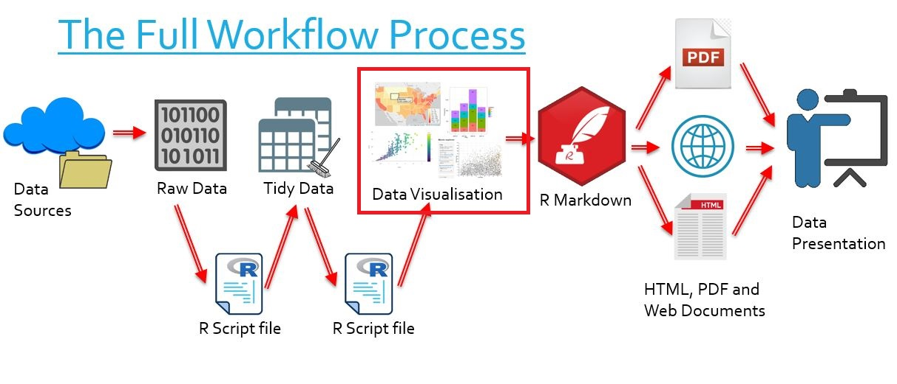

```{r setup, include=FALSE, message=FALSE}
knitr::opts_chunk$set(echo = TRUE,
                      warning = FALSE)
```

# Introduction to htmlwidgets

## The Bigger Picture

In this document we learn what htmlwidgets are. In the overall context of the workflow, this refers to the data visualisations we create from data and then put into our reports.

<center> </img></center>

`
There are references to LinkedIn Learning videos. These are complementary but not really required as the notes below are meant to be self-contained. Some students and staff would have access for free. Do not purchase access unless you are sure you don’t have access through your organisation already.
`

## HTML

### What is HTML?

- HTML stands for Hypertext Markup Language
- It is a markup language, which is a system for annotating and rendering documents
- HTML is the global standard for any document designed to be displayed in a web browser

### And why do we need it?

- We may be working in R, but R is a language which makes extensive use of other languages
- htmlwidgets are coded in R, but they are bound to JavaScript, and they are hosted by HTML elements!

## What are htmlwidgets?

> [htmlwidgets LinkedIn Learning 1.1 - 1.2](https://www.linkedin.com/learning/r-interactive-visualizations-with-htmlwidgets/what-are-htmlwidgets)

```{r library-htmlwidgets, echo = TRUE, message = FALSE}
library("leaflet")
library("plotly")
library("highcharter")
library("visNetwork")
library("DT")
# Loads five htmlwidget packages
```

- htmlwidget packages can be used to create htmlwidgets in R
- htmlwidgets are R objects which can be viewed in `RStudio`
- They are charts, graphs or maps and feature interactive elements

Here is an example htmlwidget made with Leaflet.

- You can zoom in and out on the map
- You can mouse over a point to see the name of the station
- You can click on the point to see its temperature

```{r example, include=TRUE, echo=FALSE, message=FALSE}

load("tidy_ACORN-SAT_data/station_data.rdata")


pal <- colorNumeric(
  palette = "YlOrRd",
  domain = station_data$average.temp)

station_graph <- station_data %>%
  filter(year == 2000) %>%
  leaflet() %>%
  addTiles() %>%
  addCircleMarkers(label = ~paste("Station: ", Station.name),
                   popup = ~paste0("Temperature: ", average.temp),
                   color = ~pal(average.temp),
                   lng = ~Longitude,
                   lat = ~Latitude)

widgetframe::frameWidget(station_graph)

```

They are also integratable with RMarkdown (see next section on producing media), meaning we can put them into documents we create. We can put interactive htmlwidgets into:

- Websites
- Ioslides, Beamer and Slidy slideshow presentations
- PowerPoint presentations (!)
    
We can put htmlwidgets into other media, but for these documents we lose interactivity:
    
- PDF
- Word
- PowerPoint presentations

Many htmlwidgets also feature compatibility with `Shiny`, which allows even more fully customiseable interactivity.

## Which htmlwidget should I use?

You will learn how to use a number of htmlwidgets this week. They all have different advantages and functionalities, and some overlap. 

For instance, Leaflet and Highcharter choropleths are just different looking. Both can be made to display roughly the same information, so it's just preference for appearance and style. Both have some advantages (e.g. for Leaflet you can use click information really easily, and for Highcharter you automatically have a little legend bar at the bottom).

As for other chart types, Plotly Leaflet Highcharter and ggplot all have their own subtleties, and it will be down to your personal preference. 

We usually work with ggplot for static charts and plotly for interactive ones because their relatively easy syntax and customiseability feels much easier, but if we were making something map-based I'd turn to Highcharter or Leaflet. Leaflet are best for scattergeo maps and Highcharter for choropleths.

In summary, here would be your first go-to packages:

- Static Scatterplots, bar graphs, line graphs, etc: `ggplot`
- Interactive Scatterplots, bar graphs, line graphs, etc: `plotly`
- Scattergeo plots: `Leaflet`
- Choropleths: `Highcharter`
- Graphs: `visNetwork`
- Tables: `DT`