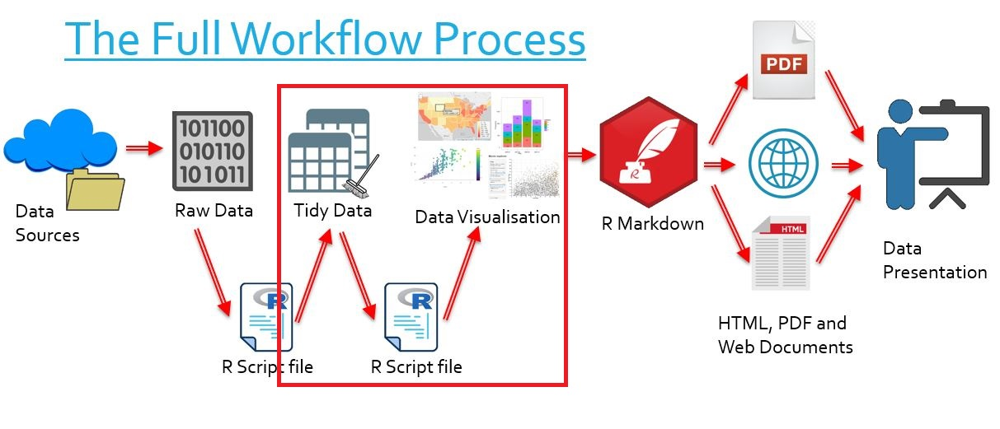

```{r setup, include=FALSE, message=TRUE}
knitr::opts_chunk$set(echo = TRUE,
                      warning = FALSE,
                      message = FALSE,
                      out.width = "100%")
```

# htmlwidgets - highcharter

## The Bigger Picture 

In this document we learn how to create interactive charts with Highcharter. Simply put, we are learning how to transform tidy data into visually clear graphs. In the overall context of the workflow, this falls into the category of transforming our data into data visualisation.

<center> </img></center>
\  
<center> </img></center>

`
There are references to LinkedIn Learning videos. These are complementary but not really required as the notes below are meant to be self-contained. Some students and staff would have access for free. Do not purchase access unless you are sure you don’t have access through your organisation already.
`

## What is Highcharter?

> [LinkedIn Learning 4.1](https://www.linkedin.com/learning/r-interactive-visualizations-with-htmlwidgets/what-is-the-highcharter-library)

```{r library-highcharter, echo = TRUE, message = FALSE}
library("tidyverse")
library("plotly")
library("highcharter")
```

- An htmlwidget used to make interactive graphs and charts of several types
    - Bar graphs and stacked bar graphs
    - Scatterplots and bubble charts
    - Interactive time series
    - Tree maps
    - Choropleths
    - And many more
- The package is specifically regarded for its effective presentation of time series
- The package is bound to the Highcharter library in JavaScript
- Highcharter heavily depends on the pipeline (`%>%`) operator to create charts

## Creating Bar Charts and Stacked Bar Charts
 
> [LinkedIn Learning 4.2](https://www.linkedin.com/learning/r-interactive-visualizations-with-htmlwidgets/create-interactive-stacked-bar-charts)

For our examples we will use the same data from the [Australian Environmental-Economic Accounts (2016)](https://www.abs.gov.au/AUSSTATS/abs@.nsf/Lookup/4655.0Explanatory%20Notes12016?OpenDocument), now including data from 2008-2014. The data relates to water consumption by state.

```{r bar1}
load(file = "tidy_EnvAcc_data/consumption.rdata")
consumption
```

- We begin by piping our data into a function, `hchart()`
- This function is how we inform Highcharter that we wish to create a visualisation
- The `type` argument specifies the type of visualisation we wish to create
- Here we specify "bar" for a bar chart

```{r bar2}
consumption %>%
  hchart(type = "bar")
```

- Currently the chart is completely empty, since we have not specifies any "aesthetics"
- In other words, we haven't told Highcharter what we wish to plot
- For the second argument of `hchart()`, we use the function `hcaes()` (highcharter aesthetics)
- This sub-function itself takes several arguments
    - We first consider `x` and `y` for the x-axis and y-axis variables respectively
    
```{r bar3}
consumption %>%
  group_by(year) %>%
  mutate(consumption_total = sum(water_consumption)) %>%
  hchart(type = "bar",
         hcaes(x = year,
               y = consumption_total))
```

Hover over the bar chart to see its interactivity!
\  

Also consider the `color` argument of `hchart()` which can be used to set custom colours.

```{r bar4}
consumption %>%
  group_by(year) %>%
  mutate(consumption_total = sum(water_consumption)) %>%
  hchart(type = "bar",
         hcaes(x = year,
               y = consumption_total),
         color = "red")
```

### Grouped Bar Charts

- We can instead create a grouped bar chart by using the `group` argument of `hcaes()`
- This determines a variable we can use to split our data
- We see that we have split the long columns into several shorter ones by category

```{r bar5}
consumption %>%
  group_by(year) %>%
  mutate(consumption_total = sum(water_consumption)) %>%
  ungroup() %>%
  hchart(type = "bar",
         hcaes(x = year,
               y = water_consumption,
               group = State))
```

### Stacked Bar Charts

- We can also create stacked bar charts
- This requires piping our chart into the `hc_plotOptions()` function
- This new function can take many arguments (see [here](https://www.rdocumentation.org/packages/highcharter/versions/0.7.0/topics/hc_plotOptions))
- Here we use the `bar` argument, which takes a list of sub-arguments as its value
- We'll use the `stacking` sub-argument for our purposes

We can set it to "stack" for a regular stacked bar chart...

```{r bar6}
consumption %>%
  group_by(year) %>%
  mutate(consumption_total = sum(water_consumption)) %>%
  ungroup() %>%
  hchart(type = "bar",
         hcaes(x = year,
               y = water_consumption,
               group = State)) %>%
  hc_plotOptions(bar = list(stacking = "stack"))
```

...or "percent" for a percentage breakdown!

```{r bar7}
consumption %>%
  group_by(year) %>%
  mutate(consumption_total = sum(water_consumption)) %>%
  ungroup() %>%
  hchart(type = "bar",
         hcaes(x = year,
               y = water_consumption,
               group = State)) %>%
  hc_plotOptions(bar = list(stacking = "percent"))
```

Also note that vertical bar charts are just column charts, so to convert between the charts we simply change "bar" to "column" where relevant:

```{r bar8}
consumption %>%
  group_by(year) %>%
  mutate(consumption_total = sum(water_consumption)) %>%
  ungroup() %>%
  hchart(type = "column",
         hcaes(x = year,
               y = water_consumption,
               group = State)) %>%
  hc_plotOptions(column = list(stacking = "percent"))
```

Lastly, be aware that the `color` argument can be vectorised for custom colours, including [HTML code colours](https://htmlcolorcodes.com/color-picker/)!

```{r bar9}
consumption %>%
  group_by(year) %>%
  mutate(consumption_total = sum(water_consumption)) %>%
  ungroup() %>%
  hchart(type = "column",
         hcaes(x = year,
               y = water_consumption,
               group = State),
         color = c("gold", "blue", "pink", "orange", "green", "purple", "red", "violet")) %>%
  hc_plotOptions(column = list(stacking = "percent"))
```

## Changing Hover Info - hc_tooltip()
> [LinkedIn Learning 4.8](https://www.linkedin.com/learning/r-interactive-visualizations-with-htmlwidgets/modify-tooltips-in-highcharter)

- The `hc_tooltip()` function changes the information displayed when we mouse over our visualisation
- We pipe our chart into this function
- Some useful arguments:

| Argument | Possible values | Function |
|:-|:-:|:-:|
| `valueDecimals` | A number | Changes the number of decimal places to which our data displays |
| `valueSuffix` | Any string | Adds the specified string as a suffix to the data |
| `shared` | `TRUE` or `FALSE` | Specifies whether the hover data is for all bars or just the one we mouse over |

Consider how each of the following arguments have modified our mouse-over display:

```{r tooltip1}
consumption %>%
  group_by(year) %>%
  mutate(consumption_total = sum(water_consumption)) %>%
  ungroup() %>%
  hchart(type = "bar",
         hcaes(x = year,
               y = water_consumption,
               group = State)) %>%
  hc_plotOptions(bar = list(stacking = "percent")) %>%
  hc_tooltip(valueDecimals = 2,
             valueSuffix = "GL",
             shared = TRUE)
```

## Scatter, Line and Bubble Charts
> [LinkedIn Learning 4.3](https://www.linkedin.com/learning/r-interactive-visualizations-with-htmlwidgets/create-interactive-scatter-charts-and-bubble-charts)

For our examples we will use data from the ABARES Agricultural Census of 2015-2016. The data relates to the average climate-adjusted productivity of all cropping farms between 1977 and 2015.

```{r lsb1}
load("tidy_ABARES_data/farm_data.rdata")
head(farm_data, 5)
```

To create a scatter chart requires a similar method to the bar chart.

- In the `hchart()` function, we set the `type` to "scatter"
- We specify the `hcaes()` arguments `x` and `y` for the data we wish to plot

```{r scatter1}
farm_data %>%
  hchart(type = "scatter",
         hcaes(x = Climate.effect,
               y = Total.factor.productivity))
```

We may also use the `color` argument of `hcaes()` to colour our points by some variable

```{r scatter2}
farm_data %>%
  hchart(type = "scatter",
         hcaes(x = Climate.effect,
               y = Total.factor.productivity,
               color = Climate.adjusted.TFP)) 
```

For line charts, we use the `type` of "line"

```{r line1}
farm_data %>%
  hchart(type = "line",
         hcaes(x = year,
               y = Climate.adjusted.TFP))
```

- If we wish to toggle the display of the markers, we use the `marker` argument of `hcaes()`
- This argument takes a list of sub-arguments
- We toggle the `enabled` sub-argument to `TRUE` or `FALSE`

```{r line2}
farm_data %>%
  hchart(type = "line",
         hcaes(x = year,
               y = Climate.adjusted.TFP),
         marker = list(enabled = FALSE))
```

For bubble charts, we use the `type` of "bubble". The argument `size` of `hcaes()` is used to determine which variable influences the size of the bubble.

```{r bubble1}
farm_data %>%
  hchart(type = "bubble",
         hcaes(x = Climate.effect,
               y = Total.factor.productivity,
               size = Climate.adjusted.TFP))
```

We can also re-scale all the bubble sizes as we like:

- Pipe the chart into the `hc_plotOptions()` function
- We use the `bubble` argument of this function
- The argument takes a list as its value
- We set the `maxSize` sub-argument of this list to be a percentage, for example "10%"
    - This percentage represents the maximum size of a bubble relative to chart size
    
```{r bubble2}
farm_data %>%
  hchart(type = "bubble",
         hcaes(x = Climate.effect,
               y = Total.factor.productivity,
               size = Climate.adjusted.TFP)) %>%
  hc_plotOptions(bubble = list(maxSize = "10%"))
```

### A Note on Scaling the Axes

- If we want say a logarithmic axis, we use the `hc_xAxis()` or `hc_yAxis()` funcitons
- The `type` argument can be set to "logarithmic"

```{r axisScale}
x0 = seq(1, 10, 0.1)
y0 = log(x0)
dataXY = cbind(x0,y0)

as_tibble(dataXY) %>%
  hchart(type = "scatter",
         hcaes(x = x0,
               y = y0))

as_tibble(dataXY) %>%
  hchart(type = "scatter",
         hcaes(x = x0,
               y = y0)) %>%
  hc_xAxis(type = "logarithmic")
```

## Interactive Time Series Charts
> [LinkedIn Learning 4.4](https://www.linkedin.com/learning/r-interactive-visualizations-with-htmlwidgets/create-interactive-time-series)

In this section we introduce a new function, `highchart()`:

- The function is similar to `hchart()`
- However, we don't pipe our data into this function
- Instead we pipe this function into other 'adding' functions which use our data

To create an interactive time series:

- We begin with the `highchart()` function, with the `type` argument of "stock"
- This is our chart format
- We then pipe this into the `hc_add_series()` function
- This function uses the first argument `data`, which we set to be our data
- The function also requires a `type`, which can be "point" or "line"
- We must also specify the `hcaes()` argument to instruct the function which variables to plot

```{r timeseries1}
highchart(type = "stock") %>%
  hc_add_series(data = farm_data,
                type = "line",
                hcaes(x = year,
                      y = Total.factor.productivity))
```

We have a highly interactive time series plot, including various zoom settings, and a scroll to select particular portions of the graph for viewing.

We can additionally plot multiple time series variables on the same graph. This is done simply by piping another `hc_add_series()` function into the mix.

```{r timeseries2}
highchart(type = "stock") %>%
  hc_add_series(data = farm_data,
                type = "line",
                hcaes(x = year,
                      y = Total.factor.productivity)) %>%
  hc_add_series(data = farm_data,
                type = "line",
                hcaes(x = year,
                      y = Climate.adjusted.TFP)) %>%
  hc_add_series(data = farm_data,
                type = "line",
                hcaes(x = year,
                      y = Climate.effect))
```

There is no legend to distinguish the different curves, but we can add one with the `hc_legend()` function and by setting `enabled` to `TRUE`.

```{r timeseries3}
highchart(type = "stock") %>%
  hc_add_series(data = farm_data,
                type = "line",
                hcaes(x = year,
                      y = Total.factor.productivity)) %>%
  hc_add_series(data = farm_data,
                type = "line",
                hcaes(x = year,
                      y = Climate.adjusted.TFP)) %>%
  hc_add_series(data = farm_data,
                type = "line",
                hcaes(x = year,
                      y = Climate.effect)) %>%
  hc_legend(enabled = TRUE)
```

However the series labels are generic and the colours are distasteful! We can fix this using the `name` argument of `hc_add_series()`, which names the series (and hence the legend). We can also specify custom colours. Overall our chart becomes much nicer.

```{r}
highchart(type = "stock") %>%
  hc_add_series(data = farm_data,
                type = "line",
                hcaes(x = year,
                      y = Total.factor.productivity),
                name = "TFP",
                color = "orange") %>%
  hc_add_series(data = farm_data,
                type = "line",
                hcaes(x = year,
                      y = Climate.adjusted.TFP),
                name = "Climate-Adjusted TFP",
                color = "red") %>%
  hc_add_series(data = farm_data,
                type = "line",
                hcaes(x = year,
                      y = Climate.effect),
                name = "Climate Effect",
                color = "lightblue") %>%
  hc_legend(enabled = TRUE)
```

## Treemaps
> [LinkedIn Learning 4.5](https://www.linkedin.com/learning/r-interactive-visualizations-with-htmlwidgets/create-interactive-treemaps)

Treemaps are used to visualise the comparative sizes of a single quantative variable among observation. For example, if we wish to see which Australian state consumed what amount of water from 2013-14, we might use a treemap for comparison.

- We first pipe the data into `hchart()` as usual
- We set the `type` to "treemap"
- We also use the special arguments of `hcaes()`, `name` for the observation and `size` for the quantative variable

```{r treemap1}
consumption %>%
  filter(year == "2013–14") %>%
  hchart(type = "treemap",
         hcaes(name = State,
               value = water_consumption))
```
  
We may set colours according to a variable:

- First we introduce the `colorValue` argument of `hcaes()` and set this to be the variable to colour by
- We must then pipe our entire chart into the `hc_colorAxis()` function
- This takes a `minColor` and `maxColor` argument

```{r treemap2}
consumption %>%
  filter(year == "2013–14") %>%
  hchart(type = "treemap",
         hcaes(name = State,
               value = water_consumption,
               colorValue = water_consumption)) %>%
  hc_colorAxis(minColor = "lightblue",
               maxColor = "darkblue")
```

**Note**: here we use various words for blue, but we may also use [HTML colour codes](https://htmlcolorcodes.com/color-picker/) such as "#000EFF".

## Interactive Choropleths
> [LinkedIn Learning 4.6](https://www.linkedin.com/learning/r-interactive-visualizations-with-htmlwidgets/create-interactive-choropleth-maps)

- A choropleth is a map-based chart in which regions are shaded with colours to reflect some variable
- Creating choropleths with Highcharter requires us to manipulate 'shapefiles'
- These are files which contain information about points, lines, polygons (etc) necessary to visually depict shapes, such as countries of the world
- Before we can create a choropleth, we must learn how to prepare these shape files

\  

There are two types of shapefiles
- ESRI shapefiles - the older standard for shapefiles
    - To use them we must have (at least) one of all of the below:
    - A `.dbf` file
    - A `.shp` file
    - A `.shx` file
- GeoJson shapefiles - a newer type
    - To use them we only require one `.json` file


A good sources of global shapefiles are [NaturalEarthData.com](http://www.naturalearthdata.com/downloads/) and [Johan's repository](https://gitgub.com/johan/world.geo.json)

**Note that for Highcharter, our process requires that we convert our shapefiles to GeoJson. We now do an example of this.**

To prepare these shapefiles we require the library "`sf`".

- We call upon `read_sf()` to read an entire directory of shapefiles and save the result
- For our example we will use an Australian shapefile released by the [Australian Government](http://data.daff.gov.au/anrdl/metadata_files/pa_nsaasr9nnd_02211a04.xml)


```{r shapefiles1}
library("sf")
shapefile_map <- read_sf(dsn = "shapefiles")
# Note: for file path, do not include a '/' at the end
class(shapefile_map)
```

We have our shapes - we will mutate our shape data so that they are named by state.

```{r shapefiles2}
shapefile_map$State <- c("NSW", "VIC", "QLD", "SA", "WA", "TAS", "NT", "ACT")
```

We then use the `geojsonio` library to convert these files.

```{r shapefiles3}
library("geojsonio")
geojson_file <- geojson_list(shapefile_map)
class(geojson_file)
```


We are now set to make our chart.

- We begin with the `highchart()` function
- We set the `type` to "map"
- We pipe this into the `hc_add_series_map()` function
- This importantly takes the `map` argument of our geojson file
    - This is how Highcharter knows what our shapes are
- It also takes the `df` argument of our data
    - This is how Highcharter knows what data to use for the map
- We use the `joinBy` argument to join the map and data
    - It takes a vector of string as its value
    - The first string is the name of the column of the geojson file names of locations
    - The second string is the name of the column of the data file names of locations
    
```{r choropleth1}
consumption14 <- consumption %>%
  filter(year == "2013–14")

highchart(type = "map") %>%
  hc_add_series_map(map = geojson_file,
                    df = consumption14,
                    value = "water_consumption",
                    joinBy = c("State", "State"))
```

Mouse over the chart! We observe that the label is a bit strange. We have ways around this:

- We can use the `name` argument of `hc_add_series_map()` to change the "Series 1" label

```{r choropleth2}
highchart(type = "map") %>%
  hc_add_series_map(map = geojson_file,
                    df = consumption14,
                    value = "water_consumption",
                    joinBy = c("State", "State"),
                    name = "Water Consumption (KL)")
```

We can also change colours as we have seen before with `hc_colorAxis()`

```{r choropleth3}
consumption14 <- consumption %>%
  filter(year == "2013–14")

highchart(type = "map") %>%
  hc_add_series_map(map = geojson_file,
                    df = consumption14,
                    value = "water_consumption",
                    joinBy = c("State", "State"),
                    name = "Water Consumption (KL)") %>%
  hc_colorAxis(minColor = "#C5C000", maxColor = "#434000")
```

**Note**: the following material is more advanced and harder to follow.

If we want even more customisation for hover information, we can use `hc_tooltip()`

- If we use the `pointFormat` argument, we can set hover text to be whatever we like, including text and variable values
- Follow the formatting below:
    - The entire argument is a string
    - Where we wish to see the value of a variable, we use `{point.variable_name}`

```{r choropleth4}
highchart(type = "map") %>%
  hc_add_series_map(map = geojson_file,
                    df = consumption14,
                    value = "water_consumption",
                    joinBy = c("State", "State"),
                    name = "Water Consumption (KL)") %>%
  hc_tooltip(pointFormat = "Welcome to {point.State}: {point.water_consumption} KL consumed!")
```

We can also use the `headerFormat` argument to remove the heading completely by setting it to `""`

```{r choropleth5}
highchart(type = "map") %>%
  hc_add_series_map(map = geojson_file,
                    df = consumption14,
                    value = "water_consumption",
                    joinBy = c("State", "State"),
                    name = "Water Consumption (KL)") %>%
  hc_tooltip(headerFormat = "",
             pointFormat = "Welcome to {point.State}: {point.water_consumption} KL consumed!")
```

Lastly we can use the `dataLabels` argument of `hc_add_series_map()`, which takes a list as its value. If we use the sub-argument `enabled` and set it to `TRUE`, our values will display on the map itself:

```{r choropleth6}
highchart(type = "map") %>%
  hc_add_series_map(map = geojson_file,
                    df = consumption14,
                    value = "water_consumption",
                    joinBy = c("State", "State"),
                    name = "Water Consumption (KL)",
                    dataLabels = list(enabled = TRUE))
```

## Specifying Custom Colours - "Map-Values" Method
> [LinkedIn Learning 4.7](https://www.linkedin.com/learning/r-interactive-visualizations-with-htmlwidgets/specify-your-own-colors)

We have already seen some usage of custom colours, but the methods already introduced can require some trial and error to get colours as we require. If we wish to use existing colour palettes, we use a "map-values" method. In short, this method mutates our original data to introduce a colour column. We then configure Highcharter to accept and use these colours.

The `plyr::mapvalues()` function is used with `mutate()`. We map a colour to a State in this example.

```{r mapvalues1}
colour_consumption <- consumption14 %>%
  mutate(colour = plyr::mapvalues(State,
                                  from = c("NSW",
                                           "VIC",
                                           "QLD",
                                           "SA",
                                           "WA",
                                           "TAS",
                                           "NT",
                                           "ACT"),
                                  to = c("red",
                                         "yellow",
                                         "pink",
                                         "green",
                                         "purple",
                                         "orange",
                                         "blue",
                                         "brown")))
colour_consumption
```

When we plot our chart, we now simply instruct Highcharter to recognise these colours.

- We do this by using the `color` argument of `hchart()`
- Importantly, it takes the value of the data's colour column (specified using the `$`) in the unique funtion
- This prevents duplicate colours in the event that we have multiple observations of the same colour

```{r mapvalues2}
colour_consumption %>%
  hchart(type = "bar",
         hcaes(x = State,
               y = water_consumption,
               group = State),
         color = unique(colour_consumption$colour)) %>%
  hc_plotOptions(bar = list(stacking = "bar"))
```

This method will also work with existing colour palettes, for example those from the `RColorBrewer` package.

```{r mapvalues3}
library("RColorBrewer")
colour_consumption <- consumption14 %>%
  mutate(colour = plyr::mapvalues(State,
                                  from = c("NSW",
                                           "VIC",
                                           "QLD",
                                           "SA",
                                           "WA",
                                           "TAS",
                                           "NT",
                                           "ACT"),
                                  to = brewer.pal(8, "Paired")))
colour_consumption

colour_consumption %>%
  hchart(type = "bar",
         hcaes(x = State,
               y = water_consumption,
               group = State),
         color = unique(colour_consumption$colour)) %>%
  hc_plotOptions(bar = list(stacking = "bar"))
```

