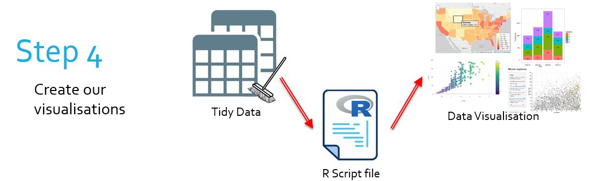

<script src="/rmarkdown-libs/htmlwidgets/htmlwidgets.js"></script>
<script src="/rmarkdown-libs/plotly-binding/plotly.js"></script>
<script src="/rmarkdown-libs/typedarray/typedarray.min.js"></script>
<script src="/rmarkdown-libs/jquery/jquery.min.js"></script>
<link href="/rmarkdown-libs/crosstalk/css/crosstalk.css" rel="stylesheet" />
<script src="/rmarkdown-libs/crosstalk/js/crosstalk.min.js"></script>
<link href="/rmarkdown-libs/plotly-htmlwidgets-css/plotly-htmlwidgets.css" rel="stylesheet" />
<script src="/rmarkdown-libs/plotly-main/plotly-latest.min.js"></script>
<script src="/rmarkdown-libs/htmlwidgets/htmlwidgets.js"></script>
<script src="/rmarkdown-libs/plotly-binding/plotly.js"></script>
<script src="/rmarkdown-libs/typedarray/typedarray.min.js"></script>
<script src="/rmarkdown-libs/jquery/jquery.min.js"></script>
<link href="/rmarkdown-libs/crosstalk/css/crosstalk.css" rel="stylesheet" />
<script src="/rmarkdown-libs/crosstalk/js/crosstalk.min.js"></script>
<link href="/rmarkdown-libs/plotly-htmlwidgets-css/plotly-htmlwidgets.css" rel="stylesheet" />
<script src="/rmarkdown-libs/plotly-main/plotly-latest.min.js"></script>
<script src="/rmarkdown-libs/htmlwidgets/htmlwidgets.js"></script>
<script src="/rmarkdown-libs/plotly-binding/plotly.js"></script>
<script src="/rmarkdown-libs/typedarray/typedarray.min.js"></script>
<script src="/rmarkdown-libs/jquery/jquery.min.js"></script>
<link href="/rmarkdown-libs/crosstalk/css/crosstalk.css" rel="stylesheet" />
<script src="/rmarkdown-libs/crosstalk/js/crosstalk.min.js"></script>
<link href="/rmarkdown-libs/plotly-htmlwidgets-css/plotly-htmlwidgets.css" rel="stylesheet" />
<script src="/rmarkdown-libs/plotly-main/plotly-latest.min.js"></script>
<script src="/rmarkdown-libs/htmlwidgets/htmlwidgets.js"></script>
<script src="/rmarkdown-libs/plotly-binding/plotly.js"></script>
<script src="/rmarkdown-libs/typedarray/typedarray.min.js"></script>
<script src="/rmarkdown-libs/jquery/jquery.min.js"></script>
<link href="/rmarkdown-libs/crosstalk/css/crosstalk.css" rel="stylesheet" />
<script src="/rmarkdown-libs/crosstalk/js/crosstalk.min.js"></script>
<link href="/rmarkdown-libs/plotly-htmlwidgets-css/plotly-htmlwidgets.css" rel="stylesheet" />
<script src="/rmarkdown-libs/plotly-main/plotly-latest.min.js"></script>
<script src="/rmarkdown-libs/htmlwidgets/htmlwidgets.js"></script>
<script src="/rmarkdown-libs/plotly-binding/plotly.js"></script>
<script src="/rmarkdown-libs/typedarray/typedarray.min.js"></script>
<script src="/rmarkdown-libs/jquery/jquery.min.js"></script>
<link href="/rmarkdown-libs/crosstalk/css/crosstalk.css" rel="stylesheet" />
<script src="/rmarkdown-libs/crosstalk/js/crosstalk.min.js"></script>
<link href="/rmarkdown-libs/plotly-htmlwidgets-css/plotly-htmlwidgets.css" rel="stylesheet" />
<script src="/rmarkdown-libs/plotly-main/plotly-latest.min.js"></script>
<script src="/rmarkdown-libs/htmlwidgets/htmlwidgets.js"></script>
<script src="/rmarkdown-libs/plotly-binding/plotly.js"></script>
<script src="/rmarkdown-libs/typedarray/typedarray.min.js"></script>
<script src="/rmarkdown-libs/jquery/jquery.min.js"></script>
<link href="/rmarkdown-libs/crosstalk/css/crosstalk.css" rel="stylesheet" />
<script src="/rmarkdown-libs/crosstalk/js/crosstalk.min.js"></script>
<link href="/rmarkdown-libs/plotly-htmlwidgets-css/plotly-htmlwidgets.css" rel="stylesheet" />
<script src="/rmarkdown-libs/plotly-main/plotly-latest.min.js"></script>
<script src="/rmarkdown-libs/htmlwidgets/htmlwidgets.js"></script>
<script src="/rmarkdown-libs/plotly-binding/plotly.js"></script>
<script src="/rmarkdown-libs/typedarray/typedarray.min.js"></script>
<script src="/rmarkdown-libs/jquery/jquery.min.js"></script>
<link href="/rmarkdown-libs/crosstalk/css/crosstalk.css" rel="stylesheet" />
<script src="/rmarkdown-libs/crosstalk/js/crosstalk.min.js"></script>
<link href="/rmarkdown-libs/plotly-htmlwidgets-css/plotly-htmlwidgets.css" rel="stylesheet" />
<script src="/rmarkdown-libs/plotly-main/plotly-latest.min.js"></script>
<script src="/rmarkdown-libs/htmlwidgets/htmlwidgets.js"></script>
<script src="/rmarkdown-libs/plotly-binding/plotly.js"></script>
<script src="/rmarkdown-libs/typedarray/typedarray.min.js"></script>
<script src="/rmarkdown-libs/jquery/jquery.min.js"></script>
<link href="/rmarkdown-libs/crosstalk/css/crosstalk.css" rel="stylesheet" />
<script src="/rmarkdown-libs/crosstalk/js/crosstalk.min.js"></script>
<link href="/rmarkdown-libs/plotly-htmlwidgets-css/plotly-htmlwidgets.css" rel="stylesheet" />
<script src="/rmarkdown-libs/plotly-main/plotly-latest.min.js"></script>
<script src="/rmarkdown-libs/htmlwidgets/htmlwidgets.js"></script>
<script src="/rmarkdown-libs/plotly-binding/plotly.js"></script>
<script src="/rmarkdown-libs/typedarray/typedarray.min.js"></script>
<script src="/rmarkdown-libs/jquery/jquery.min.js"></script>
<link href="/rmarkdown-libs/crosstalk/css/crosstalk.css" rel="stylesheet" />
<script src="/rmarkdown-libs/crosstalk/js/crosstalk.min.js"></script>
<link href="/rmarkdown-libs/plotly-htmlwidgets-css/plotly-htmlwidgets.css" rel="stylesheet" />
<script src="/rmarkdown-libs/plotly-main/plotly-latest.min.js"></script>
<script src="/rmarkdown-libs/htmlwidgets/htmlwidgets.js"></script>
<script src="/rmarkdown-libs/plotly-binding/plotly.js"></script>
<script src="/rmarkdown-libs/typedarray/typedarray.min.js"></script>
<script src="/rmarkdown-libs/jquery/jquery.min.js"></script>
<link href="/rmarkdown-libs/crosstalk/css/crosstalk.css" rel="stylesheet" />
<script src="/rmarkdown-libs/crosstalk/js/crosstalk.min.js"></script>
<link href="/rmarkdown-libs/plotly-htmlwidgets-css/plotly-htmlwidgets.css" rel="stylesheet" />
<script src="/rmarkdown-libs/plotly-main/plotly-latest.min.js"></script>
<script src="/rmarkdown-libs/htmlwidgets/htmlwidgets.js"></script>
<script src="/rmarkdown-libs/plotly-binding/plotly.js"></script>
<script src="/rmarkdown-libs/typedarray/typedarray.min.js"></script>
<script src="/rmarkdown-libs/jquery/jquery.min.js"></script>
<link href="/rmarkdown-libs/crosstalk/css/crosstalk.css" rel="stylesheet" />
<script src="/rmarkdown-libs/crosstalk/js/crosstalk.min.js"></script>
<link href="/rmarkdown-libs/plotly-htmlwidgets-css/plotly-htmlwidgets.css" rel="stylesheet" />
<script src="/rmarkdown-libs/plotly-main/plotly-latest.min.js"></script>
<script src="/rmarkdown-libs/htmlwidgets/htmlwidgets.js"></script>
<script src="/rmarkdown-libs/plotly-binding/plotly.js"></script>
<script src="/rmarkdown-libs/typedarray/typedarray.min.js"></script>
<script src="/rmarkdown-libs/jquery/jquery.min.js"></script>
<link href="/rmarkdown-libs/crosstalk/css/crosstalk.css" rel="stylesheet" />
<script src="/rmarkdown-libs/crosstalk/js/crosstalk.min.js"></script>
<link href="/rmarkdown-libs/plotly-htmlwidgets-css/plotly-htmlwidgets.css" rel="stylesheet" />
<script src="/rmarkdown-libs/plotly-main/plotly-latest.min.js"></script>
<script src="/rmarkdown-libs/htmlwidgets/htmlwidgets.js"></script>
<script src="/rmarkdown-libs/plotly-binding/plotly.js"></script>
<script src="/rmarkdown-libs/typedarray/typedarray.min.js"></script>
<script src="/rmarkdown-libs/jquery/jquery.min.js"></script>
<link href="/rmarkdown-libs/crosstalk/css/crosstalk.css" rel="stylesheet" />
<script src="/rmarkdown-libs/crosstalk/js/crosstalk.min.js"></script>
<link href="/rmarkdown-libs/plotly-htmlwidgets-css/plotly-htmlwidgets.css" rel="stylesheet" />
<script src="/rmarkdown-libs/plotly-main/plotly-latest.min.js"></script>
<script src="/rmarkdown-libs/htmlwidgets/htmlwidgets.js"></script>
<script src="/rmarkdown-libs/plotly-binding/plotly.js"></script>
<script src="/rmarkdown-libs/typedarray/typedarray.min.js"></script>
<script src="/rmarkdown-libs/jquery/jquery.min.js"></script>
<link href="/rmarkdown-libs/crosstalk/css/crosstalk.css" rel="stylesheet" />
<script src="/rmarkdown-libs/crosstalk/js/crosstalk.min.js"></script>
<link href="/rmarkdown-libs/plotly-htmlwidgets-css/plotly-htmlwidgets.css" rel="stylesheet" />
<script src="/rmarkdown-libs/plotly-main/plotly-latest.min.js"></script>
<script src="/rmarkdown-libs/htmlwidgets/htmlwidgets.js"></script>
<script src="/rmarkdown-libs/plotly-binding/plotly.js"></script>
<script src="/rmarkdown-libs/typedarray/typedarray.min.js"></script>
<script src="/rmarkdown-libs/jquery/jquery.min.js"></script>
<link href="/rmarkdown-libs/crosstalk/css/crosstalk.css" rel="stylesheet" />
<script src="/rmarkdown-libs/crosstalk/js/crosstalk.min.js"></script>
<link href="/rmarkdown-libs/plotly-htmlwidgets-css/plotly-htmlwidgets.css" rel="stylesheet" />
<script src="/rmarkdown-libs/plotly-main/plotly-latest.min.js"></script>
<script src="/rmarkdown-libs/htmlwidgets/htmlwidgets.js"></script>
<script src="/rmarkdown-libs/plotly-binding/plotly.js"></script>
<script src="/rmarkdown-libs/typedarray/typedarray.min.js"></script>
<script src="/rmarkdown-libs/jquery/jquery.min.js"></script>
<link href="/rmarkdown-libs/crosstalk/css/crosstalk.css" rel="stylesheet" />
<script src="/rmarkdown-libs/crosstalk/js/crosstalk.min.js"></script>
<link href="/rmarkdown-libs/plotly-htmlwidgets-css/plotly-htmlwidgets.css" rel="stylesheet" />
<script src="/rmarkdown-libs/plotly-main/plotly-latest.min.js"></script>
<script src="/rmarkdown-libs/htmlwidgets/htmlwidgets.js"></script>
<script src="/rmarkdown-libs/plotly-binding/plotly.js"></script>
<script src="/rmarkdown-libs/typedarray/typedarray.min.js"></script>
<script src="/rmarkdown-libs/jquery/jquery.min.js"></script>
<link href="/rmarkdown-libs/crosstalk/css/crosstalk.css" rel="stylesheet" />
<script src="/rmarkdown-libs/crosstalk/js/crosstalk.min.js"></script>
<link href="/rmarkdown-libs/plotly-htmlwidgets-css/plotly-htmlwidgets.css" rel="stylesheet" />
<script src="/rmarkdown-libs/plotly-main/plotly-latest.min.js"></script>
<script src="/rmarkdown-libs/htmlwidgets/htmlwidgets.js"></script>
<script src="/rmarkdown-libs/plotly-binding/plotly.js"></script>
<script src="/rmarkdown-libs/typedarray/typedarray.min.js"></script>
<script src="/rmarkdown-libs/jquery/jquery.min.js"></script>
<link href="/rmarkdown-libs/crosstalk/css/crosstalk.css" rel="stylesheet" />
<script src="/rmarkdown-libs/crosstalk/js/crosstalk.min.js"></script>
<link href="/rmarkdown-libs/plotly-htmlwidgets-css/plotly-htmlwidgets.css" rel="stylesheet" />
<script src="/rmarkdown-libs/plotly-main/plotly-latest.min.js"></script>
<script src="/rmarkdown-libs/htmlwidgets/htmlwidgets.js"></script>
<script src="/rmarkdown-libs/plotly-binding/plotly.js"></script>
<script src="/rmarkdown-libs/typedarray/typedarray.min.js"></script>
<script src="/rmarkdown-libs/jquery/jquery.min.js"></script>
<link href="/rmarkdown-libs/crosstalk/css/crosstalk.css" rel="stylesheet" />
<script src="/rmarkdown-libs/crosstalk/js/crosstalk.min.js"></script>
<link href="/rmarkdown-libs/plotly-htmlwidgets-css/plotly-htmlwidgets.css" rel="stylesheet" />
<script src="/rmarkdown-libs/plotly-main/plotly-latest.min.js"></script>
<script src="/rmarkdown-libs/htmlwidgets/htmlwidgets.js"></script>
<script src="/rmarkdown-libs/plotly-binding/plotly.js"></script>
<script src="/rmarkdown-libs/typedarray/typedarray.min.js"></script>
<script src="/rmarkdown-libs/jquery/jquery.min.js"></script>
<link href="/rmarkdown-libs/crosstalk/css/crosstalk.css" rel="stylesheet" />
<script src="/rmarkdown-libs/crosstalk/js/crosstalk.min.js"></script>
<link href="/rmarkdown-libs/plotly-htmlwidgets-css/plotly-htmlwidgets.css" rel="stylesheet" />
<script src="/rmarkdown-libs/plotly-main/plotly-latest.min.js"></script>

# htmlwidgets - plotly

## The Bigger Picture

In this document we learn how to create interactive charts with plotly. Simply put, we are learning how to transform tidy data into visually clear graphs. In the overall context of the workflow, this falls into the category of transforming our data into data visualisation.

<center>
 </img>
</center>
 
<center>
 </img>
</center>

` There are references to LinkedIn Learning videos. These are complementary but not really required as the notes below are meant to be self-contained. Some students and staff would have access for free. Do not purchase access unless you are sure you don’t have access through your organisation already. `

## What is plotly?

> [LinkedIn Learning 3.1](https://www.linkedin.com/learning/r-interactive-visualizations-with-htmlwidgets/what-is-the-plotly-library)

``` r
library("tidyverse")
library("plotly")
```

-   An htmlwidget used to make interactive graphs and charts of several types
    -   Bar graphs
    -   Scatterplots
    -   Line plots
    -   Pie charts
    -   Bubble charts
    -   Geoplots
    -   And many more
-   The package is bound to the plotly library in JavaScript
-   Plotly heavily depends on the pipeline (`%>%`) operator to create charts

## Upgrading ggplot graphs with plotly

> [LinkedIn Learning 3.2](https://www.linkedin.com/learning/r-interactive-visualizations-with-htmlwidgets/make-ggplot2-interactive-using-plotly)

Let’s say we have a nice graph created with `ggplot2`:

``` r
library("ggplot2")

load("tidy_ACORN-SAT_data/station_data.rdata")

temp_chart <- station_data %>%
  filter(Station.name == "Sydney") %>%
  ggplot(aes(x = year,
             y = average.temp)) +
  geom_point(color = "red") +
  scale_x_discrete(breaks = seq(1910, 2010, by = 10)) +
  ggtitle("Sydney's Average Yearly Temperature") +
  xlab("Year") +
  ylab("Average Temperature (°C)")

temp_chart
```


There is a useful command `ggplotly()` to automatically convert this to an interactive plotly widget:

``` r
ggplotly(temp_chart)
```

<div id="htmlwidget-1" style="width:100%;height:480px;" class="plotly html-widget"></div>
<script type="application/json" data-for="htmlwidget-1">{"x":{"data":[{"x":[1,2,3,4,5,6,7,8,9,10,11,12,13,14,15,16,17,18,19,20,21,22,23,24,25,26,27,28,29,30,31,32,33,34,35,36,37,38,39,40,41,42,43,44,45,46,47,48,49,50,51,52,53,54,55,56,57,58,59,60,61,62,63,64,65,66,67,68,69,70,71,72,73,74,75,76,77,78,79,80,81,82,83,84,85,86,87,88,89,90,91,92,93,94,95,96,97,98,99,100,101],"y":[18,17.9,18,18.3,18.9,18.3,18,17.8,17.9,18.5,17.5,18.2,18.3,18.2,17.6,17.5,18.3,17.3,18.4,17.5,18,17.9,17.8,17.5,17.7,17.8,17.9,18.1,18.4,18.2,18.4,17.8,18.1,17.2,17.8,17.8,18,18,17.3,17.6,18,17.9,17.6,17.6,17.8,17.8,17.6,17.9,18.3,18,17.6,17.8,17.8,17.9,18.1,18,17.5,17.9,18.3,18.1,17.8,17.9,18,18.8,17.9,18.4,18.1,18.5,18,18.5,18.9,18.4,18.2,18.4,17.9,18.1,18.2,18.3,19,18.4,18.4,18.8,17.7,18.4,18.3,17.9,18,18.4,18.9,18.4,18.6,18.9,18.8,18.6,19,19.1,18.9,19,18.2,19,18.8],"text":["year: 1910<br />average.temp: 18.0","year: 1911<br />average.temp: 17.9","year: 1912<br />average.temp: 18.0","year: 1913<br />average.temp: 18.3","year: 1914<br />average.temp: 18.9","year: 1915<br />average.temp: 18.3","year: 1916<br />average.temp: 18.0","year: 1917<br />average.temp: 17.8","year: 1918<br />average.temp: 17.9","year: 1919<br />average.temp: 18.5","year: 1920<br />average.temp: 17.5","year: 1921<br />average.temp: 18.2","year: 1922<br />average.temp: 18.3","year: 1923<br />average.temp: 18.2","year: 1924<br />average.temp: 17.6","year: 1925<br />average.temp: 17.5","year: 1926<br />average.temp: 18.3","year: 1927<br />average.temp: 17.3","year: 1928<br />average.temp: 18.4","year: 1929<br />average.temp: 17.5","year: 1930<br />average.temp: 18.0","year: 1931<br />average.temp: 17.9","year: 1932<br />average.temp: 17.8","year: 1933<br />average.temp: 17.5","year: 1934<br />average.temp: 17.7","year: 1935<br />average.temp: 17.8","year: 1936<br />average.temp: 17.9","year: 1937<br />average.temp: 18.1","year: 1938<br />average.temp: 18.4","year: 1939<br />average.temp: 18.2","year: 1940<br />average.temp: 18.4","year: 1941<br />average.temp: 17.8","year: 1942<br />average.temp: 18.1","year: 1943<br />average.temp: 17.2","year: 1944<br />average.temp: 17.8","year: 1945<br />average.temp: 17.8","year: 1946<br />average.temp: 18.0","year: 1947<br />average.temp: 18.0","year: 1948<br />average.temp: 17.3","year: 1949<br />average.temp: 17.6","year: 1950<br />average.temp: 18.0","year: 1951<br />average.temp: 17.9","year: 1952<br />average.temp: 17.6","year: 1953<br />average.temp: 17.6","year: 1954<br />average.temp: 17.8","year: 1955<br />average.temp: 17.8","year: 1956<br />average.temp: 17.6","year: 1957<br />average.temp: 17.9","year: 1958<br />average.temp: 18.3","year: 1959<br />average.temp: 18.0","year: 1960<br />average.temp: 17.6","year: 1961<br />average.temp: 17.8","year: 1962<br />average.temp: 17.8","year: 1963<br />average.temp: 17.9","year: 1964<br />average.temp: 18.1","year: 1965<br />average.temp: 18.0","year: 1966<br />average.temp: 17.5","year: 1967<br />average.temp: 17.9","year: 1968<br />average.temp: 18.3","year: 1969<br />average.temp: 18.1","year: 1970<br />average.temp: 17.8","year: 1971<br />average.temp: 17.9","year: 1972<br />average.temp: 18.0","year: 1973<br />average.temp: 18.8","year: 1974<br />average.temp: 17.9","year: 1975<br />average.temp: 18.4","year: 1976<br />average.temp: 18.1","year: 1977<br />average.temp: 18.5","year: 1978<br />average.temp: 18.0","year: 1979<br />average.temp: 18.5","year: 1980<br />average.temp: 18.9","year: 1981<br />average.temp: 18.4","year: 1982<br />average.temp: 18.2","year: 1983<br />average.temp: 18.4","year: 1984<br />average.temp: 17.9","year: 1985<br />average.temp: 18.1","year: 1986<br />average.temp: 18.2","year: 1987<br />average.temp: 18.3","year: 1988<br />average.temp: 19.0","year: 1989<br />average.temp: 18.4","year: 1990<br />average.temp: 18.4","year: 1991<br />average.temp: 18.8","year: 1992<br />average.temp: 17.7","year: 1993<br />average.temp: 18.4","year: 1994<br />average.temp: 18.3","year: 1995<br />average.temp: 17.9","year: 1996<br />average.temp: 18.0","year: 1997<br />average.temp: 18.4","year: 1998<br />average.temp: 18.9","year: 1999<br />average.temp: 18.4","year: 2000<br />average.temp: 18.6","year: 2001<br />average.temp: 18.9","year: 2002<br />average.temp: 18.8","year: 2003<br />average.temp: 18.6","year: 2004<br />average.temp: 19.0","year: 2005<br />average.temp: 19.1","year: 2006<br />average.temp: 18.9","year: 2007<br />average.temp: 19.0","year: 2008<br />average.temp: 18.2","year: 2009<br />average.temp: 19.0","year: 2010<br />average.temp: 18.8"],"type":"scatter","mode":"markers","marker":{"autocolorscale":false,"color":"rgba(255,0,0,1)","opacity":1,"size":5.66929133858268,"symbol":"circle","line":{"width":1.88976377952756,"color":"rgba(255,0,0,1)"}},"hoveron":"points","showlegend":false,"xaxis":"x","yaxis":"y","hoverinfo":"text","frame":null}],"layout":{"margin":{"t":43.7625570776256,"r":7.30593607305936,"b":40.1826484018265,"l":48.9497716894977},"plot_bgcolor":"rgba(235,235,235,1)","paper_bgcolor":"rgba(255,255,255,1)","font":{"color":"rgba(0,0,0,1)","family":"","size":14.6118721461187},"title":{"text":"Sydney's Average Yearly Temperature","font":{"color":"rgba(0,0,0,1)","family":"","size":17.5342465753425},"x":0,"xref":"paper"},"xaxis":{"domain":[0,1],"automargin":true,"type":"linear","autorange":false,"range":[0.4,101.6],"tickmode":"array","ticktext":["1910","1920","1930","1940","1950","1960","1970","1980","1990","2000","2010"],"tickvals":[1,11,21,31,41,51,61,71,81,91,101],"categoryorder":"array","categoryarray":["1910","1920","1930","1940","1950","1960","1970","1980","1990","2000","2010"],"nticks":null,"ticks":"outside","tickcolor":"rgba(51,51,51,1)","ticklen":3.65296803652968,"tickwidth":0.66417600664176,"showticklabels":true,"tickfont":{"color":"rgba(77,77,77,1)","family":"","size":11.689497716895},"tickangle":-0,"showline":false,"linecolor":null,"linewidth":0,"showgrid":true,"gridcolor":"rgba(255,255,255,1)","gridwidth":0.66417600664176,"zeroline":false,"anchor":"y","title":{"text":"Year","font":{"color":"rgba(0,0,0,1)","family":"","size":14.6118721461187}},"hoverformat":".2f"},"yaxis":{"domain":[0,1],"automargin":true,"type":"linear","autorange":false,"range":[17.105,19.195],"tickmode":"array","ticktext":["17.5","18.0","18.5","19.0"],"tickvals":[17.5,18,18.5,19],"categoryorder":"array","categoryarray":["17.5","18.0","18.5","19.0"],"nticks":null,"ticks":"outside","tickcolor":"rgba(51,51,51,1)","ticklen":3.65296803652968,"tickwidth":0.66417600664176,"showticklabels":true,"tickfont":{"color":"rgba(77,77,77,1)","family":"","size":11.689497716895},"tickangle":-0,"showline":false,"linecolor":null,"linewidth":0,"showgrid":true,"gridcolor":"rgba(255,255,255,1)","gridwidth":0.66417600664176,"zeroline":false,"anchor":"x","title":{"text":"Average Temperature (°C)","font":{"color":"rgba(0,0,0,1)","family":"","size":14.6118721461187}},"hoverformat":".2f"},"shapes":[{"type":"rect","fillcolor":null,"line":{"color":null,"width":0,"linetype":[]},"yref":"paper","xref":"paper","x0":0,"x1":1,"y0":0,"y1":1}],"showlegend":false,"legend":{"bgcolor":"rgba(255,255,255,1)","bordercolor":"transparent","borderwidth":1.88976377952756,"font":{"color":"rgba(0,0,0,1)","family":"","size":11.689497716895}},"hovermode":"closest","barmode":"relative"},"config":{"doubleClick":"reset","showSendToCloud":false},"source":"A","attrs":{"11b15f7de115":{"x":{},"y":{},"type":"scatter"}},"cur_data":"11b15f7de115","visdat":{"11b15f7de115":["function (y) ","x"]},"highlight":{"on":"plotly_click","persistent":false,"dynamic":false,"selectize":false,"opacityDim":0.2,"selected":{"opacity":1},"debounce":0},"shinyEvents":["plotly_hover","plotly_click","plotly_selected","plotly_relayout","plotly_brushed","plotly_brushing","plotly_clickannotation","plotly_doubleclick","plotly_deselect","plotly_afterplot","plotly_sunburstclick"],"base_url":"https://plot.ly"},"evals":[],"jsHooks":[]}</script>

Try using your mouse to test the interactivity!

## Creating Bar Charts

> [LinkedIn Learning 3.3](https://www.linkedin.com/learning/r-interactive-visualizations-with-htmlwidgets/create-interactive-stacked-bar-charts-2)

### Why do we use bar charts?

-   Bar charts one useful form of quantitative data visualisation.
-   For each pair of variables, a bar represents one observation, meaning we can easily compare observations by seeing which one is taller
-   For example, it becomes easy to visualise the heights of some different coloured aliens with a bar graph!

<!-- -->

    ## 
    ## ── Column specification ────────────────────────────────────────────────────────
    ## cols(
    ##   name = col_character(),
    ##   colour = col_character(),
    ##   height = col_double(),
    ##   weight = col_double()
    ## )

<div id="htmlwidget-2" style="width:100%;height:480px;" class="plotly html-widget"></div>
<script type="application/json" data-for="htmlwidget-2">{"x":{"visdat":{"11b151417507e":["function () ","plotlyVisDat"]},"cur_data":"11b151417507e","attrs":{"11b151417507e":{"alpha_stroke":1,"sizes":[10,100],"spans":[1,20],"x":{},"y":{},"type":"bar","color":{},"inherit":true}},"layout":{"margin":{"b":40,"l":60,"t":25,"r":10},"xaxis":{"domain":[0,1],"automargin":true,"title":"name","type":"category","categoryorder":"array","categoryarray":["Alphy","Bordo","Grob","Jango","Tobbi","Tommy","Wobbo","Zed"]},"yaxis":{"domain":[0,1],"automargin":true,"title":"height"},"hovermode":"closest","showlegend":true},"source":"A","config":{"showSendToCloud":false},"data":[{"x":["Bordo","Wobbo"],"y":[29,54],"type":"bar","name":"Blue","marker":{"color":"rgba(102,194,165,1)","line":{"color":"rgba(102,194,165,1)"}},"textfont":{"color":"rgba(102,194,165,1)"},"error_y":{"color":"rgba(102,194,165,1)"},"error_x":{"color":"rgba(102,194,165,1)"},"xaxis":"x","yaxis":"y","frame":null},{"x":["Tommy","Tobbi"],"y":[82,24],"type":"bar","name":"Green","marker":{"color":"rgba(252,141,98,1)","line":{"color":"rgba(252,141,98,1)"}},"textfont":{"color":"rgba(252,141,98,1)"},"error_y":{"color":"rgba(252,141,98,1)"},"error_x":{"color":"rgba(252,141,98,1)"},"xaxis":"x","yaxis":"y","frame":null},{"x":["Alphy","Jango","Zed","Grob"],"y":[184,43,80,26],"type":"bar","name":"Red","marker":{"color":"rgba(141,160,203,1)","line":{"color":"rgba(141,160,203,1)"}},"textfont":{"color":"rgba(141,160,203,1)"},"error_y":{"color":"rgba(141,160,203,1)"},"error_x":{"color":"rgba(141,160,203,1)"},"xaxis":"x","yaxis":"y","frame":null}],"highlight":{"on":"plotly_click","persistent":false,"dynamic":false,"selectize":false,"opacityDim":0.2,"selected":{"opacity":1},"debounce":0},"shinyEvents":["plotly_hover","plotly_click","plotly_selected","plotly_relayout","plotly_brushed","plotly_brushing","plotly_clickannotation","plotly_doubleclick","plotly_deselect","plotly_afterplot","plotly_sunburstclick"],"base_url":"https://plot.ly"},"evals":[],"jsHooks":[]}</script>

### How do we make bar charts?

For our examples we will use the same data from the [Australian Environmental-Economic Accounts (2016)](https://www.abs.gov.au/AUSSTATS/abs@.nsf/Lookup/4655.0Explanatory%20Notes12016?OpenDocument), now including data from 2008-2014. The data relates to water consumption by state.

``` r
load(file = "tidy_EnvAcc_data/consumption.rdata")
consumption
```

    ## # A tibble: 48 x 3
    ##    State year    water_consumption
    ##    <chr> <chr>               <dbl>
    ##  1 NSW   2008–09              4555
    ##  2 VIC   2008–09              2951
    ##  3 QLD   2008–09              3341
    ##  4 SA    2008–09              1179
    ##  5 WA    2008–09              1361
    ##  6 TAS   2008–09               466
    ##  7 NT    2008–09               160
    ##  8 ACT   2008–09                48
    ##  9 NSW   2009–10              4323
    ## 10 VIC   2009–10              2904
    ## # … with 38 more rows

-   We begin by piping our data into a function, `plot_ly()`

``` r
consumption %>%
  plot_ly()
```

<div id="htmlwidget-3" style="width:100%;height:480px;" class="plotly html-widget"></div>
<script type="application/json" data-for="htmlwidget-3">{"x":{"visdat":{"11b15b1833a3":["function () ","plotlyVisDat"]},"cur_data":"11b15b1833a3","attrs":{"11b15b1833a3":{"alpha_stroke":1,"sizes":[10,100],"spans":[1,20]}},"layout":{"margin":{"b":40,"l":60,"t":25,"r":10},"xaxis":{"domain":[0,1],"automargin":true},"yaxis":{"domain":[0,1],"automargin":true},"hovermode":"closest","showlegend":false},"source":"A","config":{"showSendToCloud":false},"data":[{"type":"scatter","mode":"markers","marker":{"color":"rgba(31,119,180,1)","line":{"color":"rgba(31,119,180,1)"}},"error_y":{"color":"rgba(31,119,180,1)"},"error_x":{"color":"rgba(31,119,180,1)"},"line":{"color":"rgba(31,119,180,1)"},"xaxis":"x","yaxis":"y","frame":null}],"highlight":{"on":"plotly_click","persistent":false,"dynamic":false,"selectize":false,"opacityDim":0.2,"selected":{"opacity":1},"debounce":0},"shinyEvents":["plotly_hover","plotly_click","plotly_selected","plotly_relayout","plotly_brushed","plotly_brushing","plotly_clickannotation","plotly_doubleclick","plotly_deselect","plotly_afterplot","plotly_sunburstclick"],"base_url":"https://plot.ly"},"evals":[],"jsHooks":[]}</script>

Already our chart is “interactive”: we can use our mouse to select specific areas of the empty graph, however we have no data.

-   `add_trace()` is a key plotly function that configures our graphs
-   The function has literally hundreds of arguments (one can read about each of them [here](https://plot.ly/r/reference/))
-   We can be content learning a few

``` r
consumption %>%
  group_by(year) %>%
  summarise(consumption_total = sum(water_consumption)) %>%
  plot_ly() %>%
  add_trace(x = ~year,
            y = ~consumption_total,
            type = "bar")
```

<div id="htmlwidget-4" style="width:100%;height:480px;" class="plotly html-widget"></div>
<script type="application/json" data-for="htmlwidget-4">{"x":{"visdat":{"11b1549332279":["function () ","plotlyVisDat"]},"cur_data":"11b1549332279","attrs":{"11b1549332279":{"alpha_stroke":1,"sizes":[10,100],"spans":[1,20],"x":{},"y":{},"type":"bar","inherit":true}},"layout":{"margin":{"b":40,"l":60,"t":25,"r":10},"xaxis":{"domain":[0,1],"automargin":true,"title":"year","type":"category","categoryorder":"array","categoryarray":["2008–09","2009–10","2010–11","2011–12","2012–13","2013–14"]},"yaxis":{"domain":[0,1],"automargin":true,"title":"consumption_total"},"hovermode":"closest","showlegend":false},"source":"A","config":{"showSendToCloud":false},"data":[{"x":["2008–09","2009–10","2010–11","2011–12","2012–13","2013–14"],"y":[14061,13513,13337,15872,19756,18645],"type":"bar","marker":{"color":"rgba(31,119,180,1)","line":{"color":"rgba(31,119,180,1)"}},"error_y":{"color":"rgba(31,119,180,1)"},"error_x":{"color":"rgba(31,119,180,1)"},"xaxis":"x","yaxis":"y","frame":null}],"highlight":{"on":"plotly_click","persistent":false,"dynamic":false,"selectize":false,"opacityDim":0.2,"selected":{"opacity":1},"debounce":0},"shinyEvents":["plotly_hover","plotly_click","plotly_selected","plotly_relayout","plotly_brushed","plotly_brushing","plotly_clickannotation","plotly_doubleclick","plotly_deselect","plotly_afterplot","plotly_sunburstclick"],"base_url":"https://plot.ly"},"evals":[],"jsHooks":[]}</script>

-   Notice that we use a tilde (“`~`”) when calling on columns from our data
-   Plotly requires this syntax in order to understand what variables refer to our data columns

We have made a generic bar graph based on total water consumption per year, but what if we want a more advanced bar graph?

-   We can pipe our existing graph into `layout()`
-   This function also has many arguments (also found [here!](https://plot.ly/r/reference/))
-   We select arguments depending on the type of graph we are creating

Now we want a stacked bar chart, showing the breakdown of which state consumed water in a given year

-   We change the `barmode` layout option to “stack”
-   We add in a `color` argument of trace to colour stack sections by variable

``` r
consumption %>%
  plot_ly() %>%
  add_trace(x = ~year,
            y = ~water_consumption,
            type = "bar",
            color = ~State) %>%
  layout(barmode = "stack")
```

<div id="htmlwidget-5" style="width:100%;height:480px;" class="plotly html-widget"></div>
<script type="application/json" data-for="htmlwidget-5">{"x":{"visdat":{"11b1569b9c56a":["function () ","plotlyVisDat"]},"cur_data":"11b1569b9c56a","attrs":{"11b1569b9c56a":{"alpha_stroke":1,"sizes":[10,100],"spans":[1,20],"x":{},"y":{},"type":"bar","color":{},"inherit":true}},"layout":{"margin":{"b":40,"l":60,"t":25,"r":10},"barmode":"stack","xaxis":{"domain":[0,1],"automargin":true,"title":"year","type":"category","categoryorder":"array","categoryarray":["2008–09","2009–10","2010–11","2011–12","2012–13","2013–14"]},"yaxis":{"domain":[0,1],"automargin":true,"title":"water_consumption"},"hovermode":"closest","showlegend":true},"source":"A","config":{"showSendToCloud":false},"data":[{"x":["2008–09","2009–10","2010–11","2011–12","2012–13","2013–14"],"y":[48,47,43,50,52,53],"type":"bar","name":"ACT","marker":{"color":"rgba(102,194,165,1)","line":{"color":"rgba(102,194,165,1)"}},"textfont":{"color":"rgba(102,194,165,1)"},"error_y":{"color":"rgba(102,194,165,1)"},"error_x":{"color":"rgba(102,194,165,1)"},"xaxis":"x","yaxis":"y","frame":null},{"x":["2008–09","2009–10","2010–11","2011–12","2012–13","2013–14"],"y":[4555,4323,5041,6293,8806,7508],"type":"bar","name":"NSW","marker":{"color":"rgba(252,141,98,1)","line":{"color":"rgba(252,141,98,1)"}},"textfont":{"color":"rgba(252,141,98,1)"},"error_y":{"color":"rgba(252,141,98,1)"},"error_x":{"color":"rgba(252,141,98,1)"},"xaxis":"x","yaxis":"y","frame":null},{"x":["2008–09","2009–10","2010–11","2011–12","2012–13","2013–14"],"y":[160,167,167,174,176,167],"type":"bar","name":"NT","marker":{"color":"rgba(141,160,203,1)","line":{"color":"rgba(141,160,203,1)"}},"textfont":{"color":"rgba(141,160,203,1)"},"error_y":{"color":"rgba(141,160,203,1)"},"error_x":{"color":"rgba(141,160,203,1)"},"xaxis":"x","yaxis":"y","frame":null},{"x":["2008–09","2009–10","2010–11","2011–12","2012–13","2013–14"],"y":[3341,3112,2964,3287,3697,4145],"type":"bar","name":"QLD","marker":{"color":"rgba(231,138,195,1)","line":{"color":"rgba(231,138,195,1)"}},"textfont":{"color":"rgba(231,138,195,1)"},"error_y":{"color":"rgba(231,138,195,1)"},"error_x":{"color":"rgba(231,138,195,1)"},"xaxis":"x","yaxis":"y","frame":null},{"x":["2008–09","2009–10","2010–11","2011–12","2012–13","2013–14"],"y":[1179,1110,1023,1045,1159,1077],"type":"bar","name":"SA","marker":{"color":"rgba(166,216,84,1)","line":{"color":"rgba(166,216,84,1)"}},"textfont":{"color":"rgba(166,216,84,1)"},"error_y":{"color":"rgba(166,216,84,1)"},"error_x":{"color":"rgba(166,216,84,1)"},"xaxis":"x","yaxis":"y","frame":null},{"x":["2008–09","2009–10","2010–11","2011–12","2012–13","2013–14"],"y":[466,464,371,368,395,390],"type":"bar","name":"TAS","marker":{"color":"rgba(255,217,47,1)","line":{"color":"rgba(255,217,47,1)"}},"textfont":{"color":"rgba(255,217,47,1)"},"error_y":{"color":"rgba(255,217,47,1)"},"error_x":{"color":"rgba(255,217,47,1)"},"xaxis":"x","yaxis":"y","frame":null},{"x":["2008–09","2009–10","2010–11","2011–12","2012–13","2013–14"],"y":[2951,2904,2359,3247,4184,3988],"type":"bar","name":"VIC","marker":{"color":"rgba(229,196,148,1)","line":{"color":"rgba(229,196,148,1)"}},"textfont":{"color":"rgba(229,196,148,1)"},"error_y":{"color":"rgba(229,196,148,1)"},"error_x":{"color":"rgba(229,196,148,1)"},"xaxis":"x","yaxis":"y","frame":null},{"x":["2008–09","2009–10","2010–11","2011–12","2012–13","2013–14"],"y":[1361,1386,1369,1408,1287,1317],"type":"bar","name":"WA","marker":{"color":"rgba(179,179,179,1)","line":{"color":"rgba(179,179,179,1)"}},"textfont":{"color":"rgba(179,179,179,1)"},"error_y":{"color":"rgba(179,179,179,1)"},"error_x":{"color":"rgba(179,179,179,1)"},"xaxis":"x","yaxis":"y","frame":null}],"highlight":{"on":"plotly_click","persistent":false,"dynamic":false,"selectize":false,"opacityDim":0.2,"selected":{"opacity":1},"debounce":0},"shinyEvents":["plotly_hover","plotly_click","plotly_selected","plotly_relayout","plotly_brushed","plotly_brushing","plotly_clickannotation","plotly_doubleclick","plotly_deselect","plotly_afterplot","plotly_sunburstclick"],"base_url":"https://plot.ly"},"evals":[],"jsHooks":[]}</script>

-   If we wish to display proportion rather than quantity, we use the `layout()` argument `barnorm`

``` r
consumption %>%
  plot_ly() %>%
  add_trace(x = ~year,
            y = ~water_consumption,
            type = "bar",
            color = ~State) %>%
  layout(barmode = "stack",
         barnorm = "percent")
```

<div id="htmlwidget-6" style="width:100%;height:480px;" class="plotly html-widget"></div>
<script type="application/json" data-for="htmlwidget-6">{"x":{"visdat":{"11b15532108bc":["function () ","plotlyVisDat"]},"cur_data":"11b15532108bc","attrs":{"11b15532108bc":{"alpha_stroke":1,"sizes":[10,100],"spans":[1,20],"x":{},"y":{},"type":"bar","color":{},"inherit":true}},"layout":{"margin":{"b":40,"l":60,"t":25,"r":10},"barmode":"stack","barnorm":"percent","xaxis":{"domain":[0,1],"automargin":true,"title":"year","type":"category","categoryorder":"array","categoryarray":["2008–09","2009–10","2010–11","2011–12","2012–13","2013–14"]},"yaxis":{"domain":[0,1],"automargin":true,"title":"water_consumption"},"hovermode":"closest","showlegend":true},"source":"A","config":{"showSendToCloud":false},"data":[{"x":["2008–09","2009–10","2010–11","2011–12","2012–13","2013–14"],"y":[48,47,43,50,52,53],"type":"bar","name":"ACT","marker":{"color":"rgba(102,194,165,1)","line":{"color":"rgba(102,194,165,1)"}},"textfont":{"color":"rgba(102,194,165,1)"},"error_y":{"color":"rgba(102,194,165,1)"},"error_x":{"color":"rgba(102,194,165,1)"},"xaxis":"x","yaxis":"y","frame":null},{"x":["2008–09","2009–10","2010–11","2011–12","2012–13","2013–14"],"y":[4555,4323,5041,6293,8806,7508],"type":"bar","name":"NSW","marker":{"color":"rgba(252,141,98,1)","line":{"color":"rgba(252,141,98,1)"}},"textfont":{"color":"rgba(252,141,98,1)"},"error_y":{"color":"rgba(252,141,98,1)"},"error_x":{"color":"rgba(252,141,98,1)"},"xaxis":"x","yaxis":"y","frame":null},{"x":["2008–09","2009–10","2010–11","2011–12","2012–13","2013–14"],"y":[160,167,167,174,176,167],"type":"bar","name":"NT","marker":{"color":"rgba(141,160,203,1)","line":{"color":"rgba(141,160,203,1)"}},"textfont":{"color":"rgba(141,160,203,1)"},"error_y":{"color":"rgba(141,160,203,1)"},"error_x":{"color":"rgba(141,160,203,1)"},"xaxis":"x","yaxis":"y","frame":null},{"x":["2008–09","2009–10","2010–11","2011–12","2012–13","2013–14"],"y":[3341,3112,2964,3287,3697,4145],"type":"bar","name":"QLD","marker":{"color":"rgba(231,138,195,1)","line":{"color":"rgba(231,138,195,1)"}},"textfont":{"color":"rgba(231,138,195,1)"},"error_y":{"color":"rgba(231,138,195,1)"},"error_x":{"color":"rgba(231,138,195,1)"},"xaxis":"x","yaxis":"y","frame":null},{"x":["2008–09","2009–10","2010–11","2011–12","2012–13","2013–14"],"y":[1179,1110,1023,1045,1159,1077],"type":"bar","name":"SA","marker":{"color":"rgba(166,216,84,1)","line":{"color":"rgba(166,216,84,1)"}},"textfont":{"color":"rgba(166,216,84,1)"},"error_y":{"color":"rgba(166,216,84,1)"},"error_x":{"color":"rgba(166,216,84,1)"},"xaxis":"x","yaxis":"y","frame":null},{"x":["2008–09","2009–10","2010–11","2011–12","2012–13","2013–14"],"y":[466,464,371,368,395,390],"type":"bar","name":"TAS","marker":{"color":"rgba(255,217,47,1)","line":{"color":"rgba(255,217,47,1)"}},"textfont":{"color":"rgba(255,217,47,1)"},"error_y":{"color":"rgba(255,217,47,1)"},"error_x":{"color":"rgba(255,217,47,1)"},"xaxis":"x","yaxis":"y","frame":null},{"x":["2008–09","2009–10","2010–11","2011–12","2012–13","2013–14"],"y":[2951,2904,2359,3247,4184,3988],"type":"bar","name":"VIC","marker":{"color":"rgba(229,196,148,1)","line":{"color":"rgba(229,196,148,1)"}},"textfont":{"color":"rgba(229,196,148,1)"},"error_y":{"color":"rgba(229,196,148,1)"},"error_x":{"color":"rgba(229,196,148,1)"},"xaxis":"x","yaxis":"y","frame":null},{"x":["2008–09","2009–10","2010–11","2011–12","2012–13","2013–14"],"y":[1361,1386,1369,1408,1287,1317],"type":"bar","name":"WA","marker":{"color":"rgba(179,179,179,1)","line":{"color":"rgba(179,179,179,1)"}},"textfont":{"color":"rgba(179,179,179,1)"},"error_y":{"color":"rgba(179,179,179,1)"},"error_x":{"color":"rgba(179,179,179,1)"},"xaxis":"x","yaxis":"y","frame":null}],"highlight":{"on":"plotly_click","persistent":false,"dynamic":false,"selectize":false,"opacityDim":0.2,"selected":{"opacity":1},"debounce":0},"shinyEvents":["plotly_hover","plotly_click","plotly_selected","plotly_relayout","plotly_brushed","plotly_brushing","plotly_clickannotation","plotly_doubleclick","plotly_deselect","plotly_afterplot","plotly_sunburstclick"],"base_url":"https://plot.ly"},"evals":[],"jsHooks":[]}</script>

Mouse over the graph to see information!

-   But what if we want a horizontal bar chart?

``` r
consumption %>%
  plot_ly() %>%
  add_trace(x = ~water_consumption,
            y = ~year,
            type = "bar",
            color = ~State) %>%
  layout(barmode = "stack",
         barnorm = "percent")
```

<div id="htmlwidget-7" style="width:100%;height:480px;" class="plotly html-widget"></div>
<script type="application/json" data-for="htmlwidget-7">{"x":{"visdat":{"11b15562b1395":["function () ","plotlyVisDat"]},"cur_data":"11b15562b1395","attrs":{"11b15562b1395":{"alpha_stroke":1,"sizes":[10,100],"spans":[1,20],"x":{},"y":{},"type":"bar","color":{},"inherit":true}},"layout":{"margin":{"b":40,"l":60,"t":25,"r":10},"barmode":"stack","barnorm":"percent","xaxis":{"domain":[0,1],"automargin":true,"title":"water_consumption"},"yaxis":{"domain":[0,1],"automargin":true,"title":"year","type":"category","categoryorder":"array","categoryarray":["2008–09","2009–10","2010–11","2011–12","2012–13","2013–14"]},"hovermode":"closest","showlegend":true},"source":"A","config":{"showSendToCloud":false},"data":[{"x":[48,47,43,50,52,53],"y":["2008–09","2009–10","2010–11","2011–12","2012–13","2013–14"],"type":"bar","orientation":"h","name":"ACT","marker":{"color":"rgba(102,194,165,1)","line":{"color":"rgba(102,194,165,1)"}},"textfont":{"color":"rgba(102,194,165,1)"},"error_y":{"color":"rgba(102,194,165,1)"},"error_x":{"color":"rgba(102,194,165,1)"},"xaxis":"x","yaxis":"y","frame":null},{"x":[4555,4323,5041,6293,8806,7508],"y":["2008–09","2009–10","2010–11","2011–12","2012–13","2013–14"],"type":"bar","orientation":"h","name":"NSW","marker":{"color":"rgba(252,141,98,1)","line":{"color":"rgba(252,141,98,1)"}},"textfont":{"color":"rgba(252,141,98,1)"},"error_y":{"color":"rgba(252,141,98,1)"},"error_x":{"color":"rgba(252,141,98,1)"},"xaxis":"x","yaxis":"y","frame":null},{"x":[160,167,167,174,176,167],"y":["2008–09","2009–10","2010–11","2011–12","2012–13","2013–14"],"type":"bar","orientation":"h","name":"NT","marker":{"color":"rgba(141,160,203,1)","line":{"color":"rgba(141,160,203,1)"}},"textfont":{"color":"rgba(141,160,203,1)"},"error_y":{"color":"rgba(141,160,203,1)"},"error_x":{"color":"rgba(141,160,203,1)"},"xaxis":"x","yaxis":"y","frame":null},{"x":[3341,3112,2964,3287,3697,4145],"y":["2008–09","2009–10","2010–11","2011–12","2012–13","2013–14"],"type":"bar","orientation":"h","name":"QLD","marker":{"color":"rgba(231,138,195,1)","line":{"color":"rgba(231,138,195,1)"}},"textfont":{"color":"rgba(231,138,195,1)"},"error_y":{"color":"rgba(231,138,195,1)"},"error_x":{"color":"rgba(231,138,195,1)"},"xaxis":"x","yaxis":"y","frame":null},{"x":[1179,1110,1023,1045,1159,1077],"y":["2008–09","2009–10","2010–11","2011–12","2012–13","2013–14"],"type":"bar","orientation":"h","name":"SA","marker":{"color":"rgba(166,216,84,1)","line":{"color":"rgba(166,216,84,1)"}},"textfont":{"color":"rgba(166,216,84,1)"},"error_y":{"color":"rgba(166,216,84,1)"},"error_x":{"color":"rgba(166,216,84,1)"},"xaxis":"x","yaxis":"y","frame":null},{"x":[466,464,371,368,395,390],"y":["2008–09","2009–10","2010–11","2011–12","2012–13","2013–14"],"type":"bar","orientation":"h","name":"TAS","marker":{"color":"rgba(255,217,47,1)","line":{"color":"rgba(255,217,47,1)"}},"textfont":{"color":"rgba(255,217,47,1)"},"error_y":{"color":"rgba(255,217,47,1)"},"error_x":{"color":"rgba(255,217,47,1)"},"xaxis":"x","yaxis":"y","frame":null},{"x":[2951,2904,2359,3247,4184,3988],"y":["2008–09","2009–10","2010–11","2011–12","2012–13","2013–14"],"type":"bar","orientation":"h","name":"VIC","marker":{"color":"rgba(229,196,148,1)","line":{"color":"rgba(229,196,148,1)"}},"textfont":{"color":"rgba(229,196,148,1)"},"error_y":{"color":"rgba(229,196,148,1)"},"error_x":{"color":"rgba(229,196,148,1)"},"xaxis":"x","yaxis":"y","frame":null},{"x":[1361,1386,1369,1408,1287,1317],"y":["2008–09","2009–10","2010–11","2011–12","2012–13","2013–14"],"type":"bar","orientation":"h","name":"WA","marker":{"color":"rgba(179,179,179,1)","line":{"color":"rgba(179,179,179,1)"}},"textfont":{"color":"rgba(179,179,179,1)"},"error_y":{"color":"rgba(179,179,179,1)"},"error_x":{"color":"rgba(179,179,179,1)"},"xaxis":"x","yaxis":"y","frame":null}],"highlight":{"on":"plotly_click","persistent":false,"dynamic":false,"selectize":false,"opacityDim":0.2,"selected":{"opacity":1},"debounce":0},"shinyEvents":["plotly_hover","plotly_click","plotly_selected","plotly_relayout","plotly_brushed","plotly_brushing","plotly_clickannotation","plotly_doubleclick","plotly_deselect","plotly_afterplot","plotly_sunburstclick"],"base_url":"https://plot.ly"},"evals":[],"jsHooks":[]}</script>

It is an exercise for the careful reader to deduce what part of the code was modified!

## Creating Scatter Charts

> [LinkedIn Learning 3.4](https://www.linkedin.com/learning/r-interactive-visualizations-with-htmlwidgets/interactive-scatter-line-and-bubble-charts-with-leaflet)

### Why do we use scatter charts?

-   Scatter charts are used to plot many data points for two variables
-   These charts often aim to show the relationship between these variables by demonstrating trends in the data

### How do we make scatter charts?

For our examples we will use data from the [ABARES Agricultural Census of 2015-2016](http://www.agriculture.gov.au/abares/data/agricultural-census-visualisations#about--the-agricultural-census). The data relates to the average climate-adjusted productivity of all cropping farms between 1977 and 2015.

``` r
load("tidy_ABARES_data/farm_data.rdata")
head(farm_data, n=5)
```

    ## # A tibble: 5 x 4
    ##   year  Total.factor.productivity Climate.effect Climate.adjusted.TFP
    ##   <chr>                     <dbl>          <dbl>                <dbl>
    ## 1 1978                       95.9           89.7                 103.
    ## 2 1979                      113.           113.                  102.
    ## 3 1980                      112.           106.                  103.
    ## 4 1981                       84.2           92.5                 101.
    ## 5 1982                      104.           105.                  101.

-   When we plot our data, our code looks very similar to before
-   We set the `type` to “scatter”
-   We use the new `mode` argument to set to “markers”
    -   This simply specifies that we want *points* on our plot
    -   We could set it to “lines” or “lines+markers” if we wished to connect them
-   Here we have coloured the points by climate-adjusted TFP, however we would normally see points coloured by a categorical variable

``` r
farm_data %>%
  plot_ly() %>%
  add_trace(type = "scatter",
            x = ~Climate.effect,
            y = ~Total.factor.productivity,
            mode = "markers",
            color = ~Climate.adjusted.TFP)
```

<div id="htmlwidget-8" style="width:100%;height:480px;" class="plotly html-widget"></div>
<script type="application/json" data-for="htmlwidget-8">{"x":{"visdat":{"11b151c4aa9ef":["function () ","plotlyVisDat"]},"cur_data":"11b151c4aa9ef","attrs":{"11b151c4aa9ef":{"alpha_stroke":1,"sizes":[10,100],"spans":[1,20],"type":"scatter","x":{},"y":{},"mode":"markers","color":{},"inherit":true}},"layout":{"margin":{"b":40,"l":60,"t":25,"r":10},"xaxis":{"domain":[0,1],"automargin":true,"title":"Climate.effect"},"yaxis":{"domain":[0,1],"automargin":true,"title":"Total.factor.productivity"},"hovermode":"closest","showlegend":false,"legend":{"yanchor":"top","y":0.5}},"source":"A","config":{"showSendToCloud":false},"data":[{"type":"scatter","x":[89.7388493101648,112.504709951187,106.200618765995,92.5168050842539,104.719697217651,71.8990859408416,108.782609743192,110.374126201728,102.267933426979,105.677932130369,101.668816749898,108.816156509311,109.075576558943,105.499963024495,97.4523744765834,107.161889868887,106.796847522028,79.8298076454022,107.273809311187,110.939909658049,95.9593932172032,105.117308673663,106.050572313368,103.956407607853,103.934321735567,70.8610825476007,102.867422074115,90.3263769274873,104.6330868732,71.7689236092396,86.3851118818384,93.3315637780629,95.6549135927081,103.151643346567,101.670320025671,97.2244614388598,99.4570317762405,93.3067562955598],"y":[95.9309290556451,112.504709951187,111.957747863446,84.2158734044707,104.441890944991,79.649004370883,116.299532751233,112.818056339395,114.3916214882,110.944493100516,114.359223330772,125.684672479059,136.622265177761,135.614948934404,128.684285609081,146.026017258723,151.773680149412,117.614093618966,157.136954159739,161.126535160986,142.368337022659,146.127548168312,157.481004690804,146.279259154696,154.421727215381,105.773714377163,153.76165042252,136.320646314629,157.226220816185,103.078017701755,136.170886439483,150.118785385296,148.03180822269,160.852431624485,165.314126616658,165.839580098845,173.300506217071,152.67817794346],"mode":"markers","marker":{"colorbar":{"title":"Climate.adjusted.TFP","ticklen":2},"cmin":100.985267165331,"cmax":170.582811003963,"colorscale":[["0","rgba(68,1,84,1)"],["0.0416666666666666","rgba(70,19,97,1)"],["0.0833333333333334","rgba(72,32,111,1)"],["0.125","rgba(71,45,122,1)"],["0.166666666666667","rgba(68,58,128,1)"],["0.208333333333333","rgba(64,70,135,1)"],["0.25","rgba(60,82,138,1)"],["0.291666666666667","rgba(56,93,140,1)"],["0.333333333333333","rgba(49,104,142,1)"],["0.375","rgba(46,114,142,1)"],["0.416666666666667","rgba(42,123,142,1)"],["0.458333333333334","rgba(38,133,141,1)"],["0.5","rgba(37,144,140,1)"],["0.541666666666667","rgba(33,154,138,1)"],["0.583333333333333","rgba(39,164,133,1)"],["0.625","rgba(47,174,127,1)"],["0.666666666666667","rgba(53,183,121,1)"],["0.708333333333333","rgba(79,191,110,1)"],["0.75","rgba(98,199,98,1)"],["0.791666666666667","rgba(119,207,85,1)"],["0.833333333333333","rgba(147,214,70,1)"],["0.875","rgba(172,220,52,1)"],["0.916666666666667","rgba(199,225,42,1)"],["0.958333333333333","rgba(226,228,40,1)"],["1","rgba(253,231,37,1)"]],"showscale":false,"color":[103.303452617098,102.170736656891,102.570924313428,101.259005261548,100.985267165331,103.609543091725,105.458318991158,105.998762176204,107.665020695406,107.881275731135,110.174369370012,117.389838749193,127.899964828395,129.077500257623,129.833088096789,137.839548453956,143.824290994661,144.238610780829,144.674133568969,143.424548356899,144.632174608399,143.517512926244,145.044614741991,145.398234322993,147.09898508182,148.999344251742,150.076587910326,148.730816063637,148.08540634151,146.881065727505,154.592031016973,157.101494844372,157.506967120683,158.047555054574,163.565246700611,167.958522306897,170.582811003963,165.404339124209],"line":{"colorbar":{"title":"","ticklen":2},"cmin":100.985267165331,"cmax":170.582811003963,"colorscale":[["0","rgba(68,1,84,1)"],["0.0416666666666666","rgba(70,19,97,1)"],["0.0833333333333334","rgba(72,32,111,1)"],["0.125","rgba(71,45,122,1)"],["0.166666666666667","rgba(68,58,128,1)"],["0.208333333333333","rgba(64,70,135,1)"],["0.25","rgba(60,82,138,1)"],["0.291666666666667","rgba(56,93,140,1)"],["0.333333333333333","rgba(49,104,142,1)"],["0.375","rgba(46,114,142,1)"],["0.416666666666667","rgba(42,123,142,1)"],["0.458333333333334","rgba(38,133,141,1)"],["0.5","rgba(37,144,140,1)"],["0.541666666666667","rgba(33,154,138,1)"],["0.583333333333333","rgba(39,164,133,1)"],["0.625","rgba(47,174,127,1)"],["0.666666666666667","rgba(53,183,121,1)"],["0.708333333333333","rgba(79,191,110,1)"],["0.75","rgba(98,199,98,1)"],["0.791666666666667","rgba(119,207,85,1)"],["0.833333333333333","rgba(147,214,70,1)"],["0.875","rgba(172,220,52,1)"],["0.916666666666667","rgba(199,225,42,1)"],["0.958333333333333","rgba(226,228,40,1)"],["1","rgba(253,231,37,1)"]],"showscale":false,"color":[103.303452617098,102.170736656891,102.570924313428,101.259005261548,100.985267165331,103.609543091725,105.458318991158,105.998762176204,107.665020695406,107.881275731135,110.174369370012,117.389838749193,127.899964828395,129.077500257623,129.833088096789,137.839548453956,143.824290994661,144.238610780829,144.674133568969,143.424548356899,144.632174608399,143.517512926244,145.044614741991,145.398234322993,147.09898508182,148.999344251742,150.076587910326,148.730816063637,148.08540634151,146.881065727505,154.592031016973,157.101494844372,157.506967120683,158.047555054574,163.565246700611,167.958522306897,170.582811003963,165.404339124209]}},"xaxis":"x","yaxis":"y","frame":null},{"x":[70.8610825476007,112.504709951187],"y":[79.649004370883,173.300506217071],"type":"scatter","mode":"markers","opacity":0,"hoverinfo":"none","showlegend":false,"marker":{"colorbar":{"title":"Climate.adjusted.TFP","ticklen":2,"len":0.5,"lenmode":"fraction","y":1,"yanchor":"top"},"cmin":100.985267165331,"cmax":170.582811003963,"colorscale":[["0","rgba(68,1,84,1)"],["0.0416666666666666","rgba(70,19,97,1)"],["0.0833333333333334","rgba(72,32,111,1)"],["0.125","rgba(71,45,122,1)"],["0.166666666666667","rgba(68,58,128,1)"],["0.208333333333333","rgba(64,70,135,1)"],["0.25","rgba(60,82,138,1)"],["0.291666666666667","rgba(56,93,140,1)"],["0.333333333333333","rgba(49,104,142,1)"],["0.375","rgba(46,114,142,1)"],["0.416666666666667","rgba(42,123,142,1)"],["0.458333333333334","rgba(38,133,141,1)"],["0.5","rgba(37,144,140,1)"],["0.541666666666667","rgba(33,154,138,1)"],["0.583333333333333","rgba(39,164,133,1)"],["0.625","rgba(47,174,127,1)"],["0.666666666666667","rgba(53,183,121,1)"],["0.708333333333333","rgba(79,191,110,1)"],["0.75","rgba(98,199,98,1)"],["0.791666666666667","rgba(119,207,85,1)"],["0.833333333333333","rgba(147,214,70,1)"],["0.875","rgba(172,220,52,1)"],["0.916666666666667","rgba(199,225,42,1)"],["0.958333333333333","rgba(226,228,40,1)"],["1","rgba(253,231,37,1)"]],"showscale":true,"color":[100.985267165331,170.582811003963],"line":{"color":"rgba(255,127,14,1)"}},"xaxis":"x","yaxis":"y","frame":null}],"highlight":{"on":"plotly_click","persistent":false,"dynamic":false,"selectize":false,"opacityDim":0.2,"selected":{"opacity":1},"debounce":0},"shinyEvents":["plotly_hover","plotly_click","plotly_selected","plotly_relayout","plotly_brushed","plotly_brushing","plotly_clickannotation","plotly_doubleclick","plotly_deselect","plotly_afterplot","plotly_sunburstclick"],"base_url":"https://plot.ly"},"evals":[],"jsHooks":[]}</script>

## Creating Line Charts

### Why do we use line charts?

-   Line charts are like scatterplots, except our x-axis variable is usually time
-   We use line charts to measure how one variable changes over time
-   It is visually useful so we can see any patterns in the data over time

### How do we make line charts?

> [LinkedIn Learning 3.4](https://www.linkedin.com/learning/r-interactive-visualizations-with-htmlwidgets/interactive-scatter-line-and-bubble-charts-with-leaflet)

Using the same data as before, let’s make some line charts.

-   Once again our code looks very similar to before - this is the versatility of plotly
-   We note that line charts are simply scatter charts with a different `mode`

``` r
farm_data %>%
  plot_ly() %>%
  add_trace(type = "scatter",
            x = ~year,
            y = ~Total.factor.productivity,
            mode = "lines")
```

<div id="htmlwidget-9" style="width:100%;height:480px;" class="plotly html-widget"></div>
<script type="application/json" data-for="htmlwidget-9">{"x":{"visdat":{"11b15e4ccf18":["function () ","plotlyVisDat"]},"cur_data":"11b15e4ccf18","attrs":{"11b15e4ccf18":{"alpha_stroke":1,"sizes":[10,100],"spans":[1,20],"type":"scatter","x":{},"y":{},"mode":"lines","inherit":true}},"layout":{"margin":{"b":40,"l":60,"t":25,"r":10},"xaxis":{"domain":[0,1],"automargin":true,"title":"year","type":"category","categoryorder":"array","categoryarray":["1978","1979","1980","1981","1982","1983","1984","1985","1986","1987","1988","1989","1990","1991","1992","1993","1994","1995","1996","1997","1998","1999","2000","2001","2002","2003","2004","2005","2006","2007","2008","2009","2010","2011","2012","2013","2014","2015"]},"yaxis":{"domain":[0,1],"automargin":true,"title":"Total.factor.productivity"},"hovermode":"closest","showlegend":false},"source":"A","config":{"showSendToCloud":false},"data":[{"type":"scatter","x":["1978","1979","1980","1981","1982","1983","1984","1985","1986","1987","1988","1989","1990","1991","1992","1993","1994","1995","1996","1997","1998","1999","2000","2001","2002","2003","2004","2005","2006","2007","2008","2009","2010","2011","2012","2013","2014","2015"],"y":[95.9309290556451,112.504709951187,111.957747863446,84.2158734044707,104.441890944991,79.649004370883,116.299532751233,112.818056339395,114.3916214882,110.944493100516,114.359223330772,125.684672479059,136.622265177761,135.614948934404,128.684285609081,146.026017258723,151.773680149412,117.614093618966,157.136954159739,161.126535160986,142.368337022659,146.127548168312,157.481004690804,146.279259154696,154.421727215381,105.773714377163,153.76165042252,136.320646314629,157.226220816185,103.078017701755,136.170886439483,150.118785385296,148.03180822269,160.852431624485,165.314126616658,165.839580098845,173.300506217071,152.67817794346],"mode":"lines","marker":{"color":"rgba(31,119,180,1)","line":{"color":"rgba(31,119,180,1)"}},"error_y":{"color":"rgba(31,119,180,1)"},"error_x":{"color":"rgba(31,119,180,1)"},"line":{"color":"rgba(31,119,180,1)"},"xaxis":"x","yaxis":"y","frame":null}],"highlight":{"on":"plotly_click","persistent":false,"dynamic":false,"selectize":false,"opacityDim":0.2,"selected":{"opacity":1},"debounce":0},"shinyEvents":["plotly_hover","plotly_click","plotly_selected","plotly_relayout","plotly_brushed","plotly_brushing","plotly_clickannotation","plotly_doubleclick","plotly_deselect","plotly_afterplot","plotly_sunburstclick"],"base_url":"https://plot.ly"},"evals":[],"jsHooks":[]}</script>

-   If we want to play around with colour, we can use the `marker` and `line` arguments
-   Each take a list of options, and we can change their colour with `color` this way

``` r
farm_data %>%
  plot_ly() %>%
  add_trace(type = "scatter",
            x = ~year,
            y = ~Total.factor.productivity,
            mode = "lines",
            marker = list(color = "Blue"),
            line = list(color = "Red"))
```

<div id="htmlwidget-10" style="width:100%;height:480px;" class="plotly html-widget"></div>
<script type="application/json" data-for="htmlwidget-10">{"x":{"visdat":{"11b157d2bee7a":["function () ","plotlyVisDat"]},"cur_data":"11b157d2bee7a","attrs":{"11b157d2bee7a":{"alpha_stroke":1,"sizes":[10,100],"spans":[1,20],"type":"scatter","x":{},"y":{},"mode":"lines","marker":{"color":"Blue"},"line":{"color":"Red"},"inherit":true}},"layout":{"margin":{"b":40,"l":60,"t":25,"r":10},"xaxis":{"domain":[0,1],"automargin":true,"title":"year","type":"category","categoryorder":"array","categoryarray":["1978","1979","1980","1981","1982","1983","1984","1985","1986","1987","1988","1989","1990","1991","1992","1993","1994","1995","1996","1997","1998","1999","2000","2001","2002","2003","2004","2005","2006","2007","2008","2009","2010","2011","2012","2013","2014","2015"]},"yaxis":{"domain":[0,1],"automargin":true,"title":"Total.factor.productivity"},"hovermode":"closest","showlegend":false},"source":"A","config":{"showSendToCloud":false},"data":[{"type":"scatter","x":["1978","1979","1980","1981","1982","1983","1984","1985","1986","1987","1988","1989","1990","1991","1992","1993","1994","1995","1996","1997","1998","1999","2000","2001","2002","2003","2004","2005","2006","2007","2008","2009","2010","2011","2012","2013","2014","2015"],"y":[95.9309290556451,112.504709951187,111.957747863446,84.2158734044707,104.441890944991,79.649004370883,116.299532751233,112.818056339395,114.3916214882,110.944493100516,114.359223330772,125.684672479059,136.622265177761,135.614948934404,128.684285609081,146.026017258723,151.773680149412,117.614093618966,157.136954159739,161.126535160986,142.368337022659,146.127548168312,157.481004690804,146.279259154696,154.421727215381,105.773714377163,153.76165042252,136.320646314629,157.226220816185,103.078017701755,136.170886439483,150.118785385296,148.03180822269,160.852431624485,165.314126616658,165.839580098845,173.300506217071,152.67817794346],"mode":"lines+markers","marker":{"color":"Blue","line":{"color":"rgba(31,119,180,1)"}},"line":{"color":"Red"},"error_y":{"color":"rgba(31,119,180,1)"},"error_x":{"color":"rgba(31,119,180,1)"},"xaxis":"x","yaxis":"y","frame":null}],"highlight":{"on":"plotly_click","persistent":false,"dynamic":false,"selectize":false,"opacityDim":0.2,"selected":{"opacity":1},"debounce":0},"shinyEvents":["plotly_hover","plotly_click","plotly_selected","plotly_relayout","plotly_brushed","plotly_brushing","plotly_clickannotation","plotly_doubleclick","plotly_deselect","plotly_afterplot","plotly_sunburstclick"],"base_url":"https://plot.ly"},"evals":[],"jsHooks":[]}</script>

## Creating Bubble Charts

### Why do we use bubble charts?

-   Bubble charts are useful in similar ways to scatter charts, but they convey even more information
-   Bubble charts have an additional element - size - that can be used to visually represent a third variable
-   A common usage is to visualise data to do with countries or cities, with the size element reflecting population

### How to we make bubble charts?

> [LinkedIn Learning 3.4](https://www.linkedin.com/learning/r-interactive-visualizations-with-htmlwidgets/interactive-scatter-line-and-bubble-charts-with-leaflet)

-   Bubble charts are simply scatter plots with resized markers
-   Here we plot TFP against climate-adjusted TFP, with the climate effect as the size.

``` r
farm_data %>%
  plot_ly() %>%
  add_trace(type = "scatter",
            x = ~Climate.adjusted.TFP,
            y = ~Total.factor.productivity,
            mode = "markers",
            size = ~Climate.effect)
```

<div id="htmlwidget-11" style="width:100%;height:480px;" class="plotly html-widget"></div>
<script type="application/json" data-for="htmlwidget-11">{"x":{"visdat":{"11b1554d621bf":["function () ","plotlyVisDat"]},"cur_data":"11b1554d621bf","attrs":{"11b1554d621bf":{"alpha_stroke":1,"sizes":[10,100],"spans":[1,20],"type":"scatter","x":{},"y":{},"mode":"markers","size":{},"inherit":true}},"layout":{"margin":{"b":40,"l":60,"t":25,"r":10},"xaxis":{"domain":[0,1],"automargin":true,"title":"Climate.adjusted.TFP"},"yaxis":{"domain":[0,1],"automargin":true,"title":"Total.factor.productivity"},"hovermode":"closest","showlegend":false},"source":"A","config":{"showSendToCloud":false},"data":[{"type":"scatter","x":[103.303452617098,102.170736656891,102.570924313428,101.259005261548,100.985267165331,103.609543091725,105.458318991158,105.998762176204,107.665020695406,107.881275731135,110.174369370012,117.389838749193,127.899964828395,129.077500257623,129.833088096789,137.839548453956,143.824290994661,144.238610780829,144.674133568969,143.424548356899,144.632174608399,143.517512926244,145.044614741991,145.398234322993,147.09898508182,148.999344251742,150.076587910326,148.730816063637,148.08540634151,146.881065727505,154.592031016973,157.101494844372,157.506967120683,158.047555054574,163.565246700611,167.958522306897,170.582811003963,165.404339124209],"y":[95.9309290556451,112.504709951187,111.957747863446,84.2158734044707,104.441890944991,79.649004370883,116.299532751233,112.818056339395,114.3916214882,110.944493100516,114.359223330772,125.684672479059,136.622265177761,135.614948934404,128.684285609081,146.026017258723,151.773680149412,117.614093618966,157.136954159739,161.126535160986,142.368337022659,146.127548168312,157.481004690804,146.279259154696,154.421727215381,105.773714377163,153.76165042252,136.320646314629,157.226220816185,103.078017701755,136.170886439483,150.118785385296,148.03180822269,160.852431624485,165.314126616658,165.839580098845,173.300506217071,152.67817794346],"mode":"markers","marker":{"color":"rgba(31,119,180,1)","size":[50.7985354437316,100,86.3756295490623,56.8022396178423,83.1750692794379,12.243327760243,91.9558155807844,95.3953930191298,77.8763295942039,85.2460017971271,76.5815216175903,92.0283166845295,92.5889740028895,84.8613758524795,67.4689675905212,88.4531238658237,87.6641961650999,29.3831639827951,88.6950036067354,96.618161405164,64.2423439335089,84.0343851765444,86.0513499034504,81.5254515788458,81.4777197017334,10,79.1719414706466,52.0682972021531,82.9878874346614,11.9620215778913,43.5504548280794,58.563092046286,63.5843040865239,79.7861990681603,76.5847704896989,66.9764030692721,71.8014229556752,58.5094782387364],"sizemode":"area","line":{"color":"rgba(31,119,180,1)"}},"textfont":{"size":[50.7985354437316,100,86.3756295490623,56.8022396178423,83.1750692794379,12.243327760243,91.9558155807844,95.3953930191298,77.8763295942039,85.2460017971271,76.5815216175903,92.0283166845295,92.5889740028895,84.8613758524795,67.4689675905212,88.4531238658237,87.6641961650999,29.3831639827951,88.6950036067354,96.618161405164,64.2423439335089,84.0343851765444,86.0513499034504,81.5254515788458,81.4777197017334,10,79.1719414706466,52.0682972021531,82.9878874346614,11.9620215778913,43.5504548280794,58.563092046286,63.5843040865239,79.7861990681603,76.5847704896989,66.9764030692721,71.8014229556752,58.5094782387364]},"error_y":{"color":"rgba(31,119,180,1)","width":[]},"error_x":{"color":"rgba(31,119,180,1)","width":[]},"line":{"color":"rgba(31,119,180,1)"},"xaxis":"x","yaxis":"y","frame":null}],"highlight":{"on":"plotly_click","persistent":false,"dynamic":false,"selectize":false,"opacityDim":0.2,"selected":{"opacity":1},"debounce":0},"shinyEvents":["plotly_hover","plotly_click","plotly_selected","plotly_relayout","plotly_brushed","plotly_brushing","plotly_clickannotation","plotly_doubleclick","plotly_deselect","plotly_afterplot","plotly_sunburstclick"],"base_url":"https://plot.ly"},"evals":[],"jsHooks":[]}</script>

## Additional options

> [LinkedIn Learning 3.7](https://www.linkedin.com/learning/r-interactive-visualizations-with-htmlwidgets/customize-tooltips)

-   We can add a title with the layout option `title`
-   We can change the names of our axes with `layout()` options
    -   `xaxis` and `yaxis` are layout options
    -   Each of them take the value of a list, and that list contains sub-options
    -   We want a list where the sub-option `title` is set to whatever we like
-   We can add text if we hover over our chart with the `text` argument of `add_trace()`
    -   This usually involves some variable
    -   We use `paste()` or `paste0()` to insert text *and* a variable
    -   Remember the tilde (“`~`”)!

``` r
farm_data %>%
  plot_ly() %>%
  add_trace(type = "scatter",
            x = ~year,
            y = ~Total.factor.productivity,
            mode = "lines",
            text = ~paste0("Climate effect is: ", Climate.effect)) %>%
  layout(title = "Total Factor Productivity over Time",
         xaxis = list(title = "Time"),
         yaxis = list(title = "Total Factor Productivity"))
```

<div id="htmlwidget-12" style="width:100%;height:480px;" class="plotly html-widget"></div>
<script type="application/json" data-for="htmlwidget-12">{"x":{"visdat":{"11b15120dcc18":["function () ","plotlyVisDat"]},"cur_data":"11b15120dcc18","attrs":{"11b15120dcc18":{"alpha_stroke":1,"sizes":[10,100],"spans":[1,20],"type":"scatter","x":{},"y":{},"mode":"lines","text":{},"inherit":true}},"layout":{"margin":{"b":40,"l":60,"t":25,"r":10},"title":"Total Factor Productivity over Time","xaxis":{"domain":[0,1],"automargin":true,"title":"Time","type":"category","categoryorder":"array","categoryarray":["1978","1979","1980","1981","1982","1983","1984","1985","1986","1987","1988","1989","1990","1991","1992","1993","1994","1995","1996","1997","1998","1999","2000","2001","2002","2003","2004","2005","2006","2007","2008","2009","2010","2011","2012","2013","2014","2015"]},"yaxis":{"domain":[0,1],"automargin":true,"title":"Total Factor Productivity"},"hovermode":"closest","showlegend":false},"source":"A","config":{"showSendToCloud":false},"data":[{"type":"scatter","x":["1978","1979","1980","1981","1982","1983","1984","1985","1986","1987","1988","1989","1990","1991","1992","1993","1994","1995","1996","1997","1998","1999","2000","2001","2002","2003","2004","2005","2006","2007","2008","2009","2010","2011","2012","2013","2014","2015"],"y":[95.9309290556451,112.504709951187,111.957747863446,84.2158734044707,104.441890944991,79.649004370883,116.299532751233,112.818056339395,114.3916214882,110.944493100516,114.359223330772,125.684672479059,136.622265177761,135.614948934404,128.684285609081,146.026017258723,151.773680149412,117.614093618966,157.136954159739,161.126535160986,142.368337022659,146.127548168312,157.481004690804,146.279259154696,154.421727215381,105.773714377163,153.76165042252,136.320646314629,157.226220816185,103.078017701755,136.170886439483,150.118785385296,148.03180822269,160.852431624485,165.314126616658,165.839580098845,173.300506217071,152.67817794346],"mode":"lines","text":["Climate effect is: 89.7388493101648","Climate effect is: 112.504709951187","Climate effect is: 106.200618765995","Climate effect is: 92.5168050842539","Climate effect is: 104.719697217651","Climate effect is: 71.8990859408416","Climate effect is: 108.782609743192","Climate effect is: 110.374126201728","Climate effect is: 102.267933426979","Climate effect is: 105.677932130369","Climate effect is: 101.668816749898","Climate effect is: 108.816156509311","Climate effect is: 109.075576558943","Climate effect is: 105.499963024495","Climate effect is: 97.4523744765834","Climate effect is: 107.161889868887","Climate effect is: 106.796847522028","Climate effect is: 79.8298076454022","Climate effect is: 107.273809311187","Climate effect is: 110.939909658049","Climate effect is: 95.9593932172032","Climate effect is: 105.117308673663","Climate effect is: 106.050572313368","Climate effect is: 103.956407607853","Climate effect is: 103.934321735567","Climate effect is: 70.8610825476007","Climate effect is: 102.867422074115","Climate effect is: 90.3263769274873","Climate effect is: 104.6330868732","Climate effect is: 71.7689236092396","Climate effect is: 86.3851118818384","Climate effect is: 93.3315637780629","Climate effect is: 95.6549135927081","Climate effect is: 103.151643346567","Climate effect is: 101.670320025671","Climate effect is: 97.2244614388598","Climate effect is: 99.4570317762405","Climate effect is: 93.3067562955598"],"marker":{"color":"rgba(31,119,180,1)","line":{"color":"rgba(31,119,180,1)"}},"error_y":{"color":"rgba(31,119,180,1)"},"error_x":{"color":"rgba(31,119,180,1)"},"line":{"color":"rgba(31,119,180,1)"},"xaxis":"x","yaxis":"y","frame":null}],"highlight":{"on":"plotly_click","persistent":false,"dynamic":false,"selectize":false,"opacityDim":0.2,"selected":{"opacity":1},"debounce":0},"shinyEvents":["plotly_hover","plotly_click","plotly_selected","plotly_relayout","plotly_brushed","plotly_brushing","plotly_clickannotation","plotly_doubleclick","plotly_deselect","plotly_afterplot","plotly_sunburstclick"],"base_url":"https://plot.ly"},"evals":[],"jsHooks":[]}</script>

-   If we hover over the data, we get our coordinates as well as what we specified
-   If we want more precise control over what is displayed, we use the `hoverinfo` argument
    -   This allows us to say we *just* want the `text` argument active
    -   Note the argument takes a vector

``` r
farm_data %>%
  plot_ly() %>%
  add_trace(type = "scatter",
            x = ~year,
            y = ~Total.factor.productivity,
            mode = "lines",
            text = ~paste0("Climate effect is: ", Climate.effect),
            hoverinfo = c("text")) %>%
  layout(title = "Total Factor Productivity over Time",
         xaxis = list(title = "Time"),
         yaxis = list(title = "Total Factor Productivity"))
```

<div id="htmlwidget-13" style="width:100%;height:480px;" class="plotly html-widget"></div>
<script type="application/json" data-for="htmlwidget-13">{"x":{"visdat":{"11b153daa837c":["function () ","plotlyVisDat"]},"cur_data":"11b153daa837c","attrs":{"11b153daa837c":{"alpha_stroke":1,"sizes":[10,100],"spans":[1,20],"type":"scatter","x":{},"y":{},"mode":"lines","text":{},"hoverinfo":"text","inherit":true}},"layout":{"margin":{"b":40,"l":60,"t":25,"r":10},"title":"Total Factor Productivity over Time","xaxis":{"domain":[0,1],"automargin":true,"title":"Time","type":"category","categoryorder":"array","categoryarray":["1978","1979","1980","1981","1982","1983","1984","1985","1986","1987","1988","1989","1990","1991","1992","1993","1994","1995","1996","1997","1998","1999","2000","2001","2002","2003","2004","2005","2006","2007","2008","2009","2010","2011","2012","2013","2014","2015"]},"yaxis":{"domain":[0,1],"automargin":true,"title":"Total Factor Productivity"},"hovermode":"closest","showlegend":false},"source":"A","config":{"showSendToCloud":false},"data":[{"type":"scatter","x":["1978","1979","1980","1981","1982","1983","1984","1985","1986","1987","1988","1989","1990","1991","1992","1993","1994","1995","1996","1997","1998","1999","2000","2001","2002","2003","2004","2005","2006","2007","2008","2009","2010","2011","2012","2013","2014","2015"],"y":[95.9309290556451,112.504709951187,111.957747863446,84.2158734044707,104.441890944991,79.649004370883,116.299532751233,112.818056339395,114.3916214882,110.944493100516,114.359223330772,125.684672479059,136.622265177761,135.614948934404,128.684285609081,146.026017258723,151.773680149412,117.614093618966,157.136954159739,161.126535160986,142.368337022659,146.127548168312,157.481004690804,146.279259154696,154.421727215381,105.773714377163,153.76165042252,136.320646314629,157.226220816185,103.078017701755,136.170886439483,150.118785385296,148.03180822269,160.852431624485,165.314126616658,165.839580098845,173.300506217071,152.67817794346],"mode":"lines","text":["Climate effect is: 89.7388493101648","Climate effect is: 112.504709951187","Climate effect is: 106.200618765995","Climate effect is: 92.5168050842539","Climate effect is: 104.719697217651","Climate effect is: 71.8990859408416","Climate effect is: 108.782609743192","Climate effect is: 110.374126201728","Climate effect is: 102.267933426979","Climate effect is: 105.677932130369","Climate effect is: 101.668816749898","Climate effect is: 108.816156509311","Climate effect is: 109.075576558943","Climate effect is: 105.499963024495","Climate effect is: 97.4523744765834","Climate effect is: 107.161889868887","Climate effect is: 106.796847522028","Climate effect is: 79.8298076454022","Climate effect is: 107.273809311187","Climate effect is: 110.939909658049","Climate effect is: 95.9593932172032","Climate effect is: 105.117308673663","Climate effect is: 106.050572313368","Climate effect is: 103.956407607853","Climate effect is: 103.934321735567","Climate effect is: 70.8610825476007","Climate effect is: 102.867422074115","Climate effect is: 90.3263769274873","Climate effect is: 104.6330868732","Climate effect is: 71.7689236092396","Climate effect is: 86.3851118818384","Climate effect is: 93.3315637780629","Climate effect is: 95.6549135927081","Climate effect is: 103.151643346567","Climate effect is: 101.670320025671","Climate effect is: 97.2244614388598","Climate effect is: 99.4570317762405","Climate effect is: 93.3067562955598"],"hoverinfo":["text","text","text","text","text","text","text","text","text","text","text","text","text","text","text","text","text","text","text","text","text","text","text","text","text","text","text","text","text","text","text","text","text","text","text","text","text","text"],"marker":{"color":"rgba(31,119,180,1)","line":{"color":"rgba(31,119,180,1)"}},"error_y":{"color":"rgba(31,119,180,1)"},"error_x":{"color":"rgba(31,119,180,1)"},"line":{"color":"rgba(31,119,180,1)"},"xaxis":"x","yaxis":"y","frame":null}],"highlight":{"on":"plotly_click","persistent":false,"dynamic":false,"selectize":false,"opacityDim":0.2,"selected":{"opacity":1},"debounce":0},"shinyEvents":["plotly_hover","plotly_click","plotly_selected","plotly_relayout","plotly_brushed","plotly_brushing","plotly_clickannotation","plotly_doubleclick","plotly_deselect","plotly_afterplot","plotly_sunburstclick"],"base_url":"https://plot.ly"},"evals":[],"jsHooks":[]}</script>

## Combining Multiple Plots

> [LinkedIn Learning 3.8](https://www.linkedin.com/learning/r-interactive-visualizations-with-htmlwidgets/combine-multiple-charts)

We can plot several graphs which share one particular axis. In this example (using `farm_data`) we share the x-axis, but the y-axis is just as achievable.

1.  We will create a vector of the variables we want to plot
    -   They must be referred to by column name only
    -   The vector must be a vector of strings

``` r
variables = c("Total.factor.productivity",
              "Climate.effect",
              "Climate.adjusted.TFP")
```

1.  We will create a function which plots ***one*** chart with plotly, using a generic dummy variable name (eg `var1`)
    -   When it comes to the axis we share, we use the shared variable
    -   For the other, we use `as.formula(paste0("~", var1))`
    -   This is because we need a way of writing \~var for every variable, and then passing this into the y argument
    -   We also use the `name` argument of `add_trace()` to tell the function the name of our variables. This helps `lapply()` decide what to put on our legend in the final plot

``` r
plot1 <- function(var1) {
  farm_data %>%
    plot_ly() %>%
    add_trace(type = "scatter",
              x = ~year,
              y = as.formula(paste0("~", var1)),
              name = paste0(var1),
              mode = "lines") %>%
    layout(xaxis = list(title = "Year"),
           yaxis = list(title = "Index"))
}
```

1.  We will use `lapply()` to create the same plot of all our variables at once

``` r
plots <- lapply(variables, plot1)
```

1.  We use the subplot function with very particular arguments to force these plots onto one graph

``` r
subplot(plots,
        shareX = TRUE,
        nrows = length(plots),
        titleY = TRUE)
```

<div id="htmlwidget-14" style="width:100%;height:480px;" class="plotly html-widget"></div>
<script type="application/json" data-for="htmlwidget-14">{"x":{"data":[{"type":"scatter","x":["1978","1979","1980","1981","1982","1983","1984","1985","1986","1987","1988","1989","1990","1991","1992","1993","1994","1995","1996","1997","1998","1999","2000","2001","2002","2003","2004","2005","2006","2007","2008","2009","2010","2011","2012","2013","2014","2015"],"y":[95.9309290556451,112.504709951187,111.957747863446,84.2158734044707,104.441890944991,79.649004370883,116.299532751233,112.818056339395,114.3916214882,110.944493100516,114.359223330772,125.684672479059,136.622265177761,135.614948934404,128.684285609081,146.026017258723,151.773680149412,117.614093618966,157.136954159739,161.126535160986,142.368337022659,146.127548168312,157.481004690804,146.279259154696,154.421727215381,105.773714377163,153.76165042252,136.320646314629,157.226220816185,103.078017701755,136.170886439483,150.118785385296,148.03180822269,160.852431624485,165.314126616658,165.839580098845,173.300506217071,152.67817794346],"name":"Total.factor.productivity","mode":"lines","marker":{"color":"rgba(31,119,180,1)","line":{"color":"rgba(31,119,180,1)"}},"error_y":{"color":"rgba(31,119,180,1)"},"error_x":{"color":"rgba(31,119,180,1)"},"line":{"color":"rgba(31,119,180,1)"},"xaxis":"x","yaxis":"y","frame":null},{"type":"scatter","x":["1978","1979","1980","1981","1982","1983","1984","1985","1986","1987","1988","1989","1990","1991","1992","1993","1994","1995","1996","1997","1998","1999","2000","2001","2002","2003","2004","2005","2006","2007","2008","2009","2010","2011","2012","2013","2014","2015"],"y":[89.7388493101648,112.504709951187,106.200618765995,92.5168050842539,104.719697217651,71.8990859408416,108.782609743192,110.374126201728,102.267933426979,105.677932130369,101.668816749898,108.816156509311,109.075576558943,105.499963024495,97.4523744765834,107.161889868887,106.796847522028,79.8298076454022,107.273809311187,110.939909658049,95.9593932172032,105.117308673663,106.050572313368,103.956407607853,103.934321735567,70.8610825476007,102.867422074115,90.3263769274873,104.6330868732,71.7689236092396,86.3851118818384,93.3315637780629,95.6549135927081,103.151643346567,101.670320025671,97.2244614388598,99.4570317762405,93.3067562955598],"name":"Climate.effect","mode":"lines","marker":{"color":"rgba(255,127,14,1)","line":{"color":"rgba(255,127,14,1)"}},"error_y":{"color":"rgba(255,127,14,1)"},"error_x":{"color":"rgba(255,127,14,1)"},"line":{"color":"rgba(255,127,14,1)"},"xaxis":"x","yaxis":"y2","frame":null},{"type":"scatter","x":["1978","1979","1980","1981","1982","1983","1984","1985","1986","1987","1988","1989","1990","1991","1992","1993","1994","1995","1996","1997","1998","1999","2000","2001","2002","2003","2004","2005","2006","2007","2008","2009","2010","2011","2012","2013","2014","2015"],"y":[103.303452617098,102.170736656891,102.570924313428,101.259005261548,100.985267165331,103.609543091725,105.458318991158,105.998762176204,107.665020695406,107.881275731135,110.174369370012,117.389838749193,127.899964828395,129.077500257623,129.833088096789,137.839548453956,143.824290994661,144.238610780829,144.674133568969,143.424548356899,144.632174608399,143.517512926244,145.044614741991,145.398234322993,147.09898508182,148.999344251742,150.076587910326,148.730816063637,148.08540634151,146.881065727505,154.592031016973,157.101494844372,157.506967120683,158.047555054574,163.565246700611,167.958522306897,170.582811003963,165.404339124209],"name":"Climate.adjusted.TFP","mode":"lines","marker":{"color":"rgba(44,160,44,1)","line":{"color":"rgba(44,160,44,1)"}},"error_y":{"color":"rgba(44,160,44,1)"},"error_x":{"color":"rgba(44,160,44,1)"},"line":{"color":"rgba(44,160,44,1)"},"xaxis":"x","yaxis":"y3","frame":null}],"layout":{"xaxis":{"domain":[0,1],"automargin":true,"title":"Year","type":"category","categoryorder":"array","categoryarray":["1978","1979","1980","1981","1982","1983","1984","1985","1986","1987","1988","1989","1990","1991","1992","1993","1994","1995","1996","1997","1998","1999","2000","2001","2002","2003","2004","2005","2006","2007","2008","2009","2010","2011","2012","2013","2014","2015"],"anchor":"y3"},"yaxis3":{"domain":[0,0.313333333333333],"automargin":true,"title":"Index","anchor":"x"},"yaxis2":{"domain":[0.353333333333333,0.646666666666667],"automargin":true,"title":"Index","anchor":"x"},"yaxis":{"domain":[0.686666666666667,1],"automargin":true,"title":"Index","anchor":"x"},"annotations":[],"shapes":[],"images":[],"margin":{"b":40,"l":60,"t":25,"r":10},"hovermode":"closest","showlegend":true},"attrs":{"11b154717dee6":{"alpha_stroke":1,"sizes":[10,100],"spans":[1,20],"type":"scatter","x":{},"y":{},"name":"Total.factor.productivity","mode":"lines","inherit":true},"11b15702af280":{"alpha_stroke":1,"sizes":[10,100],"spans":[1,20],"type":"scatter","x":{},"y":{},"name":"Climate.effect","mode":"lines","inherit":true},"11b151396eb08":{"alpha_stroke":1,"sizes":[10,100],"spans":[1,20],"type":"scatter","x":{},"y":{},"name":"Climate.adjusted.TFP","mode":"lines","inherit":true}},"source":"A","config":{"showSendToCloud":false},"highlight":{"on":"plotly_click","persistent":false,"dynamic":false,"selectize":false,"opacityDim":0.2,"selected":{"opacity":1},"debounce":0},"subplot":true,"shinyEvents":["plotly_hover","plotly_click","plotly_selected","plotly_relayout","plotly_brushed","plotly_brushing","plotly_clickannotation","plotly_doubleclick","plotly_deselect","plotly_afterplot","plotly_sunburstclick"],"base_url":"https://plot.ly"},"evals":[],"jsHooks":[]}</script>

-   It is possible to tweak `nrows` to easily plot graphs next to each other, but this is visually weaker

## Creating Scattergeo Plots

> [LinkedIn Learning 3.5](https://www.linkedin.com/learning/r-interactive-visualizations-with-htmlwidgets/create-interactive-maps)

We return to our [ACORN-SAT](http://www.bom.gov.au/climate/data/acorn-sat/#tabs=Data-and-networks) data as an example

-   To make a map, we begin with the `plot_geo()` function *instead of* `plot_ly()`
-   We set `x` to be longitude, and `y` to be latitude

``` r
load("tidy_ACORN-SAT_data/station_data.rdata")

station_data %>%
  filter(year == 2000) %>%
  plot_geo() %>%
  add_trace(x = ~Longitude,
            y = ~Latitude,
            color = ~average.temp)
```

    ## No scattergeo mode specifed:
    ##   Setting the mode to markers
    ##   Read more about this attribute -> https://plotly.com/r/reference/#scatter-mode

<div id="htmlwidget-15" style="width:100%;height:480px;" class="plotly html-widget"></div>
<script type="application/json" data-for="htmlwidget-15">{"x":{"visdat":{"11b15125be646":["function () ","plotlyVisDat"]},"cur_data":"11b15125be646","attrs":{"11b15125be646":{"alpha_stroke":1,"sizes":[10,100],"spans":[1,20],"x":{},"y":{},"color":{},"inherit":true}},"layout":{"margin":{"b":40,"l":60,"t":25,"r":10},"mapType":"geo","geo":{"domain":{"x":[0,1],"y":[0,1]}},"hovermode":"closest","showlegend":false,"legend":{"yanchor":"top","y":0.5}},"source":"A","config":{"showSendToCloud":false},"data":[{"type":"scattergeo","mode":"markers","marker":{"colorbar":{"title":"average.temp","ticklen":2},"cmin":13.3,"cmax":27.3,"colorscale":[["0","rgba(68,1,84,1)"],["0.0416666666666667","rgba(70,19,97,1)"],["0.0833333333333333","rgba(72,32,111,1)"],["0.125","rgba(71,45,122,1)"],["0.166666666666667","rgba(68,58,128,1)"],["0.208333333333333","rgba(64,70,135,1)"],["0.25","rgba(60,82,138,1)"],["0.291666666666667","rgba(56,93,140,1)"],["0.333333333333333","rgba(49,104,142,1)"],["0.375","rgba(46,114,142,1)"],["0.416666666666667","rgba(42,123,142,1)"],["0.458333333333333","rgba(38,133,141,1)"],["0.5","rgba(37,144,140,1)"],["0.541666666666667","rgba(33,154,138,1)"],["0.583333333333333","rgba(39,164,133,1)"],["0.625","rgba(47,174,127,1)"],["0.666666666666667","rgba(53,183,121,1)"],["0.708333333333333","rgba(79,191,110,1)"],["0.75","rgba(98,199,98,1)"],["0.791666666666667","rgba(119,207,85,1)"],["0.833333333333333","rgba(147,214,70,1)"],["0.875","rgba(172,220,52,1)"],["0.916666666666667","rgba(199,225,42,1)"],["0.958333333333333","rgba(226,228,40,1)"],["1","rgba(253,231,37,1)"]],"showscale":false,"color":[25.6,25.9,25.8,22.6,21.5,18.8,17.5,16.9,18.1,15.9,17.9,21.4,27.3,24.8,20.5,20,20,17.6,16.4,16.8,17.8,14.4,15.4,25.6,26.8,24.6,24.7,22.4,22.8,23,22.8,25,24.2,22.2,19.8,20.8,20.1,20.1,20.7,18.7,19.8,19.2,19.3,15.6,19.4,13.3,16.5,18.6,16.4,15.8,17.5,16.5,14.6,15.8,14.1,14.6,15,14.3,13.8,13.6],"line":{"colorbar":{"title":"","ticklen":2},"cmin":13.3,"cmax":27.3,"colorscale":[["0","rgba(68,1,84,1)"],["0.0416666666666667","rgba(70,19,97,1)"],["0.0833333333333333","rgba(72,32,111,1)"],["0.125","rgba(71,45,122,1)"],["0.166666666666667","rgba(68,58,128,1)"],["0.208333333333333","rgba(64,70,135,1)"],["0.25","rgba(60,82,138,1)"],["0.291666666666667","rgba(56,93,140,1)"],["0.333333333333333","rgba(49,104,142,1)"],["0.375","rgba(46,114,142,1)"],["0.416666666666667","rgba(42,123,142,1)"],["0.458333333333333","rgba(38,133,141,1)"],["0.5","rgba(37,144,140,1)"],["0.541666666666667","rgba(33,154,138,1)"],["0.583333333333333","rgba(39,164,133,1)"],["0.625","rgba(47,174,127,1)"],["0.666666666666667","rgba(53,183,121,1)"],["0.708333333333333","rgba(79,191,110,1)"],["0.75","rgba(98,199,98,1)"],["0.791666666666667","rgba(119,207,85,1)"],["0.833333333333333","rgba(147,214,70,1)"],["0.875","rgba(172,220,52,1)"],["0.916666666666667","rgba(199,225,42,1)"],["0.958333333333333","rgba(226,228,40,1)"],["1","rgba(253,231,37,1)"]],"showscale":false,"color":[25.6,25.9,25.8,22.6,21.5,18.8,17.5,16.9,18.1,15.9,17.9,21.4,27.3,24.8,20.5,20,20,17.6,16.4,16.8,17.8,14.4,15.4,25.6,26.8,24.6,24.7,22.4,22.8,23,22.8,25,24.2,22.2,19.8,20.8,20.1,20.1,20.7,18.7,19.8,19.2,19.3,15.6,19.4,13.3,16.5,18.6,16.4,15.8,17.5,16.5,14.6,15.8,14.1,14.6,15,14.3,13.8,13.6]}},"geo":"geo","lat":[-18.23,-17.95,-20.37,-24.89,-26.61,-31.93,-34.37,-33.83,-31.48,-32.67,-30.78,-25.03,-12.42,-19.64,-23.8,-31.16,-30.71,-32.13,-34.6,-33.77,-34.92,-37.75,-37.16,-16,-17.69,-20.73,-16.87,-21.12,-20.05,-23.55,-23.44,-19.92,-22.91,-23.38,-27.63,-27.03,-27.39,-26.66,-26.41,-31.48,-30.04,-30.04,-29.49,-29.78,-29.43,-33.43,-32.22,-33.86,-35.91,-35.16,-34.24,-35.72,-36.1,-37.57,-38.12,-39.13,-37.86,-38.86,-41.05,-42.89],"lon":[127.66,122.24,118.63,113.67,118.54,115.98,115.14,121.89,118.28,116.67,121.45,128.3,130.89,134.18,133.89,136.81,134.58,133.7,135.88,138.22,138.62,140.77,139.76,144.08,141.07,143.14,145.75,149.22,146.27,145.29,144.28,138.12,139.9,150.48,152.71,153.47,153.13,150.18,146.26,145.83,145.95,148.12,149.85,151.11,153.36,149.56,148.58,151.21,150.15,147.46,142.09,143.92,146.51,149.92,147.13,146.42,144.76,143.51,146.79,147.33],"frame":null},{"type":"scattergeo","mode":"markers","opacity":0,"hoverinfo":"none","showlegend":false,"marker":{"colorbar":{"title":"average.temp","ticklen":2,"len":0.5,"lenmode":"fraction","y":1,"yanchor":"top"},"cmin":13.3,"cmax":27.3,"colorscale":[["0","rgba(68,1,84,1)"],["0.0416666666666667","rgba(70,19,97,1)"],["0.0833333333333333","rgba(72,32,111,1)"],["0.125","rgba(71,45,122,1)"],["0.166666666666667","rgba(68,58,128,1)"],["0.208333333333333","rgba(64,70,135,1)"],["0.25","rgba(60,82,138,1)"],["0.291666666666667","rgba(56,93,140,1)"],["0.333333333333333","rgba(49,104,142,1)"],["0.375","rgba(46,114,142,1)"],["0.416666666666667","rgba(42,123,142,1)"],["0.458333333333333","rgba(38,133,141,1)"],["0.5","rgba(37,144,140,1)"],["0.541666666666667","rgba(33,154,138,1)"],["0.583333333333333","rgba(39,164,133,1)"],["0.625","rgba(47,174,127,1)"],["0.666666666666667","rgba(53,183,121,1)"],["0.708333333333333","rgba(79,191,110,1)"],["0.75","rgba(98,199,98,1)"],["0.791666666666667","rgba(119,207,85,1)"],["0.833333333333333","rgba(147,214,70,1)"],["0.875","rgba(172,220,52,1)"],["0.916666666666667","rgba(199,225,42,1)"],["0.958333333333333","rgba(226,228,40,1)"],["1","rgba(253,231,37,1)"]],"showscale":true,"color":[13.3,27.3],"line":{"color":"rgba(255,127,14,1)"}},"lat":[-42.89,-12.42],"lon":[113.67,153.47],"geo":"geo","frame":null}],"highlight":{"on":"plotly_click","persistent":false,"dynamic":false,"selectize":false,"opacityDim":0.2,"selected":{"opacity":1},"debounce":0},"shinyEvents":["plotly_hover","plotly_click","plotly_selected","plotly_relayout","plotly_brushed","plotly_brushing","plotly_clickannotation","plotly_doubleclick","plotly_deselect","plotly_afterplot","plotly_sunburstclick"],"base_url":"https://plot.ly"},"evals":[],"jsHooks":[]}</script>

Note that if we wish we may still add the argument `size` to our data.
There is also an `opacity` option which takes a numeric value.

-   There are even more options with the `layout()` function
    -   They control what our map displays
-   We use the `geo` argument, and once again we must format it as a list

``` r
load("tidy_ACORN-SAT_data/station_data.rdata")

station_data %>%
  filter(year == 2000) %>%
  plot_geo() %>%
  add_trace(x = ~Longitude,
            y = ~Latitude,
            color = ~average.temp) %>%
  layout(geo = list(showlakes = TRUE,
                    showrivers = TRUE,
                    showcountries = TRUE))
```

    ## No scattergeo mode specifed:
    ##   Setting the mode to markers
    ##   Read more about this attribute -> https://plotly.com/r/reference/#scatter-mode

<div id="htmlwidget-16" style="width:100%;height:480px;" class="plotly html-widget"></div>
<script type="application/json" data-for="htmlwidget-16">{"x":{"visdat":{"11b157b9ddac7":["function () ","plotlyVisDat"]},"cur_data":"11b157b9ddac7","attrs":{"11b157b9ddac7":{"alpha_stroke":1,"sizes":[10,100],"spans":[1,20],"x":{},"y":{},"color":{},"inherit":true}},"layout":{"margin":{"b":40,"l":60,"t":25,"r":10},"mapType":"geo","geo":{"domain":{"x":[0,1],"y":[0,1]},"showlakes":true,"showrivers":true,"showcountries":true},"hovermode":"closest","showlegend":false,"legend":{"yanchor":"top","y":0.5}},"source":"A","config":{"showSendToCloud":false},"data":[{"type":"scattergeo","mode":"markers","marker":{"colorbar":{"title":"average.temp","ticklen":2},"cmin":13.3,"cmax":27.3,"colorscale":[["0","rgba(68,1,84,1)"],["0.0416666666666667","rgba(70,19,97,1)"],["0.0833333333333333","rgba(72,32,111,1)"],["0.125","rgba(71,45,122,1)"],["0.166666666666667","rgba(68,58,128,1)"],["0.208333333333333","rgba(64,70,135,1)"],["0.25","rgba(60,82,138,1)"],["0.291666666666667","rgba(56,93,140,1)"],["0.333333333333333","rgba(49,104,142,1)"],["0.375","rgba(46,114,142,1)"],["0.416666666666667","rgba(42,123,142,1)"],["0.458333333333333","rgba(38,133,141,1)"],["0.5","rgba(37,144,140,1)"],["0.541666666666667","rgba(33,154,138,1)"],["0.583333333333333","rgba(39,164,133,1)"],["0.625","rgba(47,174,127,1)"],["0.666666666666667","rgba(53,183,121,1)"],["0.708333333333333","rgba(79,191,110,1)"],["0.75","rgba(98,199,98,1)"],["0.791666666666667","rgba(119,207,85,1)"],["0.833333333333333","rgba(147,214,70,1)"],["0.875","rgba(172,220,52,1)"],["0.916666666666667","rgba(199,225,42,1)"],["0.958333333333333","rgba(226,228,40,1)"],["1","rgba(253,231,37,1)"]],"showscale":false,"color":[25.6,25.9,25.8,22.6,21.5,18.8,17.5,16.9,18.1,15.9,17.9,21.4,27.3,24.8,20.5,20,20,17.6,16.4,16.8,17.8,14.4,15.4,25.6,26.8,24.6,24.7,22.4,22.8,23,22.8,25,24.2,22.2,19.8,20.8,20.1,20.1,20.7,18.7,19.8,19.2,19.3,15.6,19.4,13.3,16.5,18.6,16.4,15.8,17.5,16.5,14.6,15.8,14.1,14.6,15,14.3,13.8,13.6],"line":{"colorbar":{"title":"","ticklen":2},"cmin":13.3,"cmax":27.3,"colorscale":[["0","rgba(68,1,84,1)"],["0.0416666666666667","rgba(70,19,97,1)"],["0.0833333333333333","rgba(72,32,111,1)"],["0.125","rgba(71,45,122,1)"],["0.166666666666667","rgba(68,58,128,1)"],["0.208333333333333","rgba(64,70,135,1)"],["0.25","rgba(60,82,138,1)"],["0.291666666666667","rgba(56,93,140,1)"],["0.333333333333333","rgba(49,104,142,1)"],["0.375","rgba(46,114,142,1)"],["0.416666666666667","rgba(42,123,142,1)"],["0.458333333333333","rgba(38,133,141,1)"],["0.5","rgba(37,144,140,1)"],["0.541666666666667","rgba(33,154,138,1)"],["0.583333333333333","rgba(39,164,133,1)"],["0.625","rgba(47,174,127,1)"],["0.666666666666667","rgba(53,183,121,1)"],["0.708333333333333","rgba(79,191,110,1)"],["0.75","rgba(98,199,98,1)"],["0.791666666666667","rgba(119,207,85,1)"],["0.833333333333333","rgba(147,214,70,1)"],["0.875","rgba(172,220,52,1)"],["0.916666666666667","rgba(199,225,42,1)"],["0.958333333333333","rgba(226,228,40,1)"],["1","rgba(253,231,37,1)"]],"showscale":false,"color":[25.6,25.9,25.8,22.6,21.5,18.8,17.5,16.9,18.1,15.9,17.9,21.4,27.3,24.8,20.5,20,20,17.6,16.4,16.8,17.8,14.4,15.4,25.6,26.8,24.6,24.7,22.4,22.8,23,22.8,25,24.2,22.2,19.8,20.8,20.1,20.1,20.7,18.7,19.8,19.2,19.3,15.6,19.4,13.3,16.5,18.6,16.4,15.8,17.5,16.5,14.6,15.8,14.1,14.6,15,14.3,13.8,13.6]}},"geo":"geo","lat":[-18.23,-17.95,-20.37,-24.89,-26.61,-31.93,-34.37,-33.83,-31.48,-32.67,-30.78,-25.03,-12.42,-19.64,-23.8,-31.16,-30.71,-32.13,-34.6,-33.77,-34.92,-37.75,-37.16,-16,-17.69,-20.73,-16.87,-21.12,-20.05,-23.55,-23.44,-19.92,-22.91,-23.38,-27.63,-27.03,-27.39,-26.66,-26.41,-31.48,-30.04,-30.04,-29.49,-29.78,-29.43,-33.43,-32.22,-33.86,-35.91,-35.16,-34.24,-35.72,-36.1,-37.57,-38.12,-39.13,-37.86,-38.86,-41.05,-42.89],"lon":[127.66,122.24,118.63,113.67,118.54,115.98,115.14,121.89,118.28,116.67,121.45,128.3,130.89,134.18,133.89,136.81,134.58,133.7,135.88,138.22,138.62,140.77,139.76,144.08,141.07,143.14,145.75,149.22,146.27,145.29,144.28,138.12,139.9,150.48,152.71,153.47,153.13,150.18,146.26,145.83,145.95,148.12,149.85,151.11,153.36,149.56,148.58,151.21,150.15,147.46,142.09,143.92,146.51,149.92,147.13,146.42,144.76,143.51,146.79,147.33],"frame":null},{"type":"scattergeo","mode":"markers","opacity":0,"hoverinfo":"none","showlegend":false,"marker":{"colorbar":{"title":"average.temp","ticklen":2,"len":0.5,"lenmode":"fraction","y":1,"yanchor":"top"},"cmin":13.3,"cmax":27.3,"colorscale":[["0","rgba(68,1,84,1)"],["0.0416666666666667","rgba(70,19,97,1)"],["0.0833333333333333","rgba(72,32,111,1)"],["0.125","rgba(71,45,122,1)"],["0.166666666666667","rgba(68,58,128,1)"],["0.208333333333333","rgba(64,70,135,1)"],["0.25","rgba(60,82,138,1)"],["0.291666666666667","rgba(56,93,140,1)"],["0.333333333333333","rgba(49,104,142,1)"],["0.375","rgba(46,114,142,1)"],["0.416666666666667","rgba(42,123,142,1)"],["0.458333333333333","rgba(38,133,141,1)"],["0.5","rgba(37,144,140,1)"],["0.541666666666667","rgba(33,154,138,1)"],["0.583333333333333","rgba(39,164,133,1)"],["0.625","rgba(47,174,127,1)"],["0.666666666666667","rgba(53,183,121,1)"],["0.708333333333333","rgba(79,191,110,1)"],["0.75","rgba(98,199,98,1)"],["0.791666666666667","rgba(119,207,85,1)"],["0.833333333333333","rgba(147,214,70,1)"],["0.875","rgba(172,220,52,1)"],["0.916666666666667","rgba(199,225,42,1)"],["0.958333333333333","rgba(226,228,40,1)"],["1","rgba(253,231,37,1)"]],"showscale":true,"color":[13.3,27.3],"line":{"color":"rgba(255,127,14,1)"}},"lat":[-42.89,-12.42],"lon":[113.67,153.47],"geo":"geo","frame":null}],"highlight":{"on":"plotly_click","persistent":false,"dynamic":false,"selectize":false,"opacityDim":0.2,"selected":{"opacity":1},"debounce":0},"shinyEvents":["plotly_hover","plotly_click","plotly_selected","plotly_relayout","plotly_brushed","plotly_brushing","plotly_clickannotation","plotly_doubleclick","plotly_deselect","plotly_afterplot","plotly_sunburstclick"],"base_url":"https://plot.ly"},"evals":[],"jsHooks":[]}</script>

## Creating Choropleths

> [LinkedIn Learning 3.5](https://www.linkedin.com/learning/r-interactive-visualizations-with-htmlwidgets/create-interactive-maps)

For our examples let us use a [global surface temperature dataset](https://www.kaggle.com/berkeleyearth/climate-change-earth-surface-temperature-data) obtained through Kaggle. We consider temperatures for just one day.

``` r
temperature_data <- read_csv("global_temp/GlobalLandTemperaturesByCountry.csv") %>%
  filter(dt == "2000-01-01")
```

To make a choropleth is relatively simple, but not extensively customiseable
1. We pipe our data into `plot_geo`
2. We specify how we determine location with the `locationmode` argument of `add_trace()`
- `locationmode` can take the value of “ISO-3,” “USA-states” or “country names”
- The last option is usually the most useful
- ISO-3 is a method which codes regions by [3 letter codes](https://unstats.un.org/unsd/tradekb/Knowledgebase/Country-Code)
3. We specify what column of our data contains our regional names with `locations`
4. We specify which variable we wish to colour by using the `z` argument

``` r
temperature_data %>%
  plot_geo() %>%
  add_trace(locationmode = "country names",
            locations = ~Country,
            z = ~AverageTemperature)
```

<div id="htmlwidget-17" style="width:100%;height:480px;" class="plotly html-widget"></div>
<script type="application/json" data-for="htmlwidget-17">{"x":{"visdat":{"11b153974ed61":["function () ","plotlyVisDat"]},"cur_data":"11b153974ed61","attrs":{"11b153974ed61":{"alpha_stroke":1,"sizes":[10,100],"spans":[1,20],"locationmode":"country names","locations":{},"z":{},"inherit":true}},"layout":{"margin":{"b":40,"l":60,"t":25,"r":10},"mapType":"geo","scene":{"zaxis":{"title":"AverageTemperature"}},"geo":{"domain":{"x":[0,1],"y":[0,1]}},"hovermode":"closest","showlegend":false,"legend":{"yanchor":"top","y":0.5}},"source":"A","config":{"showSendToCloud":false},"data":[{"colorbar":{"title":"AverageTemperature","ticklen":2,"len":0.5,"lenmode":"fraction","y":1,"yanchor":"top"},"colorscale":[["0","rgba(68,1,84,1)"],["0.0416666666666667","rgba(70,19,97,1)"],["0.0833333333333333","rgba(72,32,111,1)"],["0.125","rgba(71,45,122,1)"],["0.166666666666667","rgba(68,58,128,1)"],["0.208333333333333","rgba(64,70,135,1)"],["0.25","rgba(60,82,138,1)"],["0.291666666666667","rgba(56,93,140,1)"],["0.333333333333333","rgba(49,104,142,1)"],["0.375","rgba(46,114,142,1)"],["0.416666666666667","rgba(42,123,142,1)"],["0.458333333333333","rgba(38,133,141,1)"],["0.5","rgba(37,144,140,1)"],["0.541666666666667","rgba(33,154,138,1)"],["0.583333333333333","rgba(39,164,133,1)"],["0.625","rgba(47,174,127,1)"],["0.666666666666667","rgba(53,183,121,1)"],["0.708333333333333","rgba(79,191,110,1)"],["0.75","rgba(98,199,98,1)"],["0.791666666666667","rgba(119,207,85,1)"],["0.833333333333333","rgba(147,214,70,1)"],["0.875","rgba(172,220,52,1)"],["0.916666666666667","rgba(199,225,42,1)"],["0.958333333333333","rgba(226,228,40,1)"],["1","rgba(253,231,37,1)"]],"showscale":true,"locationmode":"country names","locations":["Åland","Afghanistan","Africa","Albania","Algeria","American Samoa","Andorra","Angola","Anguilla","Antigua And Barbuda","Argentina","Armenia","Aruba","Asia","Australia","Austria","Azerbaijan","Bahamas","Bahrain","Baker Island","Bangladesh","Barbados","Belarus","Belgium","Belize","Benin","Bhutan","Bolivia","Bonaire, Saint Eustatius And Saba","Bosnia And Herzegovina","Botswana","Brazil","British Virgin Islands","Bulgaria","Burkina Faso","Burma","Burundi","Côte D'Ivoire","Cambodia","Cameroon","Canada","Cape Verde","Cayman Islands","Central African Republic","Chad","Chile","China","Christmas Island","Colombia","Comoros","Congo (Democratic Republic Of The)","Congo","Costa Rica","Croatia","Cuba","Curaçao","Cyprus","Czech Republic","Denmark (Europe)","Denmark","Djibouti","Dominica","Dominican Republic","Ecuador","Egypt","El Salvador","Equatorial Guinea","Eritrea","Estonia","Ethiopia","Europe","Falkland Islands (Islas Malvinas)","Faroe Islands","Federated States Of Micronesia","Fiji","Finland","France (Europe)","France","French Guiana","French Polynesia","French Southern And Antarctic Lands","Gabon","Gambia","Gaza Strip","Georgia","Germany","Ghana","Greece","Greenland","Grenada","Guadeloupe","Guam","Guatemala","Guernsey","Guinea Bissau","Guinea","Guyana","Haiti","Heard Island And Mcdonald Islands","Honduras","Hong Kong","Hungary","Iceland","India","Indonesia","Iran","Iraq","Ireland","Isle Of Man","Israel","Italy","Jamaica","Japan","Jersey","Jordan","Kazakhstan","Kenya","Kingman Reef","Kiribati","Kuwait","Kyrgyzstan","Laos","Latvia","Lebanon","Lesotho","Liberia","Libya","Liechtenstein","Lithuania","Luxembourg","Macau","Macedonia","Madagascar","Malawi","Malaysia","Mali","Malta","Martinique","Mauritania","Mauritius","Mayotte","Mexico","Moldova","Monaco","Mongolia","Montenegro","Montserrat","Morocco","Mozambique","Namibia","Nepal","Netherlands (Europe)","Netherlands","New Caledonia","New Zealand","Nicaragua","Niger","Nigeria","Niue","North America","North Korea","Northern Mariana Islands","Norway","Oceania","Oman","Pakistan","Palau","Palestina","Palmyra Atoll","Panama","Papua New Guinea","Paraguay","Peru","Philippines","Poland","Portugal","Puerto Rico","Qatar","Reunion","Romania","Russia","Rwanda","Saint Barthélemy","Saint Kitts And Nevis","Saint Lucia","Saint Martin","Saint Pierre And Miquelon","Saint Vincent And The Grenadines","Samoa","San Marino","Sao Tome And Principe","Saudi Arabia","Senegal","Serbia","Seychelles","Sierra Leone","Singapore","Sint Maarten","Slovakia","Slovenia","Solomon Islands","Somalia","South Africa","South America","South Georgia And The South Sandwich Isla","South Korea","Spain","Sri Lanka","Sudan","Suriname","Svalbard And Jan Mayen","Swaziland","Sweden","Switzerland","Syria","Taiwan","Tajikistan","Tanzania","Thailand","Timor Leste","Togo","Tonga","Trinidad And Tobago","Tunisia","Turkey","Turkmenistan","Turks And Caicas Islands","Uganda","Ukraine","United Arab Emirates","United Kingdom (Europe)","United Kingdom","United States","Uruguay","Uzbekistan","Venezuela","Vietnam","Virgin Islands","Western Sahara","Yemen","Zambia","Zimbabwe"],"z":[0.197,2.404,21.193,0.397,11.26,27.401,3.275,22.232,24.948,24.952,22.092,-3.582,25.853,-6.907,27.071,-4.598,0.629,21.424,16.703,25.659,18.228,25.562,-4.353,3.285,22.275,27.883,3.988,23.068,25.225,-1.501,24.086,25.653,24.555,-3.066,27.224,19.291,20.412,26.796,25.976,24.744,-22.21,22.211,24.272,25.194,22.795,14.225,-8.254,26.317,24.802,27.493,24.14,25.066,25.283,-0.151,22.446,25.371,10.265,-2.117,3.099,-27.903,24.566,24.941,23.306,22.036,13.219,23.874,26.011,23.367,-3.044,22.039,-1.078,10.365,5.138,27.17,27.482,-7.652,3.089,6.82,25.209,27.159,8.564,25.138,25.892,10.056,-2.159,0.71,28.127,3.353,-28.537,26.111,24.961,26.544,20.705,7.197,26.168,25.71,25.826,24.027,4.994,22.949,16.678,-2.775,-1.95,17.84,25.894,6.717,9.209,5.849,6.923,10.821,3.851,24.327,2.731,7.197,8.687,-10.206,24.563,26.69,26.157,13.302,-9.115,19.922,-2.932,8.377,17.77,26.263,11.959,-4.868,-2.503,2.43,16.021,-4.238,25.617,23.285,25.635,22.934,11.795,24.941,20.167,26.672,27.386,16.099,-4.115,0.157,-23.917,-2.885,24.958,8.812,26.101,23.202,6.421,4.05,4.507,25.475,14.927,24.941,20.337,25.362,27.315,-10.425,-9.723,26.544,-5.199,26.599,20.875,10.295,27.606,21.017,26.705,26.139,25.345,28.774,20.447,25.908,-1.952,7.029,23.505,18.436,26.139,-5.018,-25.655,19.666,24.948,24.43,25.747,24.948,-2.328,25.954,26.915,5.162,26.651,15.874,25.795,-3.466,27.097,26.867,26.016,24.948,-3.737,-1.654,27.258,25.28,21.476,23.984,5.936,-0.349,4.662,25.888,22.769,25.662,-11.3,21.424,-4.812,-1.81,6.255,17.364,-7.631,23.183,24.032,26.248,28.647,26.451,25.698,9.445,-0.982,2.166,23.68,23.849,-4.743,20.244,4.911,5.243,-2.338,25.099,-0.323,24.754,20.329,24.555,15.864,21.137,22.167,23.264],"type":"choropleth","marker":{"line":{"color":"rgba(31,119,180,1)"}},"geo":"geo","frame":null}],"highlight":{"on":"plotly_click","persistent":false,"dynamic":false,"selectize":false,"opacityDim":0.2,"selected":{"opacity":1},"debounce":0},"shinyEvents":["plotly_hover","plotly_click","plotly_selected","plotly_relayout","plotly_brushed","plotly_brushing","plotly_clickannotation","plotly_doubleclick","plotly_deselect","plotly_afterplot","plotly_sunburstclick"],"base_url":"https://plot.ly"},"evals":[],"jsHooks":[]}</script>

What happens if we don’t specify `z`?

-   We’ll remove `z` and simply specify that `color` refers to temperature

``` r
temperature_data %>%
  plot_geo() %>%
  add_trace(locationmode = "country names",
            locations = ~Country,
            color = ~AverageTemperature)
```

    ## No scattergeo mode specifed:
    ##   Setting the mode to markers
    ##   Read more about this attribute -> https://plotly.com/r/reference/#scatter-mode

<div id="htmlwidget-18" style="width:100%;height:480px;" class="plotly html-widget"></div>
<script type="application/json" data-for="htmlwidget-18">{"x":{"visdat":{"11b151b8039ef":["function () ","plotlyVisDat"]},"cur_data":"11b151b8039ef","attrs":{"11b151b8039ef":{"alpha_stroke":1,"sizes":[10,100],"spans":[1,20],"locationmode":"country names","locations":{},"color":{},"inherit":true}},"layout":{"margin":{"b":40,"l":60,"t":25,"r":10},"mapType":"geo","geo":{"domain":{"x":[0,1],"y":[0,1]}},"hovermode":"closest","showlegend":false,"legend":{"yanchor":"top","y":0.5}},"source":"A","config":{"showSendToCloud":false},"data":[{"locationmode":"country names","locations":["Åland","Afghanistan","Africa","Albania","Algeria","American Samoa","Andorra","Angola","Anguilla","Antarctica","Antigua And Barbuda","Argentina","Armenia","Aruba","Asia","Australia","Austria","Azerbaijan","Bahamas","Bahrain","Baker Island","Bangladesh","Barbados","Belarus","Belgium","Belize","Benin","Bhutan","Bolivia","Bonaire, Saint Eustatius And Saba","Bosnia And Herzegovina","Botswana","Brazil","British Virgin Islands","Bulgaria","Burkina Faso","Burma","Burundi","Côte D'Ivoire","Cambodia","Cameroon","Canada","Cape Verde","Cayman Islands","Central African Republic","Chad","Chile","China","Christmas Island","Colombia","Comoros","Congo (Democratic Republic Of The)","Congo","Costa Rica","Croatia","Cuba","Curaçao","Cyprus","Czech Republic","Denmark (Europe)","Denmark","Djibouti","Dominica","Dominican Republic","Ecuador","Egypt","El Salvador","Equatorial Guinea","Eritrea","Estonia","Ethiopia","Europe","Falkland Islands (Islas Malvinas)","Faroe Islands","Federated States Of Micronesia","Fiji","Finland","France (Europe)","France","French Guiana","French Polynesia","French Southern And Antarctic Lands","Gabon","Gambia","Gaza Strip","Georgia","Germany","Ghana","Greece","Greenland","Grenada","Guadeloupe","Guam","Guatemala","Guernsey","Guinea Bissau","Guinea","Guyana","Haiti","Heard Island And Mcdonald Islands","Honduras","Hong Kong","Hungary","Iceland","India","Indonesia","Iran","Iraq","Ireland","Isle Of Man","Israel","Italy","Jamaica","Japan","Jersey","Jordan","Kazakhstan","Kenya","Kingman Reef","Kiribati","Kuwait","Kyrgyzstan","Laos","Latvia","Lebanon","Lesotho","Liberia","Libya","Liechtenstein","Lithuania","Luxembourg","Macau","Macedonia","Madagascar","Malawi","Malaysia","Mali","Malta","Martinique","Mauritania","Mauritius","Mayotte","Mexico","Moldova","Monaco","Mongolia","Montenegro","Montserrat","Morocco","Mozambique","Namibia","Nepal","Netherlands (Europe)","Netherlands","New Caledonia","New Zealand","Nicaragua","Niger","Nigeria","Niue","North America","North Korea","Northern Mariana Islands","Norway","Oceania","Oman","Pakistan","Palau","Palestina","Palmyra Atoll","Panama","Papua New Guinea","Paraguay","Peru","Philippines","Poland","Portugal","Puerto Rico","Qatar","Reunion","Romania","Russia","Rwanda","Saint Barthélemy","Saint Kitts And Nevis","Saint Lucia","Saint Martin","Saint Pierre And Miquelon","Saint Vincent And The Grenadines","Samoa","San Marino","Sao Tome And Principe","Saudi Arabia","Senegal","Serbia","Seychelles","Sierra Leone","Singapore","Sint Maarten","Slovakia","Slovenia","Solomon Islands","Somalia","South Africa","South America","South Georgia And The South Sandwich Isla","South Korea","Spain","Sri Lanka","Sudan","Suriname","Svalbard And Jan Mayen","Swaziland","Sweden","Switzerland","Syria","Taiwan","Tajikistan","Tanzania","Thailand","Timor Leste","Togo","Tonga","Trinidad And Tobago","Tunisia","Turkey","Turkmenistan","Turks And Caicas Islands","Uganda","Ukraine","United Arab Emirates","United Kingdom (Europe)","United Kingdom","United States","Uruguay","Uzbekistan","Venezuela","Vietnam","Virgin Islands","Western Sahara","Yemen","Zambia","Zimbabwe"],"type":"scattergeo","mode":"markers","marker":{"colorbar":{"title":"AverageTemperature","ticklen":2},"cmin":-28.537,"cmax":28.774,"colorscale":[["0","rgba(68,1,84,1)"],["0.0416666666666667","rgba(70,19,97,1)"],["0.0833333333333333","rgba(72,32,111,1)"],["0.125","rgba(71,45,122,1)"],["0.166666666666667","rgba(68,58,128,1)"],["0.208333333333333","rgba(64,70,135,1)"],["0.25","rgba(60,82,138,1)"],["0.291666666666667","rgba(56,93,140,1)"],["0.333333333333333","rgba(49,104,142,1)"],["0.375","rgba(46,114,142,1)"],["0.416666666666667","rgba(42,123,142,1)"],["0.458333333333333","rgba(38,133,141,1)"],["0.5","rgba(37,144,140,1)"],["0.541666666666667","rgba(33,154,138,1)"],["0.583333333333333","rgba(39,164,133,1)"],["0.625","rgba(47,174,127,1)"],["0.666666666666667","rgba(53,183,121,1)"],["0.708333333333333","rgba(79,191,110,1)"],["0.75","rgba(98,199,98,1)"],["0.791666666666667","rgba(119,207,85,1)"],["0.833333333333333","rgba(147,214,70,1)"],["0.875","rgba(172,220,52,1)"],["0.916666666666667","rgba(199,225,42,1)"],["0.958333333333333","rgba(226,228,40,1)"],["1","rgba(253,231,37,1)"]],"showscale":false,"color":[0.197,2.404,21.193,0.397,11.26,27.401,3.275,22.232,24.948,null,24.952,22.092,-3.582,25.853,-6.907,27.071,-4.598,0.629,21.424,16.703,25.659,18.228,25.562,-4.353,3.285,22.275,27.883,3.988,23.068,25.225,-1.501,24.086,25.653,24.555,-3.066,27.224,19.291,20.412,26.796,25.976,24.744,-22.21,22.211,24.272,25.194,22.795,14.225,-8.254,26.317,24.802,27.493,24.14,25.066,25.283,-0.151,22.446,25.371,10.265,-2.117,3.099,-27.903,24.566,24.941,23.306,22.036,13.219,23.874,26.011,23.367,-3.044,22.039,-1.078,10.365,5.138,27.17,27.482,-7.652,3.089,6.82,25.209,27.159,8.564,25.138,25.892,10.056,-2.159,0.71,28.127,3.353,-28.537,26.111,24.961,26.544,20.705,7.197,26.168,25.71,25.826,24.027,4.994,22.949,16.678,-2.775,-1.95,17.84,25.894,6.717,9.209,5.849,6.923,10.821,3.851,24.327,2.731,7.197,8.687,-10.206,24.563,26.69,26.157,13.302,-9.115,19.922,-2.932,8.377,17.77,26.263,11.959,-4.868,-2.503,2.43,16.021,-4.238,25.617,23.285,25.635,22.934,11.795,24.941,20.167,26.672,27.386,16.099,-4.115,0.157,-23.917,-2.885,24.958,8.812,26.101,23.202,6.421,4.05,4.507,25.475,14.927,24.941,20.337,25.362,27.315,-10.425,-9.723,26.544,-5.199,26.599,20.875,10.295,27.606,21.017,26.705,26.139,25.345,28.774,20.447,25.908,-1.952,7.029,23.505,18.436,26.139,-5.018,-25.655,19.666,24.948,24.43,25.747,24.948,-2.328,25.954,26.915,5.162,26.651,15.874,25.795,-3.466,27.097,26.867,26.016,24.948,-3.737,-1.654,27.258,25.28,21.476,23.984,5.936,-0.349,4.662,25.888,22.769,25.662,-11.3,21.424,-4.812,-1.81,6.255,17.364,-7.631,23.183,24.032,26.248,28.647,26.451,25.698,9.445,-0.982,2.166,23.68,23.849,-4.743,20.244,4.911,5.243,-2.338,25.099,-0.323,24.754,20.329,24.555,15.864,21.137,22.167,23.264],"line":{"colorbar":{"title":"","ticklen":2},"cmin":-28.537,"cmax":28.774,"colorscale":[["0","rgba(68,1,84,1)"],["0.0416666666666667","rgba(70,19,97,1)"],["0.0833333333333333","rgba(72,32,111,1)"],["0.125","rgba(71,45,122,1)"],["0.166666666666667","rgba(68,58,128,1)"],["0.208333333333333","rgba(64,70,135,1)"],["0.25","rgba(60,82,138,1)"],["0.291666666666667","rgba(56,93,140,1)"],["0.333333333333333","rgba(49,104,142,1)"],["0.375","rgba(46,114,142,1)"],["0.416666666666667","rgba(42,123,142,1)"],["0.458333333333333","rgba(38,133,141,1)"],["0.5","rgba(37,144,140,1)"],["0.541666666666667","rgba(33,154,138,1)"],["0.583333333333333","rgba(39,164,133,1)"],["0.625","rgba(47,174,127,1)"],["0.666666666666667","rgba(53,183,121,1)"],["0.708333333333333","rgba(79,191,110,1)"],["0.75","rgba(98,199,98,1)"],["0.791666666666667","rgba(119,207,85,1)"],["0.833333333333333","rgba(147,214,70,1)"],["0.875","rgba(172,220,52,1)"],["0.916666666666667","rgba(199,225,42,1)"],["0.958333333333333","rgba(226,228,40,1)"],["1","rgba(253,231,37,1)"]],"showscale":false,"color":[0.197,2.404,21.193,0.397,11.26,27.401,3.275,22.232,24.948,null,24.952,22.092,-3.582,25.853,-6.907,27.071,-4.598,0.629,21.424,16.703,25.659,18.228,25.562,-4.353,3.285,22.275,27.883,3.988,23.068,25.225,-1.501,24.086,25.653,24.555,-3.066,27.224,19.291,20.412,26.796,25.976,24.744,-22.21,22.211,24.272,25.194,22.795,14.225,-8.254,26.317,24.802,27.493,24.14,25.066,25.283,-0.151,22.446,25.371,10.265,-2.117,3.099,-27.903,24.566,24.941,23.306,22.036,13.219,23.874,26.011,23.367,-3.044,22.039,-1.078,10.365,5.138,27.17,27.482,-7.652,3.089,6.82,25.209,27.159,8.564,25.138,25.892,10.056,-2.159,0.71,28.127,3.353,-28.537,26.111,24.961,26.544,20.705,7.197,26.168,25.71,25.826,24.027,4.994,22.949,16.678,-2.775,-1.95,17.84,25.894,6.717,9.209,5.849,6.923,10.821,3.851,24.327,2.731,7.197,8.687,-10.206,24.563,26.69,26.157,13.302,-9.115,19.922,-2.932,8.377,17.77,26.263,11.959,-4.868,-2.503,2.43,16.021,-4.238,25.617,23.285,25.635,22.934,11.795,24.941,20.167,26.672,27.386,16.099,-4.115,0.157,-23.917,-2.885,24.958,8.812,26.101,23.202,6.421,4.05,4.507,25.475,14.927,24.941,20.337,25.362,27.315,-10.425,-9.723,26.544,-5.199,26.599,20.875,10.295,27.606,21.017,26.705,26.139,25.345,28.774,20.447,25.908,-1.952,7.029,23.505,18.436,26.139,-5.018,-25.655,19.666,24.948,24.43,25.747,24.948,-2.328,25.954,26.915,5.162,26.651,15.874,25.795,-3.466,27.097,26.867,26.016,24.948,-3.737,-1.654,27.258,25.28,21.476,23.984,5.936,-0.349,4.662,25.888,22.769,25.662,-11.3,21.424,-4.812,-1.81,6.255,17.364,-7.631,23.183,24.032,26.248,28.647,26.451,25.698,9.445,-0.982,2.166,23.68,23.849,-4.743,20.244,4.911,5.243,-2.338,25.099,-0.323,24.754,20.329,24.555,15.864,21.137,22.167,23.264]}},"geo":"geo","frame":null},{"type":"scattergeo","mode":"markers","opacity":0,"hoverinfo":"none","showlegend":false,"marker":{"colorbar":{"title":"AverageTemperature","ticklen":2,"len":0.5,"lenmode":"fraction","y":1,"yanchor":"top"},"cmin":-28.537,"cmax":28.774,"colorscale":[["0","rgba(68,1,84,1)"],["0.0416666666666667","rgba(70,19,97,1)"],["0.0833333333333333","rgba(72,32,111,1)"],["0.125","rgba(71,45,122,1)"],["0.166666666666667","rgba(68,58,128,1)"],["0.208333333333333","rgba(64,70,135,1)"],["0.25","rgba(60,82,138,1)"],["0.291666666666667","rgba(56,93,140,1)"],["0.333333333333333","rgba(49,104,142,1)"],["0.375","rgba(46,114,142,1)"],["0.416666666666667","rgba(42,123,142,1)"],["0.458333333333333","rgba(38,133,141,1)"],["0.5","rgba(37,144,140,1)"],["0.541666666666667","rgba(33,154,138,1)"],["0.583333333333333","rgba(39,164,133,1)"],["0.625","rgba(47,174,127,1)"],["0.666666666666667","rgba(53,183,121,1)"],["0.708333333333333","rgba(79,191,110,1)"],["0.75","rgba(98,199,98,1)"],["0.791666666666667","rgba(119,207,85,1)"],["0.833333333333333","rgba(147,214,70,1)"],["0.875","rgba(172,220,52,1)"],["0.916666666666667","rgba(199,225,42,1)"],["0.958333333333333","rgba(226,228,40,1)"],["1","rgba(253,231,37,1)"]],"showscale":true,"color":[-28.537,28.774],"line":{"color":"rgba(255,127,14,1)"}},"lat":[null,null],"lon":[null,null],"geo":"geo","frame":null}],"highlight":{"on":"plotly_click","persistent":false,"dynamic":false,"selectize":false,"opacityDim":0.2,"selected":{"opacity":1},"debounce":0},"shinyEvents":["plotly_hover","plotly_click","plotly_selected","plotly_relayout","plotly_brushed","plotly_brushing","plotly_clickannotation","plotly_doubleclick","plotly_deselect","plotly_afterplot","plotly_sunburstclick"],"base_url":"https://plot.ly"},"evals":[],"jsHooks":[]}</script>

-   We learn that plotly makes a scattergeo plot with points centred on their respective country
-   plotly can use `locationmode` and `locations` to create scattergeo plots without longitudes and latitudes!

## Custom Colours

> [LinkedIn Learning 3.6](https://www.linkedin.com/learning/r-interactive-visualizations-with-htmlwidgets/specify-custom-colors)

### Specifying custom categorical colours

-   The LinkedIn Learning tutorial specifies a lengthy method for custom categorical colours, yet a simpler and less finicky solution exists
-   We use `mutate()` and `factor()` to strictly order how we plot our variable-to-colour (here, State)
-   We then specify our colours, in order, and the colour mapping will be automatic

``` r
consumption %>%
  mutate(State = factor(State, 
                        levels = c("NSW", "VIC", "QLD", "SA", "WA", "TAS", "NT", "ACT"))) %>%
  plot_ly() %>%
  add_trace(x = ~year,
            y = ~water_consumption,
            type = "bar",
            color = ~State,
            colors = c("Red", "Yellow", "Pink", "Green", "Purple", "Orange", "Blue", "Violet"))
```

<div id="htmlwidget-19" style="width:100%;height:480px;" class="plotly html-widget"></div>
<script type="application/json" data-for="htmlwidget-19">{"x":{"visdat":{"11b15523ebe47":["function () ","plotlyVisDat"]},"cur_data":"11b15523ebe47","attrs":{"11b15523ebe47":{"alpha_stroke":1,"sizes":[10,100],"spans":[1,20],"x":{},"y":{},"type":"bar","color":{},"colors":["Red","Yellow","Pink","Green","Purple","Orange","Blue","Violet"],"inherit":true}},"layout":{"margin":{"b":40,"l":60,"t":25,"r":10},"xaxis":{"domain":[0,1],"automargin":true,"title":"year","type":"category","categoryorder":"array","categoryarray":["2008–09","2009–10","2010–11","2011–12","2012–13","2013–14"]},"yaxis":{"domain":[0,1],"automargin":true,"title":"water_consumption"},"hovermode":"closest","showlegend":true},"source":"A","config":{"showSendToCloud":false},"data":[{"x":["2008–09","2009–10","2010–11","2011–12","2012–13","2013–14"],"y":[4555,4323,5041,6293,8806,7508],"type":"bar","name":"NSW","marker":{"color":"rgba(255,0,0,1)","line":{"color":"rgba(255,0,0,1)"}},"textfont":{"color":"rgba(255,0,0,1)"},"error_y":{"color":"rgba(255,0,0,1)"},"error_x":{"color":"rgba(255,0,0,1)"},"xaxis":"x","yaxis":"y","frame":null},{"x":["2008–09","2009–10","2010–11","2011–12","2012–13","2013–14"],"y":[2951,2904,2359,3247,4184,3988],"type":"bar","name":"VIC","marker":{"color":"rgba(255,255,0,1)","line":{"color":"rgba(255,255,0,1)"}},"textfont":{"color":"rgba(255,255,0,1)"},"error_y":{"color":"rgba(255,255,0,1)"},"error_x":{"color":"rgba(255,255,0,1)"},"xaxis":"x","yaxis":"y","frame":null},{"x":["2008–09","2009–10","2010–11","2011–12","2012–13","2013–14"],"y":[3341,3112,2964,3287,3697,4145],"type":"bar","name":"QLD","marker":{"color":"rgba(255,192,203,1)","line":{"color":"rgba(255,192,203,1)"}},"textfont":{"color":"rgba(255,192,203,1)"},"error_y":{"color":"rgba(255,192,203,1)"},"error_x":{"color":"rgba(255,192,203,1)"},"xaxis":"x","yaxis":"y","frame":null},{"x":["2008–09","2009–10","2010–11","2011–12","2012–13","2013–14"],"y":[1179,1110,1023,1045,1159,1077],"type":"bar","name":"SA","marker":{"color":"rgba(0,255,0,1)","line":{"color":"rgba(0,255,0,1)"}},"textfont":{"color":"rgba(0,255,0,1)"},"error_y":{"color":"rgba(0,255,0,1)"},"error_x":{"color":"rgba(0,255,0,1)"},"xaxis":"x","yaxis":"y","frame":null},{"x":["2008–09","2009–10","2010–11","2011–12","2012–13","2013–14"],"y":[1361,1386,1369,1408,1287,1317],"type":"bar","name":"WA","marker":{"color":"rgba(160,32,240,1)","line":{"color":"rgba(160,32,240,1)"}},"textfont":{"color":"rgba(160,32,240,1)"},"error_y":{"color":"rgba(160,32,240,1)"},"error_x":{"color":"rgba(160,32,240,1)"},"xaxis":"x","yaxis":"y","frame":null},{"x":["2008–09","2009–10","2010–11","2011–12","2012–13","2013–14"],"y":[466,464,371,368,395,390],"type":"bar","name":"TAS","marker":{"color":"rgba(255,165,0,1)","line":{"color":"rgba(255,165,0,1)"}},"textfont":{"color":"rgba(255,165,0,1)"},"error_y":{"color":"rgba(255,165,0,1)"},"error_x":{"color":"rgba(255,165,0,1)"},"xaxis":"x","yaxis":"y","frame":null},{"x":["2008–09","2009–10","2010–11","2011–12","2012–13","2013–14"],"y":[160,167,167,174,176,167],"type":"bar","name":"NT","marker":{"color":"rgba(0,0,255,1)","line":{"color":"rgba(0,0,255,1)"}},"textfont":{"color":"rgba(0,0,255,1)"},"error_y":{"color":"rgba(0,0,255,1)"},"error_x":{"color":"rgba(0,0,255,1)"},"xaxis":"x","yaxis":"y","frame":null},{"x":["2008–09","2009–10","2010–11","2011–12","2012–13","2013–14"],"y":[48,47,43,50,52,53],"type":"bar","name":"ACT","marker":{"color":"rgba(238,130,238,1)","line":{"color":"rgba(238,130,238,1)"}},"textfont":{"color":"rgba(238,130,238,1)"},"error_y":{"color":"rgba(238,130,238,1)"},"error_x":{"color":"rgba(238,130,238,1)"},"xaxis":"x","yaxis":"y","frame":null}],"highlight":{"on":"plotly_click","persistent":false,"dynamic":false,"selectize":false,"opacityDim":0.2,"selected":{"opacity":1},"debounce":0},"shinyEvents":["plotly_hover","plotly_click","plotly_selected","plotly_relayout","plotly_brushed","plotly_brushing","plotly_clickannotation","plotly_doubleclick","plotly_deselect","plotly_afterplot","plotly_sunburstclick"],"base_url":"https://plot.ly"},"evals":[],"jsHooks":[]}</script>

-   Here, we specify the levels of our State variable (which we have made a factor)
    -   The order is strictly “NSW,” “VIC,” “QLD,” “SA,” “WA,” “TAS,” “NT,” “ACT”
-   Then we colour by State using the `color` argument of `add_trace()`
-   Finally we specify the colours we wish to use in a vector using the `colors` argument of `add_trace()`
    -   The order is strictly “Red,” “Yellow,” “Pink,” “Green,” “Purple,” “Orange,” “Blue,” “Violet”
    -   So we have “NSW” mapped to “Red,” “VIC” mapped to “Yellow,” etc

### Specifying custom continuous colours

-   We use `colorRampPalette()` to define a palette
-   We then specify that this is how we determine colour

``` r
palette <- colorRampPalette(c('yellow', 'red'))(length(temperature_data$AverageTemperature))

temperature_data %>%
  plot_geo() %>%
  add_trace(locationmode = "country names",
            locations = ~Country,
            z = ~AverageTemperature,
            colors = palette)
```

<div id="htmlwidget-20" style="width:100%;height:480px;" class="plotly html-widget"></div>
<script type="application/json" data-for="htmlwidget-20">{"x":{"visdat":{"11b152e58b565":["function () ","plotlyVisDat"]},"cur_data":"11b152e58b565","attrs":{"11b152e58b565":{"alpha_stroke":1,"sizes":[10,100],"spans":[1,20],"locationmode":"country names","locations":{},"z":{},"colors":["#FFFF00","#FFFD00","#FFFC00","#FFFB00","#FFFA00","#FFF900","#FFF800","#FFF700","#FFF600","#FFF500","#FFF400","#FFF300","#FFF200","#FFF100","#FFF000","#FFEF00","#FFEE00","#FFED00","#FFEC00","#FFEA00","#FFE900","#FFE800","#FFE700","#FFE600","#FFE500","#FFE400","#FFE300","#FFE200","#FFE100","#FFE000","#FFDF00","#FFDE00","#FFDD00","#FFDC00","#FFDB00","#FFDA00","#FFD900","#FFD800","#FFD600","#FFD500","#FFD400","#FFD300","#FFD200","#FFD100","#FFD000","#FFCF00","#FFCE00","#FFCD00","#FFCC00","#FFCB00","#FFCA00","#FFC900","#FFC800","#FFC700","#FFC600","#FFC500","#FFC300","#FFC200","#FFC100","#FFC000","#FFBF00","#FFBE00","#FFBD00","#FFBC00","#FFBB00","#FFBA00","#FFB900","#FFB800","#FFB700","#FFB600","#FFB500","#FFB400","#FFB300","#FFB200","#FFB100","#FFAF00","#FFAE00","#FFAD00","#FFAC00","#FFAB00","#FFAA00","#FFA900","#FFA800","#FFA700","#FFA600","#FFA500","#FFA400","#FFA300","#FFA200","#FFA100","#FFA000","#FF9F00","#FF9E00","#FF9D00","#FF9B00","#FF9A00","#FF9900","#FF9800","#FF9700","#FF9600","#FF9500","#FF9400","#FF9300","#FF9200","#FF9100","#FF9000","#FF8F00","#FF8E00","#FF8D00","#FF8C00","#FF8B00","#FF8A00","#FF8800","#FF8700","#FF8600","#FF8500","#FF8400","#FF8300","#FF8200","#FF8100","#FF8000","#FF7F00","#FF7E00","#FF7D00","#FF7C00","#FF7B00","#FF7A00","#FF7900","#FF7800","#FF7700","#FF7600","#FF7400","#FF7300","#FF7200","#FF7100","#FF7000","#FF6F00","#FF6E00","#FF6D00","#FF6C00","#FF6B00","#FF6A00","#FF6900","#FF6800","#FF6700","#FF6600","#FF6500","#FF6400","#FF6300","#FF6100","#FF6000","#FF5F00","#FF5E00","#FF5D00","#FF5C00","#FF5B00","#FF5A00","#FF5900","#FF5800","#FF5700","#FF5600","#FF5500","#FF5400","#FF5300","#FF5200","#FF5100","#FF5000","#FF4F00","#FF4D00","#FF4C00","#FF4B00","#FF4A00","#FF4900","#FF4800","#FF4700","#FF4600","#FF4500","#FF4400","#FF4300","#FF4200","#FF4100","#FF4000","#FF3F00","#FF3E00","#FF3D00","#FF3C00","#FF3B00","#FF3900","#FF3800","#FF3700","#FF3600","#FF3500","#FF3400","#FF3300","#FF3200","#FF3100","#FF3000","#FF2F00","#FF2E00","#FF2D00","#FF2C00","#FF2B00","#FF2A00","#FF2900","#FF2800","#FF2600","#FF2500","#FF2400","#FF2300","#FF2200","#FF2100","#FF2000","#FF1F00","#FF1E00","#FF1D00","#FF1C00","#FF1B00","#FF1A00","#FF1900","#FF1800","#FF1700","#FF1600","#FF1500","#FF1400","#FF1200","#FF1100","#FF1000","#FF0F00","#FF0E00","#FF0D00","#FF0C00","#FF0B00","#FF0A00","#FF0900","#FF0800","#FF0700","#FF0600","#FF0500","#FF0400","#FF0300","#FF0200","#FF0100","#FF0000"],"inherit":true}},"layout":{"margin":{"b":40,"l":60,"t":25,"r":10},"mapType":"geo","scene":{"zaxis":{"title":"AverageTemperature"}},"geo":{"domain":{"x":[0,1],"y":[0,1]}},"hovermode":"closest","showlegend":false,"legend":{"yanchor":"top","y":0.5}},"source":"A","config":{"showSendToCloud":false},"data":[{"colorbar":{"title":"AverageTemperature","ticklen":2,"len":0.5,"lenmode":"fraction","y":1,"yanchor":"top"},"colorscale":[["0","rgba(255,255,0,1)"],["0.0416666666666667","rgba(255,244,0,1)"],["0.0833333333333333","rgba(255,233,0,1)"],["0.125","rgba(255,223,0,1)"],["0.166666666666667","rgba(255,212,0,1)"],["0.208333333333333","rgba(255,202,0,1)"],["0.25","rgba(255,191,0,1)"],["0.291666666666667","rgba(255,180,0,1)"],["0.333333333333333","rgba(255,169,0,1)"],["0.375","rgba(255,159,0,1)"],["0.416666666666667","rgba(255,148,0,1)"],["0.458333333333333","rgba(255,138,0,1)"],["0.5","rgba(255,127,0,1)"],["0.541666666666667","rgba(255,116,0,1)"],["0.583333333333333","rgba(255,106,0,1)"],["0.625","rgba(255,95,0,1)"],["0.666666666666667","rgba(255,85,0,1)"],["0.708333333333333","rgba(255,74,0,1)"],["0.75","rgba(255,64,0,1)"],["0.791666666666667","rgba(255,52,0,1)"],["0.833333333333333","rgba(255,42,0,1)"],["0.875","rgba(255,31,0,1)"],["0.916666666666667","rgba(255,21,0,1)"],["0.958333333333333","rgba(255,10,0,1)"],["1","rgba(255,0,0,1)"]],"showscale":true,"locationmode":"country names","locations":["Åland","Afghanistan","Africa","Albania","Algeria","American Samoa","Andorra","Angola","Anguilla","Antigua And Barbuda","Argentina","Armenia","Aruba","Asia","Australia","Austria","Azerbaijan","Bahamas","Bahrain","Baker Island","Bangladesh","Barbados","Belarus","Belgium","Belize","Benin","Bhutan","Bolivia","Bonaire, Saint Eustatius And Saba","Bosnia And Herzegovina","Botswana","Brazil","British Virgin Islands","Bulgaria","Burkina Faso","Burma","Burundi","Côte D'Ivoire","Cambodia","Cameroon","Canada","Cape Verde","Cayman Islands","Central African Republic","Chad","Chile","China","Christmas Island","Colombia","Comoros","Congo (Democratic Republic Of The)","Congo","Costa Rica","Croatia","Cuba","Curaçao","Cyprus","Czech Republic","Denmark (Europe)","Denmark","Djibouti","Dominica","Dominican Republic","Ecuador","Egypt","El Salvador","Equatorial Guinea","Eritrea","Estonia","Ethiopia","Europe","Falkland Islands (Islas Malvinas)","Faroe Islands","Federated States Of Micronesia","Fiji","Finland","France (Europe)","France","French Guiana","French Polynesia","French Southern And Antarctic Lands","Gabon","Gambia","Gaza Strip","Georgia","Germany","Ghana","Greece","Greenland","Grenada","Guadeloupe","Guam","Guatemala","Guernsey","Guinea Bissau","Guinea","Guyana","Haiti","Heard Island And Mcdonald Islands","Honduras","Hong Kong","Hungary","Iceland","India","Indonesia","Iran","Iraq","Ireland","Isle Of Man","Israel","Italy","Jamaica","Japan","Jersey","Jordan","Kazakhstan","Kenya","Kingman Reef","Kiribati","Kuwait","Kyrgyzstan","Laos","Latvia","Lebanon","Lesotho","Liberia","Libya","Liechtenstein","Lithuania","Luxembourg","Macau","Macedonia","Madagascar","Malawi","Malaysia","Mali","Malta","Martinique","Mauritania","Mauritius","Mayotte","Mexico","Moldova","Monaco","Mongolia","Montenegro","Montserrat","Morocco","Mozambique","Namibia","Nepal","Netherlands (Europe)","Netherlands","New Caledonia","New Zealand","Nicaragua","Niger","Nigeria","Niue","North America","North Korea","Northern Mariana Islands","Norway","Oceania","Oman","Pakistan","Palau","Palestina","Palmyra Atoll","Panama","Papua New Guinea","Paraguay","Peru","Philippines","Poland","Portugal","Puerto Rico","Qatar","Reunion","Romania","Russia","Rwanda","Saint Barthélemy","Saint Kitts And Nevis","Saint Lucia","Saint Martin","Saint Pierre And Miquelon","Saint Vincent And The Grenadines","Samoa","San Marino","Sao Tome And Principe","Saudi Arabia","Senegal","Serbia","Seychelles","Sierra Leone","Singapore","Sint Maarten","Slovakia","Slovenia","Solomon Islands","Somalia","South Africa","South America","South Georgia And The South Sandwich Isla","South Korea","Spain","Sri Lanka","Sudan","Suriname","Svalbard And Jan Mayen","Swaziland","Sweden","Switzerland","Syria","Taiwan","Tajikistan","Tanzania","Thailand","Timor Leste","Togo","Tonga","Trinidad And Tobago","Tunisia","Turkey","Turkmenistan","Turks And Caicas Islands","Uganda","Ukraine","United Arab Emirates","United Kingdom (Europe)","United Kingdom","United States","Uruguay","Uzbekistan","Venezuela","Vietnam","Virgin Islands","Western Sahara","Yemen","Zambia","Zimbabwe"],"z":[0.197,2.404,21.193,0.397,11.26,27.401,3.275,22.232,24.948,24.952,22.092,-3.582,25.853,-6.907,27.071,-4.598,0.629,21.424,16.703,25.659,18.228,25.562,-4.353,3.285,22.275,27.883,3.988,23.068,25.225,-1.501,24.086,25.653,24.555,-3.066,27.224,19.291,20.412,26.796,25.976,24.744,-22.21,22.211,24.272,25.194,22.795,14.225,-8.254,26.317,24.802,27.493,24.14,25.066,25.283,-0.151,22.446,25.371,10.265,-2.117,3.099,-27.903,24.566,24.941,23.306,22.036,13.219,23.874,26.011,23.367,-3.044,22.039,-1.078,10.365,5.138,27.17,27.482,-7.652,3.089,6.82,25.209,27.159,8.564,25.138,25.892,10.056,-2.159,0.71,28.127,3.353,-28.537,26.111,24.961,26.544,20.705,7.197,26.168,25.71,25.826,24.027,4.994,22.949,16.678,-2.775,-1.95,17.84,25.894,6.717,9.209,5.849,6.923,10.821,3.851,24.327,2.731,7.197,8.687,-10.206,24.563,26.69,26.157,13.302,-9.115,19.922,-2.932,8.377,17.77,26.263,11.959,-4.868,-2.503,2.43,16.021,-4.238,25.617,23.285,25.635,22.934,11.795,24.941,20.167,26.672,27.386,16.099,-4.115,0.157,-23.917,-2.885,24.958,8.812,26.101,23.202,6.421,4.05,4.507,25.475,14.927,24.941,20.337,25.362,27.315,-10.425,-9.723,26.544,-5.199,26.599,20.875,10.295,27.606,21.017,26.705,26.139,25.345,28.774,20.447,25.908,-1.952,7.029,23.505,18.436,26.139,-5.018,-25.655,19.666,24.948,24.43,25.747,24.948,-2.328,25.954,26.915,5.162,26.651,15.874,25.795,-3.466,27.097,26.867,26.016,24.948,-3.737,-1.654,27.258,25.28,21.476,23.984,5.936,-0.349,4.662,25.888,22.769,25.662,-11.3,21.424,-4.812,-1.81,6.255,17.364,-7.631,23.183,24.032,26.248,28.647,26.451,25.698,9.445,-0.982,2.166,23.68,23.849,-4.743,20.244,4.911,5.243,-2.338,25.099,-0.323,24.754,20.329,24.555,15.864,21.137,22.167,23.264],"type":"choropleth","marker":{"line":{"color":"rgba(31,119,180,1)"}},"geo":"geo","frame":null}],"highlight":{"on":"plotly_click","persistent":false,"dynamic":false,"selectize":false,"opacityDim":0.2,"selected":{"opacity":1},"debounce":0},"shinyEvents":["plotly_hover","plotly_click","plotly_selected","plotly_relayout","plotly_brushed","plotly_brushing","plotly_clickannotation","plotly_doubleclick","plotly_deselect","plotly_afterplot","plotly_sunburstclick"],"base_url":"https://plot.ly"},"evals":[],"jsHooks":[]}</script>
