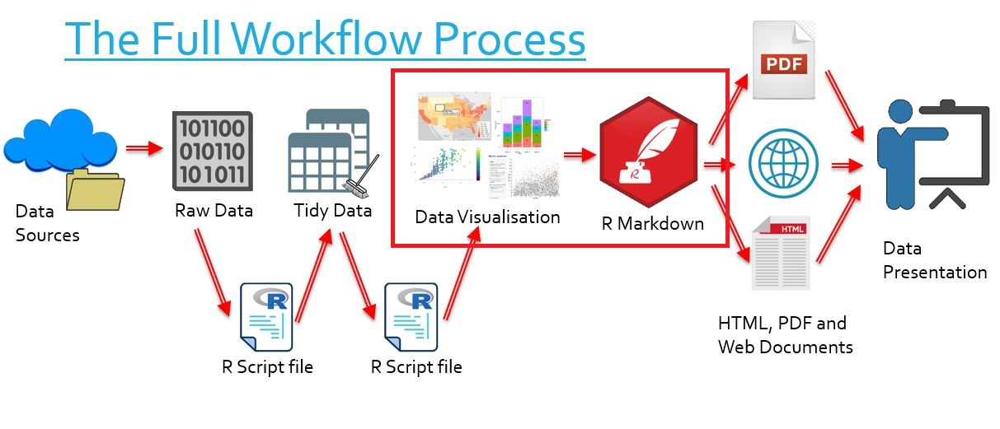

```{r setup, include=FALSE, message=FALSE}
knitr::opts_chunk$set(echo = TRUE,
                      warning = FALSE)
```

# The Bigger Picture

In this document we learn how to embed html widgets into documents. Simply put, we are learning how to insert graphs into presentations. In the overall context of the workflow, this falls into the category of transforming our data visualisations into a medium of communication.

<center> </img></center>
\  
<center>}}
There are references to LinkedIn Learning videos. These are complementary but not really required as the notes below are meant to be self-contained. Some students and staff would have access for free. Do not purchase access unless you are sure you don’t have access through your organisation already.
`


```{r library-htmlwidgets, echo = TRUE, message = FALSE}
library("leaflet")
library("plotly")
library("highcharter")
library("visNetwork")
library("DT")
# Loads five htmlwidget packages
```

```{r example, include=FALSE, echo=FALSE, message=FALSE}

load("tidy_ACORN-SAT_data/station_data.rdata")


pal <- colorNumeric(
  palette = "YlOrRd",
  domain = station_data$average.temp)

station_graph <- station_data %>%
  filter(year == 2000) %>%
  leaflet() %>%
  addTiles() %>%
  addCircleMarkers(label = ~paste("Station: ", Station.name),
                   popup = ~paste0("Temperature: ", average.temp),
                   color = ~pal(average.temp),
                   lng = ~Longitude,
                   lat = ~Latitude)

widgetframe::frameWidget(station_graph)

```


# How do you include htmlwidgets in documents?

Typically, how we include a given htmlwidget in a document is dependent on the document we are working with.

- If we are working with an html document in R Markdown, we use widgetframes
- If we are working with an offline document in R Markdown, we use the `webshot` package
- If we are embedding a non-widget HTML document, we may write our own HTML code

# What are iframes?

- "iframe" is short for inline frame
- It is an HTML element that enables us to embed external web elements in a given HTML document
- It can be thought of as a window we can build in an HTML browser which shows us part of another document
- We will be using iframes to embed elements into documents we create with R. This is to ensure full functionality and to avoid clashes with other elements in the html page.

# Widgetframes

> [R Markdown Lynda 12.3](https://www.linkedin.com/learning/creating-reports-and-presentations-with-r-markdown-and-rstudio/htmlwidgets-in-html-rmd-documents?u=2087740)

## What are widgetframes?

- Widgetframes are what we will be using to embed our widgets
- They are iframes which are used to view htmlwidgets
- Think of the window analogy - we build a window that lets us interact with an htmlwidget safely

## And why do we need them?

When we create htmlwidgets and try to display them in R Markdown, we often run into issues:

- In R Markdown, we have global options and styles which change the way our documents look
- These options call on JavaScrips, CSS and HTML and may affect our widgets if they are unprotected
- Widgetframes wrap our htmlwidgets in a responsive iframe which protects it

# How to use widgetframes in R Markdown

## Modify the YAML header

- If we are using htmlwidgets we must set the option `self_contained:` in the YAML header to `false`

```{undef}
output:
  slidy_presentation:
    self_contained: false
```

## Use the widgetframe package

- If we have an htmlwidget, we save it to an object
- We then use the `frameWidget()` function from the widgetframe package on this object
- This automatically frames our widget and displays it in our R Markdown document
- This will work when we produce any R Markdown html document

```{r widgetframe1, echo=TRUE}

load("tidy_ACORN-SAT_data/station_data.rdata")

pal <- colorNumeric(
  palette = "YlOrRd",
  domain = station_data$average.temp)

station_graph <- station_data %>%
  filter(year == 2000) %>%
  leaflet() %>%
  addTiles() %>%
  addCircleMarkers(label = ~paste("Station: ", Station.name),
                   popup = ~paste0("Temperature: ", average.temp),
                   color = ~pal(average.temp),
                   lng = ~Longitude,
                   lat = ~Latitude)

widgetframe::frameWidget(station_graph)

```

- We can also fix the height or the width of the graphs using the `height` and `width` arguments of `frameWidget()`
- Usually we do this in terms of a percentage of screen width (eg width = "80%)
- However the arguments can take numeric values representing pixels on a screen

```{r widgetframe2}
widgetframe::frameWidget(station_graph,
                         width = "80%")
```

# How to store widgets (.rdata method)

This method is much less elegant than the `.html` method. The upside is that it requires no HTML.

- We can store widgets like we store any R object, by saving and then loading them

```{r store1}

unframed_widget <- station_graph
save(unframed_widget, file = "widgets/unframed_widget.rdata")
load("widgets/unframed_widget.rdata")
widgetframe::frameWidget(unframed_widget)
```

It is critical to note the following:

- We cannot save a framed widget as a `.rdata` file
- We must save the unframed widget
- We do not need to have the packages which created the widget loaded with `library()` in order to view the graphs
- We must remember to frame the widget before displaying it in R Markdown


# How to store widgets (.html method)


## Saving widgets

- We store widgets using the `saveWidget()` function from the `htmlwidgets` package
    - For our purposed, `selfcontained` should be `TRUE`

```{r store1a}
htmlwidgets::saveWidget(widget = station_graph,
                        file = "station_graph.html",
                        selfcontained = TRUE)
```

- Don't forget the `.html`!


## Calling upon widgets

This method requires writing some HTML. The upside is that R is very responsive to HTML and so often our output is cleaner.

- Now that we've saved our widget, we can call upon it and put it in an iframe
- In our R file, we write the first line to let R know we are about to write some HTML
- We use the `iframe` function in HTML, formatted as below
- We finally write the last line to let R know we are done writing HTML


 </img>

<!--html_preserve-->
  
<iframe src = "station_graph.html" width="400" height="500"> </iframe>
  
<!--/html_preserve-->
  

# Solutions for Word, PDF and PowerPoint

Word, PDF and PowerPoint are non-HTML forms of media, and so we cannot simply call upon our HTML widgets or frame them like we do with other knit-able R Markdown files.

- In Word and PDF outputs, the 'offline' nature of these documents means we cannot have interactive widgets
- Our solution is to take a screenshot and embed this into the documents
    - We use the `webshot` package to automate this
    
In this example we will display a screenshot in this html document. In practice, we would use this method only if we required a Word, PDF or PowerPoint output.

1. We save our widget as a `.html` file with `saveWidget()` (see previous slide)
1. We use webshot to take a screenshot, save it, and display it

```{r solutions1}

library("webshot")
webshot::install_phantomjs()

webshot(url = "station_graph.html",
        file = "images/station_graph.jpg")

```

# Alternate solution for PowerPoint

As a note, this solution **requires you to already have your HTML widget uploaded to the web**.

- Go to the [LiveWeb downloads page](http://skp.mvps.org/liveweb.htm)
- Install LiveWeb
- Open a PowerPoint document, and under "Insert" will be the LiveWeb tab
    - If it does not appear, go to this file location on your computer: "C:\Program Files (x86)\Shyam Pillai\LiveWeb" and open the .ppam file
    
 </img>

- Click "Web Page" and follow the prompts to embed your webpage

# Other embeddable objects

HTML widgets are fun and useful, but as a bonus let's consider all the other objects we can embed using R.

Many websites will happily provide the HTML code necessary to embed HTML objects. For our purposes, we can simply paste this code, raw if we like, into an R Markdown document.

## Example - Videos

We consider the case of embedding YouTube videos into our documents.

1. We find the video we require.

 </img>

2. We click the "Share" button.

 </img>

3. We obtain a piece of HTML code. We can modify the options we are given (such as width and height) if we so wish.

 </img>

4. We simpy paste the code raw into R, framed by the same messages we use to declare the use of raw HTML.

 </img>

<!--html_preserve-->

<iframe width="560" height="315" src="https://www.youtube.com/embed/2sQuL-hsol8" frameborder="0" allow="accelerometer; autoplay; encrypted-media; gyroscope; picture-in-picture" allowfullscreen></iframe>

<!--/html_preserve-->

## Example - Playlists

Like YouTube, Spotify has a "Share" button and allows us to copy some HTML code allowing playlists to be embedded into R documents. Pretty cool, right?

Note that the playlist will only display if you are viewing this HTML document in a browser.

<!--html_preserve-->

<iframe src="https://open.spotify.com/embed/playlist/1KToKj6d2W25A1tLNKXhBj" width="300" height="380" frameborder="0" allowtransparency="true" allow="encrypted-media"></iframe>

<!--/html_preserve-->
